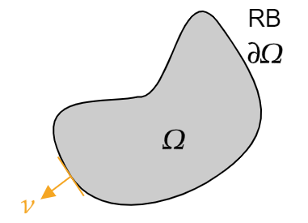

 

# Partielle DGL

## Lineare DGL 2. Ordnung

> [!def] **D1 - PDGL)**
> $$
> \mathrm{L}u := \sum_{i,j=0}^{n} a_{ij} \frac{\partial^{2}u}{\partial x_{i} \partial x_{j}} + \sum_{i=0}^{n} a_{i} \frac{\partial u}{\partial x_{i}} + cu = f
> $$

Wie Herkömmliche Lineare DGL lässt sich die PDGL in die Form einer [Linearen Abbildung](../Algebra/Lineare%20Abbildungen.md) $L$ bringen

> [!def] **D2 - KLAS)** $L$ heißt im Punkt $x \in \mathbb{R}$
> **(a) elliptisch**
> **(b) hyperbolisch**
> **(c) parabolisch**

Man möchte, dass $L$ in jedem Punkt von der gleichen Klasse ist.

>[!example] Je nachdem ob $L$ ell. hyp. oder par ist hat die Lineare Abbildung $L$ die Form wie hier mit $n=2$ dargestellt
> 
> $$
> \begin{align}
> \text{elliptisch:}\quad&\begin{pmatrix}
> 1 & 0 \\ 0 & 1
> \end{pmatrix}: x^{2}+y^{2} = \text{const.} \\
> \text{hyperbolisch:}\quad&\begin{pmatrix}
> 1 & 0 \\ 0 & -1
> \end{pmatrix}: x^{2}-y^{2} = \text{const.} \\
> \text{parabolisch:}\quad&\begin{pmatrix}
> 0 & 1 \\ 1 & 0
> \end{pmatrix}: x^{2} y^{2} = \text{const.}
> \end{align}
> $$

---

Bereich indem die Partielle DGL definiert ist:

> [!info] Ist die Zeit $t$ einer der Parameter von $u$, so zeichnen wir Folgendes Bild
> 
> 
> Raumvariablen $\Omega \subset \mathbb{K}^{n}$, Zeitvariable $I = [0,\infty)$: Definitionsraum $I \times\Omega$
> **AB:** Anfangsbedingungen: $u(0,x)=f_{0}(x), x \in\Omega$
> **RB:** Randbedingungen: $u(t,y)= f_{1}(t,y), y\in\partial \Omega$

> [!info] Falls kine Zeitvariable vorkommt sind **nur** Randbedingungen möglich
> 

Mit $\nu$ als normalvektor zu den Randwerten aus $\partial\Omega$ mit $\lVert \nu \rVert=1$

Dann Spricht man von Drichlét-RB

### Elliptische PDGL

Beispiel: [Maxwell](../../Elektrotechnik/Maxwell.md) Gleichungen

$\mathbf{E} \in \mathbb{R}^3$: [E-Feld](../../Elektrotechnik/Elektrisches%20Feld.md)
$\mathbf{B} \in \mathbb{R}^3$ : [B-Feld](../../Elektrotechnik/Magnetisches%20Feld.md)
$\rho \in\mathbb{R}$: Ladungsdichte, $\varepsilon_{0}\in\mathbb{R}$: [Permittivität](../../Elektrotechnik/Dielektrikum.md) im Vakuum
$\mathbf{J}\in \mathbb{R}^{3}$: Stromdichte

$\mathbf{E},\mathbf{B},\rho, \mathbf{J}$ hängen von $t$ und $x \in \mathbb{R}^3$ ab

Maxwell im Vakuum:

$$\operatorname{div}\mathbf{E}=\frac{\rho}{\varepsilon_{0}},\quad\operatorname{div}\mathbf{B}=0$$
- Definition der [Divergenz](../Divergenz.md) ist die Summe aller Partiellen Ableitungen von $\mathbf{F}$

> [!hint] Die Vektorfelder $\mathbf{E}$ und $\mathbf{B}$ sind [Gradient eines Potenzials](Wegunabhängig.md) $u$ (elektrische und magetische Spannung):
> Es ergibt sich also für die Potenziale $u_{e}$ und $u_{b}$:
> 
> - Eine [Poissongleichung](Laplacegleichung.md): $\operatorname{div}\mathbf{E}=\operatorname{div}\operatorname{grad}u_{e}=\boxed{ \Delta u_{e} =\frac{\rho}{\varepsilon_{0}} }$
> - Eine [Laplacegleichung](Laplacegleichung.md): $\operatorname{div}\mathbf{B}=\operatorname{div}\operatorname{grad}u_{b}=\boxed{ \Delta u_{b} =0 }$

Der [Gaußscher Integralsatz](Gaußscher%20Integralsatz.md) besagt, dass in man das Integral der Divergenz eines Vektorfeldes $\mathbf{F}$ in dem Definitionsbereiches $\Omega$ ermitteln kann, indem man $\mathbf{F}$ an den Randwerten $\partial \Omega$ betrachtet:

$$
\int_{\Omega}\operatorname{div}\mathbf{F} \mathrm{~d}x = \int_{\partial\Omega}\mathbf{F}\cdot\mathbf{\nu}\mathrm{~d}s
\implies \int_{\Omega}\Delta u \mathrm{~d}x = \int_{\partial\Omega}\operatorname{grad}u\cdot\mathbf{\nu}\mathrm{~d}s
$$

Und ist auf den [Hauptsatz der Infinitesimalrechnung](Hauptsatz%20der%20Infinitesimalrechnung.md) zurückzuführen

Für Maxwell sind die Raumvariablen $\Omega\to V\in\mathbb{R}^3$ und $\partial\Omega\to \partial V\in \mathbb{R}^2$, die einhüllende Fläche des Volumens $V$
 

--- 

Meistens gibt es sehr selten eine eindeutige Lösung von PDGL

Numerische Ermittlung von Partielle DGL mittels [[Methode der Finiten Elemente]]