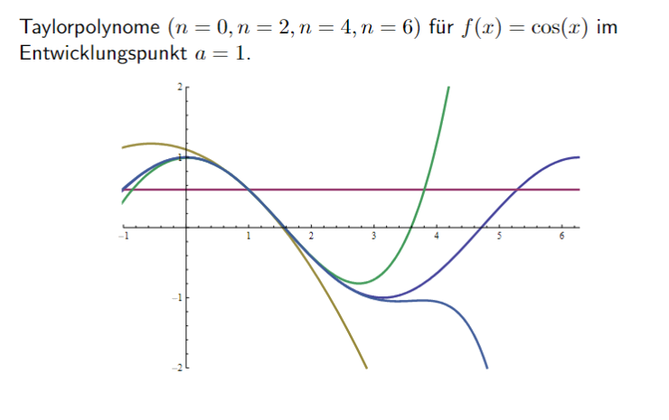

---
tags:
aliases:
  - Taylorreihen
  - McLaurenreihe
  - Taylorpolynom
  - Taylorreihenentwicklung
subject:
  - Mathematik 1
  - VL
created: 24th March 2022
professor:
  - Andreas Neubauer
def:
  - TAYL
---

# Taylorreihe

> [!QUESTION] Taylorreihen werden in der Analysis verwendet um Funktionen in der Umgebung eines Punktes durch Potenzreihen darzustellen.

> [!def] **D1 - TAYL)** Sei $f$ eine beliebig oft differenzierbare Funktion, dann heißt die unendliche Reihe: ^TAYL
>
> $$
> \begin{align}
> T(x) &= \sum_{i=0}^\infty \frac{f^{(i)}(a)}{i!}(x-a)^i\tag{TAYL}
> \end{align}
> $$
>
> Taylorreihe von $f$ mit dem Entwicklungspunkt $a$.
> Die Formulierung bis zu einem endlichen Punkt $n$ dieser Reihe heißt Taylorpolynom mit dem Grad $\deg T(x)=n$ und einem Rest der Ordnung $O(\lvert h^{n+1} \rvert)$

Ausgeschreiben lautete das Taylorpolynom:

$$ T(x) = f(a) + f'(a)(x-a)+\frac{f''(a)}{2}(x-a)^{2}+\dots+\frac{f^{(n)}(a)}{n!}(x-a)^n + \dots $$

> [!INFO] Entwicklung an der Stelle 0 (McLaurin-Reihe)  
> Für den Fall, dass $a=0$ sprich man von einer *McLaurin-Reihe*

## Abweichung von Annäherung

Entwickelt man die Taylorreihe nicht als unedliche Reihe sondern nur bis zu einem Gewissen Grad $n$ (z.B. Annäherung einer Kennlinie im Arbeitspunkt) dann hat diese Annäherung eine Abweichung der Ordnung $O(n+1)$

$$
\sum_{i=0}^{n} \frac{f^{(i)}(a)}{i!}(x-a)^i + O(n+1)
$$

## Beispiele

- Wurzelfunktionen

$$
\sqrt{ 1+x } \approx 1 + \frac{x}{2} + \dots
$$