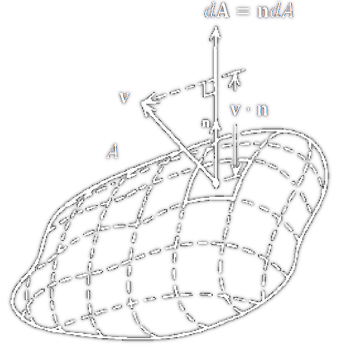

---
tags:
aliases:
  - Flächennormale
  - vektorielles Flächenelement
keywords:
subject:
  - VL
  - Einführung Elektrotechnik
semester: WS23
created: 10. Oktober 2024
professor:
  - Bernhard Jakoby
title: Flächenvektor
---
 

# Flächenintegral

> [!question] [Linienintegral](Vektoranalysis/Linienintegral.md), Volumsintegral

---

Eine Fläche kann in eine (Riemann-) Summe Kleiner Flächenelemente zerlegt werden

Ein **vektorielles-Flächenelement** $\mathrm{d}\mathbf{A}$ hat die Richtung der Flächennormale und den Betrag der tatsächlichen (Skalaren) Fläche.

Zerteilt man die Fläche in immre mehr, immer kleiner werdende vektorielle Flächenelemente und Summiert diese auf, erhält man das Flächenintegral eines Vektorfeldes durch eine Fläche.

$$
\int_A \mathbf{v} \cdot \mathrm{d} \mathbf{A} := \lim_{ n \to \infty } \sum_{i=0}^n \mathbf{v} \cdot \Delta \mathbf{A}_i 
$$

Das [innere Produkt](../../Algebra/Skalarprodukt.md) sorgt dafür, dass nur der "passend" projizierte Flächenanteil gezählt wird.  Sumiert man die einzelnen Beiträge der Flächenelemente, erhält man den Gesamtfluss durch die Fläche.

## Hüllintegral

> [!question] [Ringintegral](Vektoranalysis/Linienintegral.md#Ringintegral)

Die Integration über eine geschlossene Fläche (*Hülle*) ergibt ein **Hüllintegral**. 

$$
\oint_{A}\mathbf{v}\cdot\mathrm{d}\mathbf{A}
$$

 Umhüllt die Fläche ein Volumen $V$, so schreibt man $\partial V$ statt $A$.

## Referenzen

In der Physik / Elektrotechnik werden [Flussgrößen](../../../Elektrotechnik/Flussgrößen.md) oft durch Flächenintegrale Ausgedrückt.
