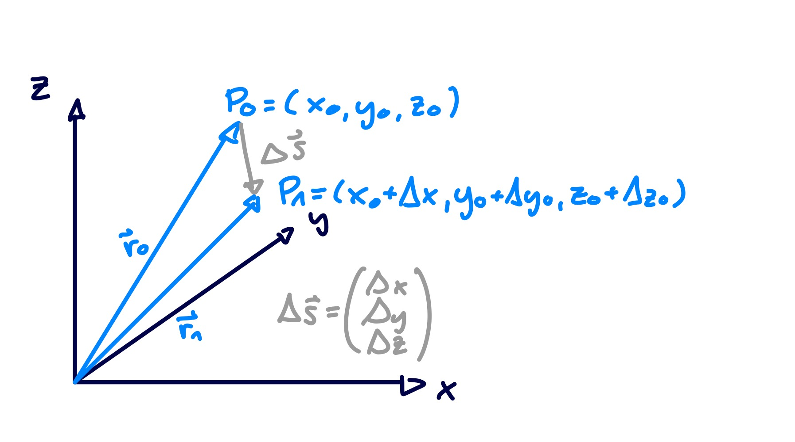

---
tags:
  - Analysis/Differenzieren
aliases:
  - Gradienten
keywords:
subject:
  - VL
  - Mathematik 2
semester: SS24
created: 19. März 2024
professor:
  - Andreas Neubauer
title: Gradient
---

# Gradient

> [!def] **D1 - GRAD)** Gradient. Sei $f: A \rightarrow \mathbb{R}, x=\left(x_1, \ldots, x_n\right) \in A \subseteq \mathbb{R}^{n}$
> Ist $f$ [partiell](../Partielle%20Ableitung.md) differenzierbar in $x$, liefert der Gradient von $f$ den [Vektor](../../Algebra/Vektor.md) aller partiellen Ableitungen an der Stelle $x$:
> 
> $$
> \operatorname{grad} f(\mathbf{x}) = \nabla f(\mathbf{x}) :=\begin{pmatrix}
> \frac{\partial f}{\partial x_1}(\mathbf{x}), \ldots, \frac{\partial f}{\partial x_n}(\mathbf{x}) \end{pmatrix}^T
> $$
> 
> der *Gradient* von $f$ an der Stelle $x$.
 
- Statt $\operatorname{grad} f(\mathbf{x})$ verwendet man auch den [Nabla Operator](Nabla%20Operator.md) $\nabla f(\mathbf{x})$ (lies: Nabla $f$ ).
- Ist die Funktion $\mathbf{f}$ ein [Vektorfeld](index.md), erhält man durch dessen Gradienten die [Jacobi Matrix](Jacobi%20Matrix.md) als Tensor zweiter stufe.

## Gradient eines Skalarfeldes

Wendet man den Gradienten auf ein Skalarfeld an, so erhält man ein Vektorfeld welches in jedem Punkt in die Richting des stärksten Anstiegs zeigt. Die Magnitude ist dabei die stärke des Ansteigs.

Aus der Abbildung folgt:

$$
\begin{align}
&f(x_{0} + \Delta x, y_{0}+\Delta y, z_{0}+\Delta z)  \\
&\approx f(x_{0},y_{0},z_{0}) + \frac{ \partial f }{ \partial x } \Delta x + \frac{ \partial f }{ \partial y } \Delta y + \frac{ \partial f }{ \partial z } \Delta z
 \\ \\
&f(x_{0} + \Delta x, y_{0}+\Delta y, z_{0}+\Delta z) - f(x_{0},y_{0},z_{0}) = \Delta f\\
&\approx \frac{ \partial f }{ \partial x } \Delta x + \frac{ \partial f }{ \partial y } \Delta y + \frac{ \partial f }{ \partial z } \Delta z =\nabla f \cdot \mathrm{d}\mathbf{s}
\end{align}
$$

- Differenzation jeweils im Punkt $(x_{0},y_{0},z_{0})$

$$
\Delta f \approx \nabla f \cdot \mathrm{d}\mathbf{s} \to \mathrm{d}f = \nabla f \cdot \mathrm{d}\mathbf{s}
$$

> [!hint] [Skalarprodukt](../../Algebra/Skalarprodukt.md): $\mathrm{d}f = \nabla f\cdot \mathrm{d}\mathbf{s} = \left| \nabla f \right| \left| \mathrm{d}\mathbf{s} \right|\cos\alpha$ 
> ... wird Maximal für $\alpha \to 0$; Deshalb richtung des maximalen Anstiegs.

Das aus dem Gradienten eines Skalarfeldes resultierende Vektorfeld (**Gradientenfeld**) besitzt die besondere Eigenschaft der [Wegunabhängigkeit](Wegunabhängig.md).

> [!example] **Beispiel)** Gradientenfeld in 2D (z.B. T-Verteilung auf einer Herdplatte)
> 
> Wäremstrom: $\dot{\mathbf{q}} = -\lambda \nabla T$
> 
> 
> 
> Draufsicht:
> 
> 

## Vergleich mit 1D Ableitung

### 1D Ableitung

- Die [skalare Ableitung](../Differenzialrechnung.md) $f'(t) = \frac{\mathrm{d}f(t)}{\mathrm{d}t}\big|_{t_{0}}$ gibt an, wie stark sich die Funktion in der Umgebung der Stelle $t_{0}$ ändert.
- Insbesondere ergibt ein infinitesimaler Schritt $\mathrm{d}t$ (also von $t_{0}$ auf $t_{0}+\mathrm{d}t$) eine Änderung $\mathrm{d}f = f'(t_{0})\mathrm{d}t$

### Gradient

- Der Gradient eines Skalarfeldes $\nabla f(\mathbf{r})\Big|_{\mathbf{r_{0}}}$ gibt an, wie stark sich das Feld in der Umgebung von $\mathbf{r}_{0}$ ändert. Der resultierende Vektor zeigt dabei in die Richtung des Stärksten anstiegs.
- Insbesondere ergibt ein infinitesimaler Schritt $\mathrm{d}\mathrm{s}$ (also von $\mathbf{r}_{0}$ auf $\mathbf{r}_{0}+\mathrm{d}\mathbf{s}$) eine Änderung $\mathrm{d}f = \left( \nabla f \big|_{\mathbf{r}_{0}}\right)\cdot \mathrm{d}\mathbf{s}$
- Die Tatsache, dass nicht jede Richtung eine ähnlich starke Änderung aufweist, steckt im [inneren Produkt](../../Algebra/Skalarprodukt.md)

## Gradientensatz

Der Gradientensatz ist der [Fundamentalsatz der Analysis](../Fundamentalsatz%20der%20Analysis.md) erweitert auf Vektorfelder. Der Gradient ist die Inverse Operation zum [Kurvenintegral](Linienintegral.md).

## Beispiele

> [!example] $f(x,y) = 1 - \frac{x^{2}}{10} + \frac{y^{2}}{20}$
> 
> $$
> \nabla f(x,y) = \begin{pmatrix}
> \frac{ \partial f }{ \partial x } \\
> \frac{ \partial f }{ \partial y } 
> \end{pmatrix} = \begin{pmatrix}
> \frac{ \partial }{ \partial x } \left( 1 - \frac{x^{2}}{10} + \frac{y^{2}}{20} \right) \\
> \frac{ \partial }{ \partial y } \left( 1 - \frac{x^{2}}{10} + \frac{y^{2}}{20} \right)
> \end{pmatrix}
> = \begin{pmatrix}
> -\frac{x}{5} \\
> \frac{y}{10}
> \end{pmatrix}  \\
> $$

> [!example] $f(\mathbf{r}) = 2 x^4 z -\frac{1}{3} xy^4z^3-10$ mit $\mathbf{r} = (x,y,z)^T$
> 
> $$
> \nabla f(\mathbf{r}) = \begin{pmatrix}
> \frac{ \partial }{ \partial x } \left(2 x^4 z -\frac{1}{3} xy^4z^3-10\right) \\
> \frac{ \partial }{ \partial y } \left(2 x^4 z -\frac{1}{3} xy^4z^3-10\right) \\
> \frac{ \partial }{ \partial z } \left(2 x^4 z -\frac{1}{3} xy^4z^3-10\right)
> \end{pmatrix} = \begin{pmatrix}
> 8 x^{3}z - \frac{1}{3}y^4z^{3} \\
> -\frac{3}{4} xy^{3}z^{3} \\
> 2x^4 - xy^4z^{2}
> \end{pmatrix}
> $$

