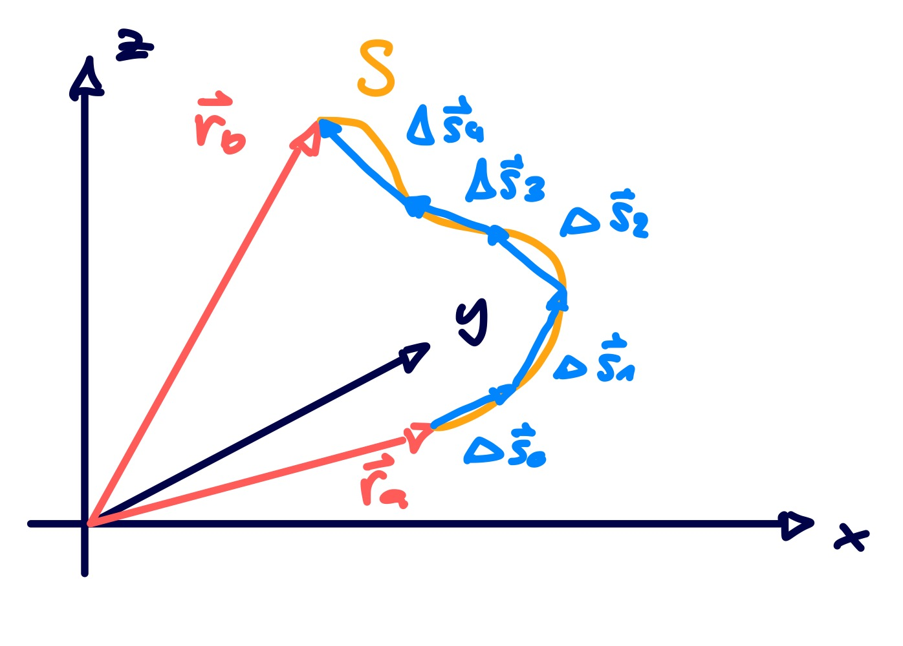
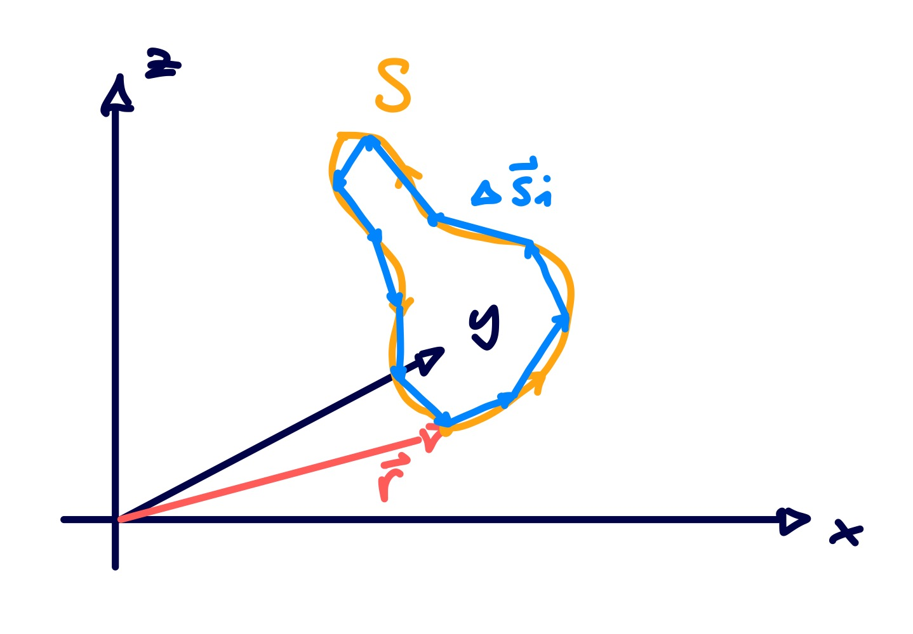
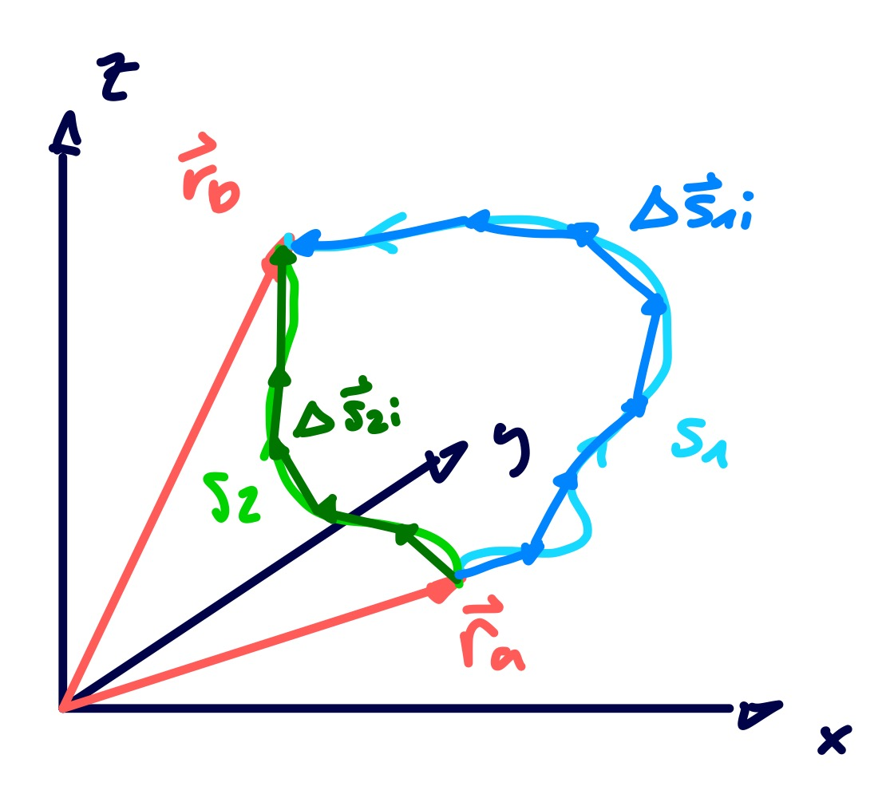

---
tags:
aliases:
  - Kurvenintegral
  - Ringintegral
  - Umlaufintegral
  - Zirkulation
subject:
  - VL
  - Theoretische Elektrotechnik
semester: SS26
created: 7th May 2026
professor:
release: false
title: Linienintegral
---

# Linienintegral

- [Kurvenintegral - Wikipedia](https://de.wikipedia.org/wiki/Kurvenintegral)

---

## Elektrotechnik

> [!question] [Flächenintegral](Flächenintegral.md), Volumsintegral

Integration eines Vektorfeldes:

> [!def] **D)** Definition als Riemannsche Summe. Sei $S:[\mathbf{r}_{a},\mathbf{r}_{b}]$
> 
> $$
> \int_{S}\mathbf{f}(\mathbf{r})\cdot \mathrm{d}\mathbf{s} := \lim_{ n \to \infty } \sum_{i=0}^n \mathbf{f}(\mathbf{r}) \cdot\Delta \mathbf{s}
> $$
> 

- Verknüpfung der Vektorgrößen über das [Skalarprodukt](../../Algebra/Skalarprodukt.md).

Die von $[\mathbf{r}_{a}, \mathbf{r}_{b}]$ beschränkte Kurve $S$ wird in sehr viele, immer kleiner werdende segmente $\Delta \mathbf{s} \to \mathrm{d}\mathbf{s}$ unterteilt und aufsummiert (*integriert*).

### Ringintegral

Ein Linienintegral über eine Geschlossene Kurve (Anfangs und Endpunkt sind identisch), werden als **Ringintegral** (auch *Umlaufintegral*) bezeichnet.

Sei $S:[\mathbf{r}_{a},\mathbf{r}_{a}]$

$$
\oint_{S}\mathbf{f}(\mathbf{r})\cdot \mathrm{d}\mathbf{s} := \lim_{ n \to \infty } \sum_{i=0}^n \mathbf{f}(\mathbf{r}) \cdot\Delta \mathbf{s}
$$

Das Ergebnis des Ringintegrals wird auch als **Zirkulation** beziechnet.

### Spezialfall: Integration in einem Gradientenfeld

> [!question] [Gradient](Gradient.md), [Wegunabhängigheit](Wegunabhängig.md)

[Gradientensatz](Wegunabhängig.md): Bei einem Linienintegral eines Gradientenfeldes $\mathbf{f} = \nabla\varphi$ ist das Ergebnis unabhängig von dem integrationsweg. Das Integral heißt Wegunabhängig.

$$
\int_{S} \mathbf{f}\cdot\mathrm{d}\mathbf{s} = \int_{\mathbf{r}_{a}}^{\mathbf{r}_{b}}\nabla\varphi \cdot\mathrm{d}\mathbf{s} = \varphi(\mathbf{r}_{b}) - \varphi(\mathbf{r}_{a})
$$

$$
\int_{S_{1}} \mathbf{f}\cdot\mathrm{d}\mathbf{s} =\int_{S_{2}} \mathbf{f}\cdot\mathrm{d}\mathbf{s} 
$$

Summe Über alle Teilstücke: Bis auf anfang und ende der Linie heben sich die Beiträge der Teilstücke auf.

Das Ringintegral eines Gradentenfeldes ist aufgrunddessen immer Null:

$$
\oint \mathbf{f} \cdot\mathrm{d}\mathbf{s} = \oint \nabla\varphi \cdot\mathrm{d}\mathbf{s} = 0
$$