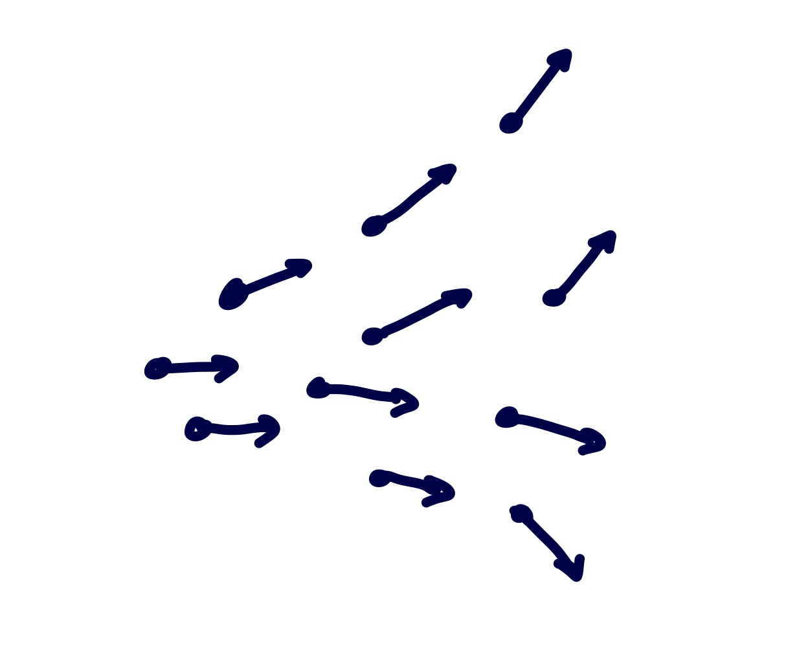
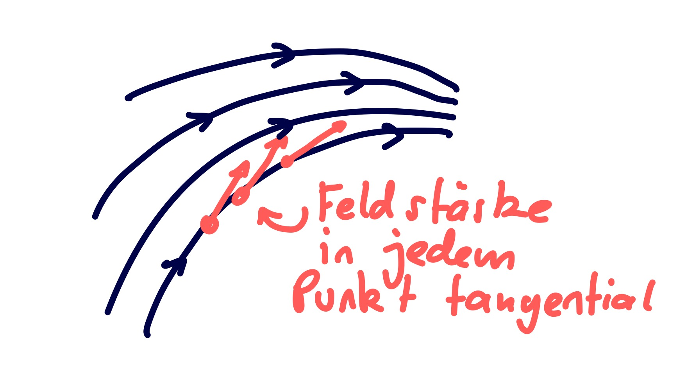
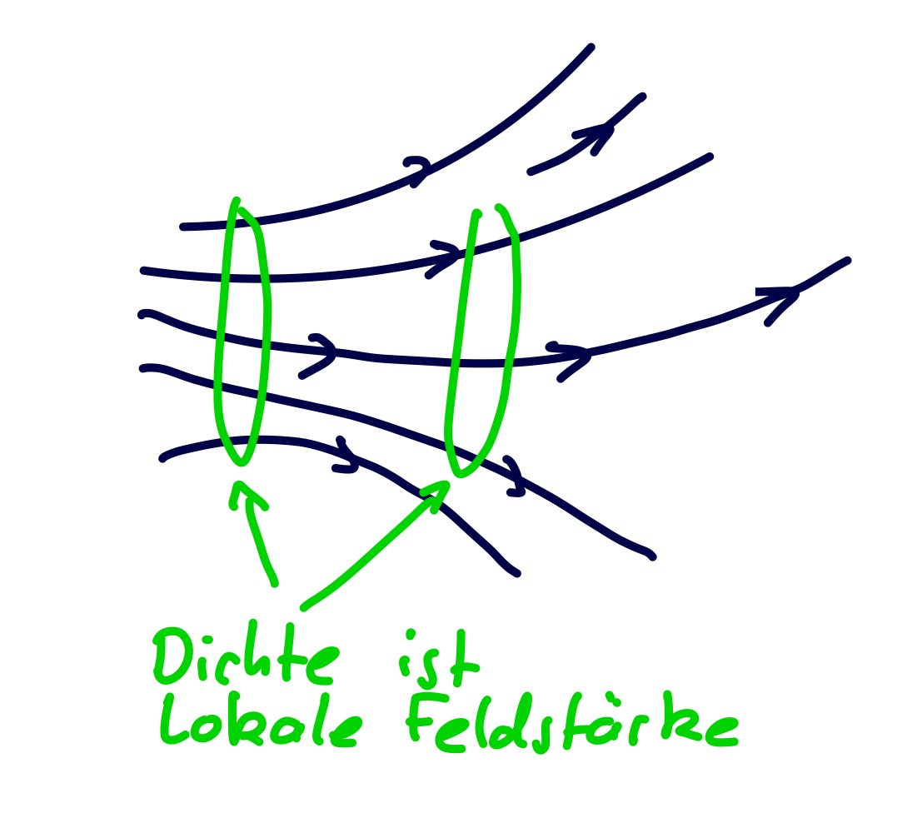

---
tags:
aliases:
  - Vektorfeld
  - Feldvektor
keywords:
subject:
  - VL
  - Mathematik 2
  - Elektrotechnik
  - Theoretische Elektrotechnik
semester: SS26
created: 12th April 2026
professor:
  - Andreas Neubauer
  - Reinhard Feger
release: false
title: index
---

# Vektorfelder

> [!def] **D1 - VECF)**
> Ein Vektorfeld auf einer Menge $\Omega \in\mathbb{R}^{n}$ ist eine Abbildung, die jedem Punkt $\mathbf{x} \in \Omega$ der Menge einen [Vektor](../../Algebra/Vektor.md) $\mathbf{v}(\mathbf{x}) \in \mathbb{K}^{n}$ zuordnet.

Im gegensatz zu einem Skalarfeld, dass jedem Punkt einen skalaren Wert (eine Zahl) zuordnet.

## Vektorfelder in der Elektrotechnik

Die Bedeutensten Vektorfelder in der Elektrotechnik sind das [elektrische Feld](../../../Elektrotechnik/Elektrostatik/Elektrisches%20Feld.md) $\mathbf{E}$ und das [magnetische Feld](../../../Elektrotechnik/Magnetostatik/Magnetisches%20Feld.md) $\mathbf{B}$, welche durch die [Maxwell](Maxwell.md)-Gleichungen beschrieben werden. Diese Felder sind [konservativ](Wegunabhängig.md).

> [!tldr] Im Folgenden werden die physikalischen Ursachen der Mathematischen Operationen auf konservative Vektorfelder erläutert:
> 
> - [Gradient](Gradient.md) und Gradientintegral ([Fundamentalsatz der Analysis](../Fundamentalsatz%20der%20Analysis.md))
>  - [Divergenz](Divergenz.md) und Divergenzintegral / [Gaußscher Integralsatz](Gaußscher%20Integralsatz.md)
>  -  [Rotor](Rotor.md) und Rotationsintegral / [Stokesscher Integralsatz](Stokesscher%20Integralsatz.md)

### Darstellung von Vektorfeldern, Feldlinien

Darstellung der Feldvektoren an (ausgewählten) Punkten. 

Darstellug Durch **Feldlinien**

|    |              |
| -------------------------------------------------------- | ------------------------------------------------------------------ |
| Feldstärke ist in jedem Punkt *tangential* zur Feldlinie | Die *Dichte* der Feldlinien ist ein Maß für die lokale Feldstärke. |

> [!example] [Gravitationsfeld](../../../Physik/Gravitationsfeld.md)

### Räumliche Differenzation von Feldern

> [!question] [Nabla Operator](Nabla%20Operator.md)

Im Raum gibt es 3 von einander unabhängige Koordinaten, daher gibt es auch mehrere Möglichkeiten, Feldgrößen zu Differnzieren.

Zur Vollständigen Beschreibung von Vektorfeldern sind zwei Differenzialausdrücke relevant.

- [Divergenz](Divergenz.md)
- [Rotation](Rotor.md)

$\implies$ [Maxwellgleichungen](../../../Elektrotechnik/Maxwell.md)

> [!hint] Wichtige Elemente der Vektoranalysis
> 
> - [Gradient](Gradient.md) eines Skalarfeldes
> - Linienintegral (Wegintegral) eines Vektorfeldes
> 	- Sonderfall: *Ringintegral* über einen *geschlossenen* Weg
> - Flächenintegral eines Vektorfeldes
> 	- Sonderfall: *Hüllintegral* über eine *geschlossene* Fläche / Kontur
> - Divergenz eines Vektorfeldes als *geschrumpftes* Hüllintegral
> - Rotor eines Vektorfeldes als *geschrumpftes* Linienintegral
> - Integralsätze von [Gauß](Gaußscher%20Integralsatz.md) und [Stokes](Stokesscher%20Integralsatz.md)

## Referenzen 

[Vektorfeld - Wikipedia](https://de.wikipedia.org/wiki/Vektorfeld)