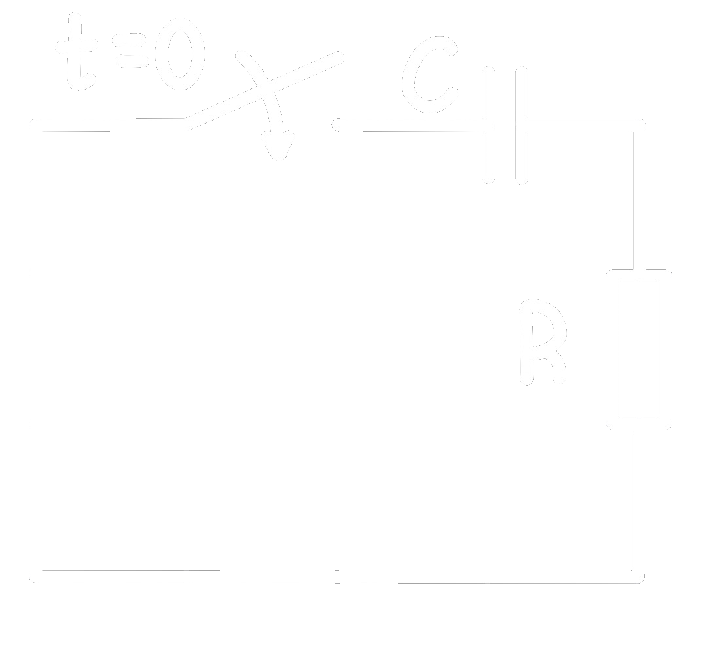

# Lineare Differentialgleichungen 1. Ordnung

## Lineare Differentialgleichungen 1. Ordnung mit konstantem Koeffizienten

$$y'+p\cdot y=s(x)$$

oder 

$$\frac{dy}{dx}+p\cdot y=s(x)$$

> [!quote] Linear  
> Eine DGL 1. Ordnung heißt **linear**, wenn sie in der Form $y'+p\cdot y=s(x)$ geschrieben werden kann.

> [!quote] konstanter Koeffizient $p$  
> Der Faktor $p$ heißt **Koeffizient** der linearen DGL. ist der Koeffizient eine *Konstante*, so spricht man von einer **linearen Differentialgleichungen 1. Ordnung mit konstantem Koeffizienten**.

> [!quote] Störterm $s(x)$  
> Die im Allgemeinen vom $x$ abhängige Funktion **$s(x)$** wird oft als **Störfunktion** bezeichnet.

Ist **$s(x)=0$** für *alle* x, heißt die lineare DGL **homogen**, sonst **inhomogen**.

$$
y'+\underbrace{p}_{\text{Koeffizient}} \cdot y=\underbrace{s(x)}_{\text{Störterm}}
$$

> [!WARNING] Ist der konstante Koeffizient $p$ positiv, so klingt die Lösung exponentiell ab, sie ist "flüchtig". 

> [!EXAMPLE] Bsp.:  
> $y'+x^{2}\cdot y=0\rightarrow$ **homogene lineare** DGL 1. Ordnung mit **nicht konstantem** Koeffizienten  
> $y'+2\cdot y=1\rightarrow$ **inhomogene lineare** DGL 1. Ordnung mit **konstantem** Koeffizienten

### Lösen von *homogenen* DGL 1. Ordnung

| Womit?                                                | Wann?                                                                                                                                             |
| ----------------------------------------------------- | ------------------------------------------------------------------------------------------------------------------------------------------------- |
| [Trennen der Variablen](Trennen%20der%20Variablen.md) | Eine **homogene** lineare [DGL](GDGL.md) 1. Ordnung lässt sich durch [Trennen der Variablen](Trennen%20der%20Variablen.md) lösen.          |
| [Exponentialansatz](Exponentialansatz.md)             | Ist der **Koeffizient $p$** *konstant*, so kann die Lösung einfacher mit mit einem *[Exponentialansatz](Exponentialansatz.md)* gefunden werden. |

> [!example] Spannung am [Kondensator](../../Elektrotechnik/Kapazität.md) beim Entladen.  
> 

### Lösung der *inhomogenen* DGL 1. Ordnung

Die allgemeine Lösung $y$ einer inhomogenen linearen DGL 1. Ordnung (oder auch einer höheren Ordnung) ist als Summe der allgemeinen Lösung $y_{h}$ der **dazugehörigen homogenen DGL und einer *beliebigen* **partikulären Lösung $y_{p}$** der **inhomogenen DGL **darstellbar:

$$
\begin{align*}
	y = y_{h} + y_{p}
\end{align*}
$$

Eine partikuläre Lösung $y_{p}$ der inhomogenen lineare DGL kann, wenn der Koeffizient $p$ konstant ist, durch einen Lösungsansatz entsprechend dem Störterm $s(x)$ gesucht werden.  

[[DGL Störterm-Ansätze]]