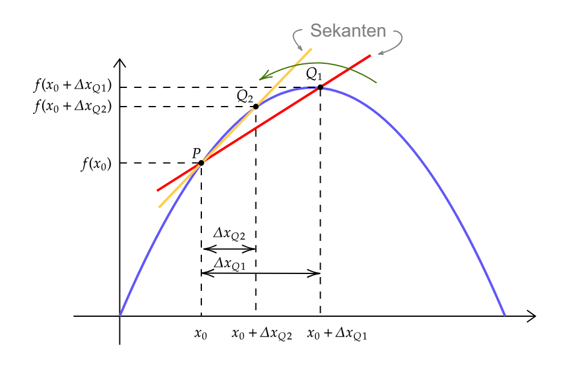
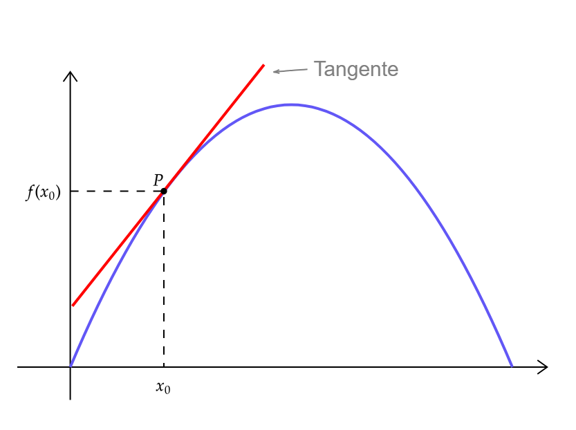

---
tags:
  - Infinitesimalrechnung/Differenzieren
aliases:
  - Differenzieren
  - Ableitung
  - ableiten
  - Satz 11.6
subject:
  - Mathematik 2
  - VL
keywords:
  - Differenzierbarkeit
  - Stetigkeit
semester: SS24
created: 27. September 2024
professor:
  - Andreas Neubauer
  - Rudolf Frauenschuh
---
 

# Differenzialrechnung

Die Steigung der Tangente nimmt man als Steigung der Funktion im betreffenden Punkt.  
Die Ableitung $f'(x)$ ist die Steigung der Tangente am Graphen der Funktion $f(x)$ im Punkt $(x_{0}|f(x_{0}))$.

**Der Differenzialquotient hat aber eine viel Weitreichendere Bedeutung**
Die Tangente ist eine lineare Näherung (Approximation) an einer Kurve. Sogar die *Beste Näherung*.

> [!INFO] Bei der Differenzialrechnung wird somit die Änderung in einer Funktionen betrachtet.  
> Sie wird in der Physik als häufigste Operation verwendet und benötigt um Naturgesetze zu definieren. (Siehe [DGL](../{MOC}%20DGL.md))

|  |  |
| ---------------------------------------- | ---------------------------------------- |
|                                          |                                          |

Steigung der Sekante $k=\dfrac{\Delta y}{\Delta x}=\dfrac{f(x_{0}+\Delta x)-f(x_{0})}{\Delta x}\to$ Differenzenquotient oder mittlere Steigung im Intervall.  
$Q_{i}$ rückt immer näher zu $P$. Der [Grenzwert](Grenzwert.md) der Sekanten-Steigung ist die Ableitung. 

> [!important] Differenzieren einer Funktion  
> Die Funktion $f$ mit $y = f(x)$ heißt an der Stelle $x_{0}$ *differenzierbar*, wenn der [Grenzwert](Grenzwert.md)
> 
> $$
> \boxed{
> f^{\prime}\left(x_0\right)=\lim _{x \rightarrow x_0} \frac{f(x)-f\left(x_0\right)}{x-x_0}=\lim _{h \rightarrow 0} \frac{f\left(x_0+h\right)-f\left(x_0\right)}{h}
> }
> $$
>  existiert. $h = x-x_{0}$ bzw. $x = x_{0}+h$
> 
> Diesen [Grenzwert](Grenzwert.md) nennt man *Ableitung* oder *Differenzialquotient* von $f$ an der Stelle $x_{0}$.
> 
> Er wird mit $f(x_{0})$, $y'(x_{0})$ oder $\frac{dy}{dx}\Big|_{x=x_{0}}$ (gesprochen: $dy$ nach $dx$ für $x=x_{0}$) bezeichnet.
> 
> Das Bilden der Ableitung wird *ableiten* oder *differenzieren* genannt.

> [!success] Differenzieren heißt linear approximieren
> 1. Der *Differenzialquotient* (die Ableitung) $f'(x)$ ist der *[Grenzwert](Grenzwert.md) des Differenzenquotienten*: $f'(x_{0})=\lim_{ \Delta x \to 0}\frac{\Delta y}{\Delta x}$.
> 2. Die Bezeichnung $\frac{dy}{dx}$ soll an die Verwandtschaft der Ableitung mit einem Differenzenquotient erinnern.  
>     - Differenzierbarkeit einer Funktion an der Stelle $x_{0}$ bedeutet geometrisch, dass es dort eine *Tangente* gibt.  
>     - Ist eine Funktion also an einer Stelle $x_{0}$ *differenzierbar*, so heißt dies, dass sie dort *linear approximierbar* ist.  
>     - In der Nähe von $x_{0}$ verlaufen der Funktionsgraph und die Tangente gleich.

---

>[!example] $f(x) = x^{2}$  
> $$
> \begin{align}
> f'(x_{0}) &= \lim_{ \Delta x \to 0 } \frac{(x+\Delta x)^{2}-x^{2}}{\Delta x} \\
> &= \lim_{ \Delta x \to 0 } \frac{(x^{2}+2\cdot x\cdot\Delta x+\Delta x^{2})-x^{2}}{\Delta x} \\
> &= \lim_{ \Delta x \to 0 } \frac{2\cdot x\cdot\Delta x+\Delta x^{2}}{\Delta x} \\
> &= \lim_{ \Delta x \to 0 } 2\cdot x+\underbrace{ \Delta x }_{ \to 0 } \\
> &= 2x
> \end{align}
> $$

| Art der Funktion                                | Stammfunktion                                              | Ableitung                                                                                        |
| ----------------------------------------------- | ---------------------------------------------------------- | ------------------------------------------------------------------------------------------------ |
| konstante Funktion                              | $f(x)=c$                                                   | $f'(x)=0$                                                                                        |
| Potenzfunktion                                  | $f(x)=a\cdot x^{n},n\in\mathbb{R}$                         | $f'(x)=a\cdot n\cdot x^{n-1}$                                                                    |
| [Exponentialfunktion](Exponentialfunktion.md)   | $f(x)=a^{x}$  $f(x)=e^{x}$                              | $f'(x)=a^{x}\cdot \ln a$  $f'(x)=e^{x}$                                                       |
| Logarithmusfunktion                             | $f(x)=\ln x$  $f(x)=\log_{a}$                           | $f'(x)=\frac{1}{x}$  $f'(x)=\frac{1}{x\cdot \ln a}$                                           |
| Kreisfunktionen   (*Winkel $x$ im Bogenmaß*) | $f(x)=\sin x$ $f(x)=\cos x$ $f(x)=\tan x$            | $f'(x)=\cos x$ $f'(x)=-\sin x$ $f'(x)=1+\tan ^{2}x=\frac{1}{\cos ^{2}x}$                   |
| Arkusfunktionen                                 | $f(x)=\arcsin x$  $f(x)=\arccos x$  $f(x)=\arctan x$ | $f'(x)=\frac{1}{\sqrt{ 1-x^{2} }}, \|x\| < 1$  $f'(x)=-\frac{1}{\sqrt{ 1-x^{2} }}, \|x\| < 1$ |

## Ableitungsregeln

| Summenregel      | $[f(x) \pm g(x)]' =f'(x) \pm g'(x)$                                                                                    |
| ---------------- | ---------------------------------------------------------------------------------------------------------------------------- |
| [[Faktorregel]]  | $[\lambda \cdot f(x)]' = \lambda \cdot f'(x)\qquad \lambda \in \mathbb{R}$                                             |
| [[Produktregel]] | $[f(x)\cdot g(x)]' = f'(x)\cdot g(x) + f(x)\cdot g'(x)$                                                                |
| [Quotientenregel](Produktregel.md)  | $\left[\dfrac{f(x)}{g(x)}\right]'=\dfrac{f(x)'\cdot g(x)- f(x)\cdot g(x)'}{g(x)^{2}}$                                  |
| [[Kettenregel]]  | $(f\circ g)'(x)= f(g(x))'=f'(g(x))\cdot g(x)'\qquad$ folgt aus $\dfrac{df}{dx} = \dfrac{df}{dg}\cdot \dfrac{dg}{dx}$   |
| [[Umkehrregel]]  | $\left(f^{-1}\right)^{\prime}(y)=\dfrac{1}{f^{\prime}\left(f^{-1}(y)\right)}$                                                |

## Sätze und Folgerungen

- [Satz von Rolle](Satz%20von%20Rolle.md)
- [Mittelwertsatz](Mittelwertsatz.md)
    - Schrankensatz
        - Lipschitzstetigkeit
    - [L'Hospital](Analysis/L'Hospital.md)

## Stetigkeit

> [!important] **Satz 11.6**. Sei $A \subset \mathbb{R}^n$ offen, $x_0 \in A$ und $f: A \rightarrow \mathbb{R}^m$ differenzierbar in $x_0$.
> Dann ist $f$ stetig in $x_0$.

> [!success] Beweis Satz 11.6
> Da $f$ differenzierbar ist, gilt nach Definition 11.4 für alle $h \in \mathbb{R}^n$ mit $x_0+h \in A$ : 
> 
> $f\left(x_0+h\right)=f\left(x_0\right)+L h+r(h)$ und $\lim _{h \rightarrow 0} \frac{r(h)}{\|h\|}=0$, insbesondere: $\lim _{h \rightarrow 0} r(h)=0$.
> 
> Da die [lineare Abbildung](Lineare%20Abbildungen.md) $L$ stetig ist, folgt: $\lim _{h \rightarrow 0} f\left(x_0+h\right)=f\left(x_0\right)$, also ist $f$ stetig in $x_0$.
> 
> Umgekehrt impliziert [Stetigkeit](Analysis/Stetigkeit.md) natürlich nicht Differenzierbarkeit, so ist die Betragsfunktion in $x=0$ stetig, aber nicht differenzierbar.
> 
> Aus dem Beweis von Satz 11.6 geht hervor, dass für $n=1$ die Aussage auch gilt, falls $I$ ein Intervall und $x_0 \in I$ ein Randpunkt ist.
> 
> Es gibt auch eine andere Möglichkeit, den Ableitungsbegriff auf Funktionen zwischen mehrdimensionalen Räumen zu übertragen, den Begriff der [partiellen Ableitung](Analysis/Partielle%20Ableitung.md), dabei lässt man nun alle Variablen bis auf eine fest und betrachtet die Funktion als Funktion der einen restlichen Variablen.

# Tags

- [Partielle Ableitung](Partielle%20Ableitung.md)
- [Totale Ableitung](Analysis/Total%20Differenzierbar.md)
- [Fréchet-Ableitung](Analysis/Fréchet-Ableitung.md)