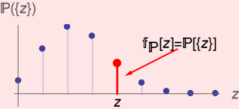

---
tags:
  - Statistik
aliases:
  - Wahrscheinlichkeitsverteilungen
subject:
  - mathe
  - KV
  - Wahrscheinlichkeitstheorie und stochastische Prozesse
created: 14th February 2026
semester: WS25
professor:
release: false
title: Diskrete Verteilung
---

# Wahrscheinlichkeitsverteilung

- Wahrscheinlichkeitsverteilung beschreibt [Wahrscheinlichkeit](Wahrscheinlichkeit.md) von [Ereignissen](Ereignis.md)
- Jedem $x_{i}$ wird eine [Wahrscheinlichkeit](Wahrscheinlichkeit.md) zugeordnet
- verschiedene Arten:
	- Diskrete Verteilung: [Binomialverteilung](Binomialverteilung.md)
	- Stetige Verteilung: [Normalverteilung](Normalverteilung.md)

Die Gesamtheit der Werte $x_{i}$ einer diskreten [Zufallsvariable](Zufallsvariable.md) $X$ zusammen mit den zugehörigen Wahrscheinlichkeiten $p_{i}$ heißt Wahrscheinlichkeitsverteilung dieser [Zufallsvariable](Zufallsvariable.md).
$$
G(X)=\sum\limits_{k=0}^{x_{1}}P(X=k) = P(0) + P(1) +\dots +P(x_{1})
$$
$M_{x}\rightarrow [0;1]$

>[!example] [Erwartungswert](Erwartungswert.md) von 2 Würfeln  
> 

| Wahrscheinlichkeitsdichte                                 | Wahrscheinlichkeitsverteilung                             |
| --------------------------------------------------------- | --------------------------------------------------------- |
|  |  |

## Diskrete Verteilungsdichte

Ist $\mathbb{P}$ eine diskrete Verteilung mit dem Träger $\mathbb{T}_{\mathbb{P}}\subseteq \mathbb{R}$ so gilt für alle $B\subseteq \mathbb{R}$

$$
\mathbb{P}(B) = \mathbb{P}(B \cap \mathbb{T_{P}}) = \sum_{z \in B \cap \mathbb{T_{P}}} \mathbb{P}(\{ z \})\tag{1}
$$

Die diskrete Verteilung $\mathbb{P}$ ist somit durch die Wahrscheinlichkeiten $\mathbb{P}(\{ z \})$ mit $z \in \mathbb{T_{P}}$ vollständig bestimmt.

> [!def] **D - PDF)** Unter eine **Verteilungsdichte** (*Probability Density Funciton - PDF*) $\mathbb{f_{P}}$ einer **diskreten Verteilung** $\mathbb{P}$ mit dem Träger $\mathbb{T_{P}} \subseteq \mathbb{R}$ versteht man die Abbildung
> 
> $$
> \mathbb{f_{P}} : \mathbb{R} \to \mathbb{R} \quad \text{mit} \quad \mathbb{f_{P}} (z) = \begin{cases}
> \mathbb{P}(\{ z \}) & \text{für } z \in \mathbb{T_{P}} \\
> 0 & \text{sonst}
> \end{cases}
> $$
> 
> Wegen $(1)$ ist die diskrete Verteilung $\mathbb{P}$ duchr ihre Verteilungsdichte $\mathbb{f_{P}}$ vollständig bestimmt.

Die Punkte an den Stellen $z\in \mathbb{T_{P}}$ entsprechen dabei den Wahrscheinlichkeiten $\mathbb{f_{P}}(z)=\mathbb{P}(\{ z \})$

> [!info] Für die Verteilungsdichte $\mathbb{f_{P}}$ einer diskreten Verteilung $\mathbb{P}$ gilt
> 
> 1. Für alle $z \in \mathbb{R}$ ist $\mathbb{f_{P}} = \mathbb{P}(\{ z \}) \geq 0$
> 2. Die Summe über alle Werte $\mathbb{f_{P}}(z)$ mit $z \in \mathbb{T_{P}}$ ergibt den Wert $1$, es gilt also
> 
> $$
> \sum_{z \in \mathbb{T_{P}}} \mathbb{f_{P}}(z)=1
> $$

### Arten von disktreten Verteilungen

- Disktrete Gleichverteilung
- Binomialverteilung
- Poissonverteilung

### Verteilungsdichten diskreter Zufallsvariablen

> [!def] **D)** Unter eine **Verteilungsdichte** $\mathbb{f}_{Z}$ einer **diskreten Zufallsvariable** $Z$ versteht man die Verteilungsdichte der Verteilung $\mathbb{P}_{Z}$ von $Z$, also die Abbilung ^DZ-DF
> 
> $$
> \mathbb{f}_{Z} : \mathbb{R} \to \mathbb{R} \quad \text{mit} \quad \mathbb{f}_{Z} (z) = \begin{cases}
> \mathbb{P}(\{ Z=z \}) & \text{für } z \in \mathbb{T_{P}} \\
> 0 & \text{sonst}
> \end{cases}
> $$
> 
> Wegen $(1)$ ist die Verteilung $\mathbb{P}_{Z}$ der diskreten Zufallsvariable $Z$ durch ihre Verteilungsdichte $\mathbb{f}_{Z}$ vollständig bestimmt.

## Bedingte Verteilungsdichte

> [!question] [Bedingte Wahrscheinlichkeit](Bedingte%20Wahrscheinlichkeit.md)

$$
\mathbb{f}_{Y|\{ X=x \}}(y) = \frac{\mathbb{f}_{XY}(x,y)}{\mathbb{f}_{X}(x)}
$$

- Die Einzelnen Verteilungsdichten $\mathbb{f}_{X}(x)$ und $\mathbb{f}_{Y}(y)$ heißten **Marginalverteilungdichten** der gemeinsamen Verteilungsdichte $\mathbb{f}_{XY}(x,y)$.
- $\mathbb{f}_{Y|\{ X=x \}}$ heißt Verteilungsdichte von $Y$ unter der Bedingung $\{ X=x \}$

Sind die Zufallsvariablen $X$ und $Y$, bzw alle $Z_{i}$ **unabhängig**, ist die gemeinsame Verteilungsdichte gleich dem **Produkt** aller Marginalverteilungsdichten.

$$
\mathbb{f}_{XY}(x,y) = \mathbb{f}_{X}(x)\mathbb{f}_{Y}(y) \qquad \mathbb{f}_{\mathbf{Z}}(\mathbf{z})=\prod_{i=1}^{k}\mathbb{f}_{Z_{i}}(z_{i})
$$

Die Unabhängigkeit einer Zufallsvaraible kann folglich geprüft werden:

- $X$ ist unabhängig von $Y$, wenn $\mathbb{f}_{X}(x) = \mathbb{f}_{X|\{ Y=y \}}(x)$
- $Y$ ist unabhängig von $X$, wenn $\mathbb{f}_{Y}(y) = \mathbb{f}_{Y|\{ X=x \}}(y)$