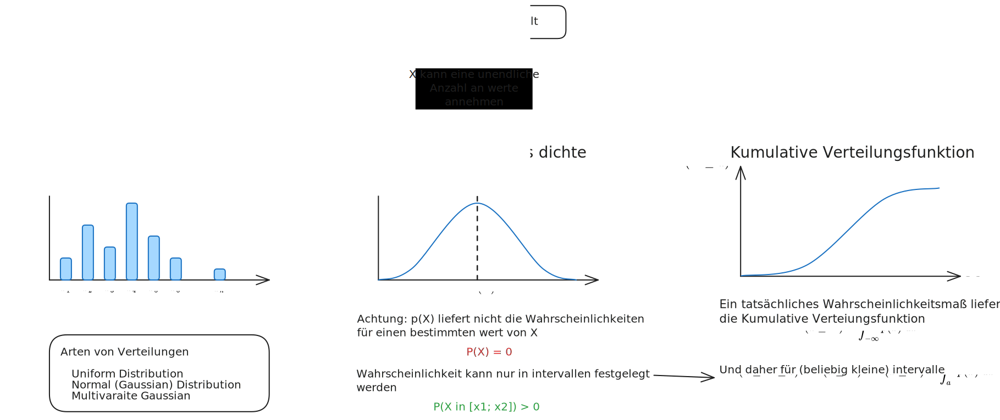

# Wahrscheinlichkeitstheorie

- Klassifizierung von [Ereignissen](Ereignis.md) (Abhängig oder Unabhängig)
- [Unbedingte Wahrscheinlichkeit](Unbedingte%20Wahrscheinlichkeit.md)
- [Bedingte Wahrscheinlichkeit](Bedingte%20Wahrscheinlichkeit.md)

Wslk. Verteilung vs Wslk. Verteilungsdichte (PDF) und CDF

%%[🖋 Edit in Excalidraw](../../_assets/ProbabilityBasics.md)%%

# Stochastische Prozesse

# Statistik

- - -

[Math in Finance - MIT OCW](https://youtube.com/playlist?list=PLWCeZ4czgx2nBByK4OVfnGrdICxKMWeKw)