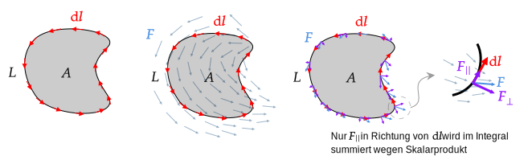

 

# Stokesscher Integralsatz

Der Stokessche Integralsatz ist ein Satz aus der Vektoranalysis, der die Beziehung zwischen einem Linienintegral über den Rand einer Fläche und einem Oberflächenintegral über die Fläche selbst beschreibt.

> [!satz] **S1 - STOI)** Stokesscher Integralsatz
> Sei $\boldsymbol{F}$ ein Vektorfeld und $A$ eine Fläche, die von einer geschlossenen Kurve $L$ umgeben ist. Dann gilt:
> 
> $$\int_{A}(\nabla \times \boldsymbol{F}) \cdot \mathrm{d} \boldsymbol{a}=\oint_L \boldsymbol{F} \cdot \mathrm{d} \boldsymbol{l}$$
> 
> häufig wird auch statt $L$ der Ausdruck $\partial A$ geschrieben. Wodurch verdeutlicht werden soll, dass die Kurve tatsächlich die Kontur der Fläche $A$ ist.
> 
> Die Fläche $A$ leigt dabei im $\mathbb{R}^{3}$ und ist von der Kurve $L$ umgeben. Die Fläche kann auch gekrümmt sein. Kann aber keine Löcher enthalten.

Die Erweiterung des Stokesschen Integralsatz auf geschlossene Flächen in einem Volumen ist der [Gaußsche Integralsatz](Analysis/Gaußscher%20Integralsatz.md).

## Erläuterung

### Rechte Seite

> [!question] Rechte Seite: $\oint_{L} \boldsymbol{F}\cdot \mathrm{d}\boldsymbol{l}$
> 
> - $\mathrm{d} \boldsymbol{l}$ ist ein Inifitesimales Stück der Kurve $L$, über das integriert wird.
> - Das Ringintegral setzt vorraus, dass die Kurve $L$ geschlossen ist, das bedeutet, dass der Startpunkt gleich dem Endpunkt ist.
> 
> Durch eine Verknüpfung der Vektoren $\boldsymbol{F}$ und $\mathrm{d} \boldsymbol{l}$ mit dem Skalarprodukt geht nur der Anteil $\boldsymbol{F}_{\|}$, der parallel zur Kurve $L$ verläuft, in das Integral ein.
> 
> 
> 

#### In der Elektrotechnik:

> [!hint] Ist $\boldsymbol{F}$ das [elektrische Feld](../Elektrotechnik/Elektrisches%20Feld.md) $\boldsymbol{E}$:
> so entspricht das Linienintegral dem [elektrischen Potenzial](../Elektrotechnik/elektrische%20Spannung.md) $\varphi_{e}$ entlang der Kurve $L$.
>
> - Die Potenzialdifferenz ist proportional zur Energie die ein positiv geladenes Teilchen Entlang dieser Linie gewinnt bzw. ein negativ geladenes Teilchen verliert.
> - Da die Potenzialdifferenz zwischen Start und Endpunkt gleich $0$ begründet dieser Satz die [Maschenregel](../Elektrotechnik/Kirchhoffsche%20Regeln.md).
> 
> > [!quote] Diese Form des Linienintegrals ist in der Integralform der 3. [Maxwell](../Elektrotechnik/Maxwell.md)-Gleichung - dem Faradayschen Induktionsgesetz - enthalten.
> 

> [!hint] Ist $\boldsymbol{F}$ die magnetische Feldstärke $\boldsymbol{H}$:
> so entspricht das Linienintegral dem magnetischen Potential $\varphi_{m}$ entlang der Kurve $L$.
> > [!quote] Diese Form ist in der Integralform der 4. [Maxwell](../Elektrotechnik/Maxwell.md)-Gleichung - dem Durchflutungssatz - enthalten.

### Linke Seite

> [!question] Linke Seite: $\int_{A}(\nabla \times \boldsymbol{F}) \cdot \mathrm{d} \boldsymbol{a}$
> 
> 
> 
> Der Rotor des Vektorfeldes $\boldsymbol{F}$ zeigt in die Richtung, die normal auf die Ebene steht in der das Vektorfeld Rotiert. (Effekt des [Kreuzproduktes](Algebra/Kreuzprodukt.md))
> 
> Es Wird Wiederum nur der Anteil des Vektorfeldes $\nabla \times \boldsymbol{F}$ in das Integral einbezogen, der parallel zu den Flächenelementen $\mathrm{d}\boldsymbol{a}$ verlaufen. (Effekt des [Skalarproduktes](Algebra/Skalarprodukt.md)) 
> 
> 
> Hier ist zu sehen dass sich die Inneren Rotoren des Vektorfeldes aufheben und nur der Randrotor in das Integral einfließt.

> [!success] Schlussfolgerung
> Durch die oben angeführten Überlegungen lässt darauch schließen dass Integration entlang einer Linie und Integration über die Fläche, bei der sich der Rotor bis auf den Rand aufhebt, äquivalent sind.
> 

---

