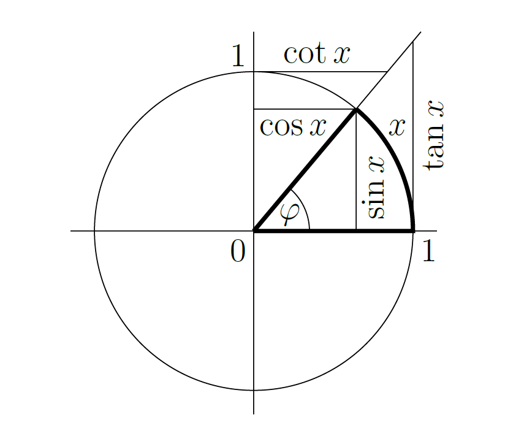

 

# Trigonometrische Funktionen

> [!def] **D1 - TRIG)** Die trigonometrischen Funktionen sind definiert wie:
> 
> $$
> \begin{align}
> \text{Sinus} &\quad \sin : \mathbb{R} \rightarrow[-1,1] \\
> \text{Cosinus} &\quad \cos : \mathbb{R} \rightarrow[-1,1]  \\
> \text{Tangens} &\quad \tan : \mathbb{R} \backslash D_1 \rightarrow \mathbb{R}, \quad x \mapsto \frac{\sin x}{\cos x} \\
> \text{Cotangens} &\quad \cot:\mathbb{R} \backslash D_2 \rightarrow \mathbb{R}, \quad x \mapsto \frac{\cos x}{\sin x}
> \end{align}
> $$
> 
> mit $D_1:=\left\{\frac{\pi}{2}+k \pi: k \in \mathbb{Z}\right\}$ und $D_2:=\{k \pi: k \in \mathbb{Z}\}$.
> Das Argument $x \in \mathbb{R}$ entspricht dabei dem Winkel in Radiant (rad), also der Länge des Bogens am Einheitskreis.
> > [!info] **==$\pi$==** bezeichnet die halbe Länge des Einheitskreises.

**Trignometrische Funktionen im Einheitskreis**

- Die Funktion $\sin(x)$ eingeschränkt auf das Intervall $\left[-\dfrac{\pi}{2}, \dfrac{\pi}{2}\right]$ streng monoton wachsend
- und die Funktion $\cos (x)$ eingeschränkt auf das Intervall $[0, \pi]$ streng monoton fallend, jeweils mit Bild $[-1,1]$. 

- Analog gilt, dass die Funktion $\tan (x)$ das Intervall $\left(-\dfrac{\pi}{2}, \dfrac{\pi}{2}\right)$ streng monoton wachsend und [bijektiv](Algebra/Abbildung.md) nach $\mathbb{R}$ abbildet.

---

## Winkelsätze

$$
\begin{gather}

\sin (k \pi)= 0 =\cos \left(\frac{\pi}{2}+k \pi\right),\qquad k \in \mathbb{Z} \\
\cos (0) =\sin \left(\frac{\pi}{2}\right)=1 \qquad\cos (\pi) = \sin \left(\frac{3 \pi}{2}\right)=-1 \\
\end{gather}
$$

### Komplexer Zusammenhang

> [Eulersche Formel](Analysis/Eulersche%20Formel.md)

$$
\begin{aligned}
& \cos (x)=\frac{e^{\mathrm{j} x}+e^{-\mathrm{j} x}}{2} \\
& \sin (x)=\frac{e^{\mathrm{j} x}-e^{-\mathrm{j} x}}{2 \mathrm{j}}
\end{aligned}
$$

### Symmetrie

> [!satz] **S1 - WSYM)** Winkelsymmetriesätze ^TRIG-S1
> $$
> \begin{aligned}
> \sin (-x) & =  -\sin x & \cos (-x) & = \cos x \\
> \sin \left(x+\frac{\pi}{2}\right) & = \cos x & \cos \left(x+\frac{\pi}{2}\right) & =-\sin x \\
> \sin (x+\pi) & = -\sin x & \cos (x+\pi) & = -\cos x \\
> \sin (x+2 \pi) & = \sin x & \cos (x+2 \pi) & = \cos x \\
> \end{aligned}
> $$

### Pythagoras

> [!satz] **S2 - PYTH)** Satz von Pythagoras ^PYTH
>
>$$\sin ^{2} x+\cos ^{2} x=1$$

### Doppelwinkel

> [!satz] **S3 - DOPW)** Doppelwinkel Sätze
> $$
> \begin{align} 
> \cos (2 x) & =\cos ^2(x)-\sin ^2(x) & \sin (2 x) & =2 \sin (x) \cos (x) \\
> 1+\cos (2 x) & =2 \cos ^2(x) & 1+\sin (2 x) & =(\sin (x)+\cos (x))^2 \\
> 1-\cos (2 x) & =2 \sin ^2(x) & 1-\sin (2 x) & =(\sin (x)-\cos (x))^2
> \end{align} 
> $$

> [!satz] **S3 - MOIV)** Satz von Moivre
> $$(\cos x + j\sin x)^{n} = \cos(nx)+j\sin(nx)$$

### Winkelsummen

> [!satz] **S4 - WSUM)** Winkelsummen Sätze
> $$
> \begin{aligned}
> \sin (x+y) & =\sin x \cos y+\cos x \sin y \\
> \cos (x+y) & =\cos x \cos y-\sin x \sin y \\
> \end{aligned}
> $$

---

### Summen von Winkelfunktionen

> [!satz] **S5 - TADD)** Trigonometrische Additionssätze
> $$
> \begin{align}
> \sin x-\sin y & =2 \cos \left(\frac{x+y}{2}\right) \sin \left(\frac{x-y}{2}\right) \\
> \sin x+\sin y & =2 \sin \left(\frac{x+y}{2}\right) \cos \left(\frac{x-y}{2}\right) \\
> \cos x-\cos y & =-2 \sin \left(\frac{x+y}{2}\right) \sin \left(\frac{x-y}{2}\right) \\
> \cos x+\cos y & =2 \cos \left(\frac{x+y}{2}\right) \cos \left(\frac{x-y}{2}\right)
> \end{align}
> $$

### Produkte von Winkelfunktionen

> [!satz] **S6 - TMUL)**
> $$
> \begin{aligned}
> & \sin x \sin y=\frac{1}{2}(\cos (x-y)-\cos (x+y)) \\
> & \cos x \cos y=\frac{1}{2}(\cos (x-y)+\cos (x+y)) \\
> & \sin x \cos y=\frac{1}{2}(\sin (x-y)+\sin (x+y)) \\
> & \tan x \tan y=\frac{\tan x+\tan y}{\cot x+\cot y}=-\frac{\tan x-\tan y}{\cot x-\cot y} \\
> & \cot x \cot y=\frac{\cot x+\cot y}{\tan x+\tan y}=-\frac{\cot x-\cot y}{\tan x-\tan y} \\
> & \tan x \cot y=\frac{\tan x+\cot y}{\cot x+\tan y}=-\frac{\tan x-\cot y}{\cot x-\tan y}
> \end{aligned}
> $$

## Arkusfunktionen

Es gibt zu den trigonometrischen Funktionen jeweils Umkehrfunktionen, genannt Arkusfunktionen:

> [!def] **D2 - ARKF)** 
> $$
> \begin{align}
> \text{Arkussinus}&\quad \arcsin :[-1,1] \rightarrow\left[-\dfrac{\pi}{2}, \dfrac{\pi}{2}\right] \\
> \text{Arkuscosinus}&\quad\arccos :[-1,1] \rightarrow[0, \pi]\\
> \text{Arkustangens}&\quad\arctan : \mathbb{R} \rightarrow\left(-\dfrac{\pi}{2}, \dfrac{\pi}{2}\right)
> \end{align}
> $$

## Integrale

$$
\begin{aligned}
\text{Trig.-Funktionen:} & \int \sin x d x=-\cos x,\quad\int \cos x d x=\sin x,\\
& \int \tan x d x=-\ln |\cos x| \quad \text { auf } \quad\left((2 k-1) \frac{\pi}{2},(2 k+1) \frac{\pi}{2}\right) \quad(k \in \mathbb{Z})\\
\text{Arkus-Funktionen:} &  \int \frac{1}{\sqrt{1-x^2}} d x=\arcsin x \quad \text { auf }(-1,1)\\
&\int \frac{1}{1+x^2} d x=\arctan x
\end{aligned}
$$

