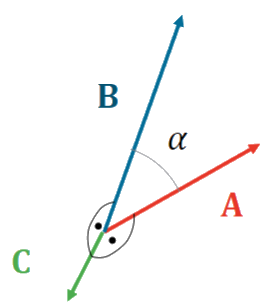

 

# Kreuzprodukt / äußeres Produkt

Das äußere Produkt zweier Vektoren liefert den Normalanteil zweier Vektoren.

> [!info] Es hängt deshalb mit dem $\sin$ zusammen, da:
> - $\sin(0°) = 0$: Vektoren mit der Winkeldifferenz $0°$ zeigen in die selbe Richtung.
> - $\sin(90°) = 1$: Vektoren mit der Winkeldifferenz $90°$ sind *Normal* aufeinander.

Form des äußeren Produkts welche ein Skalar (länge des Normalvektors) liefert:

$\lvert \vec{C} \rvert = \lvert \vec{A}\times \vec{B} \rvert = \lvert \vec{A} \rvert\cdot \lvert \vec{B} \rvert\cdot \sin(\alpha)$

Vektorform:

$\vec{C}= \vec{A} \times \vec{B} =\left(\begin{array}{l} A_y B_z-A_z B_y \\ A_z B_x-A_x B_z \\ A_x B_y-A_y B_z \end{array}\right)$

---