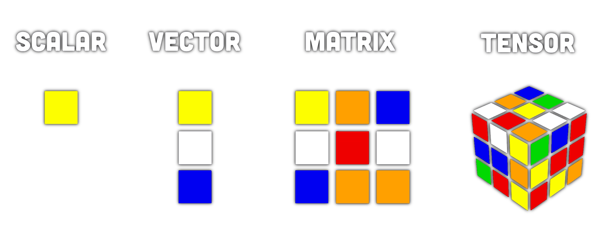
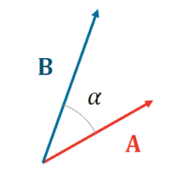

# Vektoren

## Skalarprodukt / Inneres Produkt

Das innere Produkt zweier Vektoren liefert den Anteil der in die Selbe Richtung zeigt immer als Skalar.
(bzw. den Anteil der auf den Anderen Vektor projiziert wird)
Es hängt deshalb mit dem $\cos$ zusammen.
- $\cos(0°) = 1$: Zeigen in die selbe Richtung ($100\%$ werden auf den anderen Vektor projiziert)
- $\cos(90°) = 0$: Der projizierte Anteil ist $0$

## Kreuzprodukt / äußeres Produkt

Das äußere Produkt zweier Vektoren liefert den Normalanteil zweier Vektoren.
Es hängt deshalb mit dem $\sin$ zusammen, da:
- $\sin(0°) = 0$: Vektoren mit der Winkeldifferenz $0°$ zeigen in die selbe Richtung.
- $\sin(90°) = 1$: Vektoren mit der Winkeldifferenz $90°$ sind *Normal* aufeinander.

Form des äußeren Produkts welche ein Skalar (länge des Normalvektors) liefert
$\lvert \vec{C} \rvert = \lvert \vec{A}\times \vec{B} \rvert = \lvert \vec{A} \rvert\cdot \lvert \vec{B} \rvert\cdot \sin(\alpha)$

Vektorform:

$\vec{C}= \vec{A} \times \vec{B} =\left(\begin{array}{l} A_y B_z-A_z B_y \\ A_z B_x-A_x B_z \\ A_x B_y-A_y B_z \end{array}\right)$

---

# Tags

- [Matrix](../mathe%20(4)/Matrix.md)
- Tensor
- Vektorbasis
- [Lineare Hülle](../mathe%20(4)/Lineare%20Hülle.md)