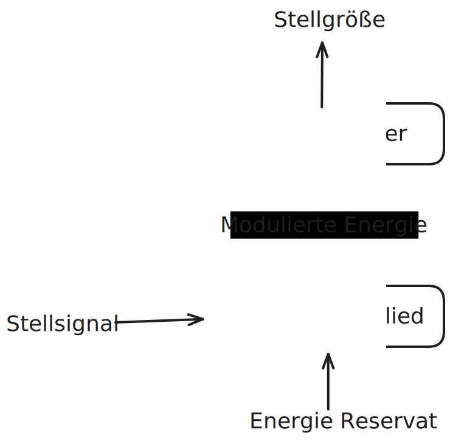

---
tags:
  - ""
aliases:
  - Aktor
subject:
  - mtrs
created: 31st March 2022
---

# Aktorik

Aktoren (en.: actuator) setzen elektrische Signale (z.B. von einem Steuerungscomputer) in mechanische [Bewegung](../Physik/Kinematik/Kinematik.md) , bzw. in andere physikalische Größen um.

%%[🖋 Edit in Excalidraw](../_assets/Excalidraw/Aktor-BSB.md)%%

# Aktoren Übersicht

## EM-Aktoren: [Elektromagnet](../Physik/Elektromagnet.md)

[Elektromagnet](../Physik/Elektromagnet.md) Aktoren sind Aktoren, die im allgemeinen auf ein [EM-Feld](../Physik/Feldtheorie/index.md) mit [Bewegung](../Physik/Kinematik/Kinematik.md) reagieren z.B. [Relais](Relais.md)

$\rightarrow$ Mechanische Translation. [Elektromagnet](../Physik/Elektromagnet.md) und [Spule](../Elektrotechnik/Induktivität.md) werden benötigt.

### Elektromotor

- Stator mit Permanentmagneten verursacht ein statisches [Magnetfeld](../Elektrotechnik/magnetisches%20Feld.md).
- Rotor mit [Elektromagnet](../Physik/Elektromagnet.md) der sich dreht.
- Kommutator sorgt für die Umpolung des Rotor.

**Funktionsweise:** Der Rotor dreht sich bis $+$ und $-$ bei einander sind, jetzt dreht der Kommutator die Polung um, sodass gleiche Pole beieinanderliegen uns sich abstoßen.

## Fl.-Druck-Aktoren: Hydraulik

Hydraulische Aktoren arbeiten mit Druck von Flüssigkeiten.

Vorteil: Wasser ist im flüssigen Zustand unkompremierbar.

## Gasdruck-Aktoren: Pneumatik

Pneumatische Aktoren arbeiten mit Gasdruck

## Thermo-Aktoren

## Pyrotechnische-Aktoren

---

# Tags