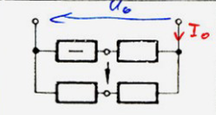
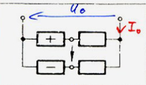

---
tags:
aliases:
  - Gleichstrom Messbrücke
keywords:
subject:
  - VL
  - Elektrotechnik
  - Elektrische Messtechnik und Sensorik
semester: SS24
created: 31. August 2023
professor:
---
 

# Gleichstrom Messbrücke

> [!question] [Wechselstrom Messbrücke](AC-Messbrücke.md)

---

| No. | Messbrücke                           | $U_{0}$ gespeist                                      | $I_{0}$ gespeist |   Brückenart   |
| :-: | ------------------------------------ | ----------------------------------------------------- | ---------------- | :------------: |
|  a  |  | $$U_{d}=+\frac{U_{0}}{4}\cdot\frac{\Delta R}{R_{0}}$$ |                  | Viertel-Brücke |
|  b  |  | $$U_{d}=-\frac{U_{0}}{4}\cdot\frac{\Delta R}{R_{0}}$$ |                  | Viertel-Brücke |
|  c  |  | $$U_{d}=-\frac{U_{0}}{4}\cdot\frac{\Delta R}{R_{0}}$$ |                  | Viertel-Brücke |
|  d  |  |                                                       |                  |  Halb-Brücke   |
|  e  |  |                                                       |                  |  Halb-Brücke   |
|  f  |  |                                                       |                  |  Halb-Brücke   |
|  g  |  |                                                       |                  |  Halb-Brücke   |
|  h  |  |                                                       |                  |  Voll-Brücke   |

[Wheatstone-Brücke](Wheatstone-Brücke.md)

# Beispiele

[INTERNAL - EMTS UE03](../xEDU/B4_SS25/EMTS/UE/UE03.md)
