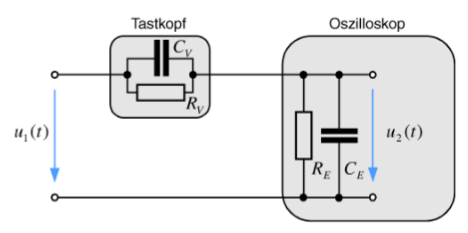

---
tags:
aliases:
keywords:
subject:
  - VL
  - Elektrische Messtechnik und Sensorik
  - PR
semester: WS25
created: 27th February 2025
professor:
release: false
title: Oszilloskop
---

# Oszilloskop

## Kanäle

 [^1]

Das Oszilloskop verfügt über ein bis 4 Kanäle Kanäle, mit welchen jeweils verschiedene Signale gemessen werden können. An die BNC-Stecker unterhalb der Kanal-Menü Tasten sind die Proben für die jeweiligen Signal anzustecken.

### Kopplung

Mit der Kopplung eines Kanals lässt sich einstellen, mit welcher Referenz das Signal angezeigt wird. Bei der DC-Kopplung wird das Signal mit Bezug auf 0V dargestellt.

Bei der AC-Kopplung wird als Referenz der Mittelwert des Signals genommen, um nur den Wechselanteil des Signals darzustellen.

### Invertierung

Invertierung des Signals hat besonders im XY-Betrieb den Vorteil, um die Achsen einstellen zu können. z.B. Beim Aufzeichnen einer Kennlinie

### Bandbreitenbegrenzung

Die Bandbreitenbegrenzung wird durch einen Tiefpass im Oszilloskop realisiert, um hochfrequente Störsignale zu Filtern [^2].

## Trigger

Der Einstellung des Triggers legt fest, wann das Oszilloskop eine neue Periode des Wechselsignals aufnimmt. Üblicherweise erfolgt dies über das Festlegen eines Schwellenwertes des Signals. Es ist aber auch möglich, das Trigger Signal extern einzuspeisen. Im Fall des Agilent 5441D ist es auch möglich den Trigger auf einen der 16 Digitalen Pins zu setzen.

## Tastköpfe

Für Messungen höherer Frequenzen ist es wichtig Tastköpfe und nicht einfache BNC-Kabel zu verwenden.

10:1 Tastkopf kann verwendet werden, damit der gesamtwiderstand größer ist und weniger Strom in das Messgerät fließt -> genauere Ergebnisse bei kleinstromigen Schaltungen.

### Frequenzkompensation

> [!important] Das besondere an den Tastköpfen des Oszilloskops ist, dass sie [frequenzkompensierte Spannungsteiler](../Elektrotechnik/Spannungsteiler.md#Frequenzkompensierter%20Spannungsteiler) sind.

Die bedingung für die frequenzunabhängigkeit ist: $R_{V}C_{V} = R_{E}C_{E}$. Um zu Überprüfen ob der Tastkopf korrekt kompensiert ist, kann ein Rechtecksignal direkt am Oszi Ausgang abgegriffen werden, und die Wellenform Betrachtet werden.

| Richtig Kompensiert | Überkompensiert | Unterkompensiert |
| - | - | - |
| schönes Rechtecksignal | Hochpass-Form | Tiefpass-Form |

# Tags

[^1]: Agilent 5441D
[^2]: [Keysight EDADOCS - BW-Limit](https://edadocs.software.keysight.com/kkbopen/what-is-the-bandwidth-limit-bw-limit-feature-and-how-does-it-differ-among-the-various-models-of-infiniium-scopes-589305657.html)