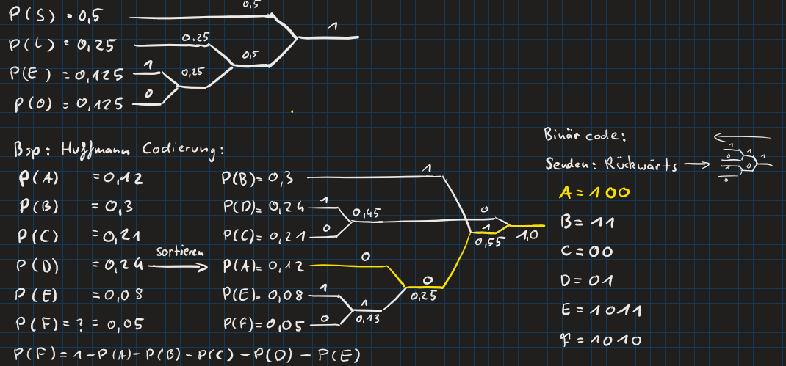
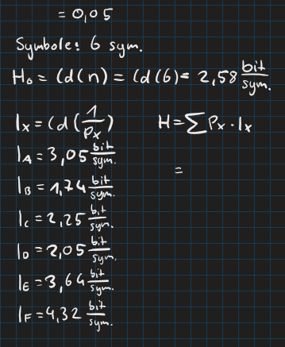
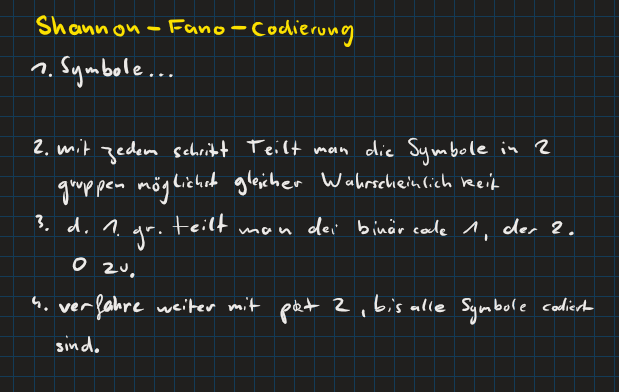
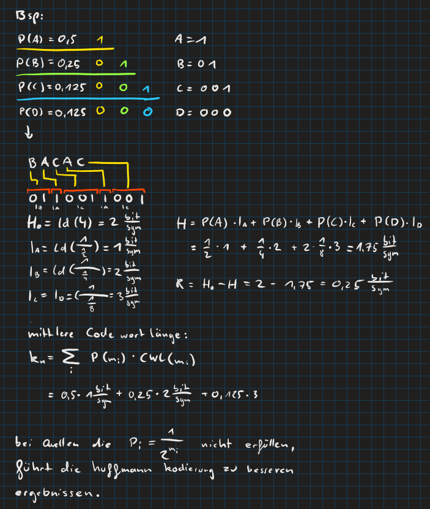

# Kodierung

## Hamming Code

> [!question] [Hamming Code](Hamming%20Code.md)

## Huffmann Kodierung

  
  
Mittlere Codewortlänge
$$
\begin{align*}
k_{m}&= \sum\limits_{i}P(i)\cdot n(i)
\end{align*}
$$

## Shannon Fano Kodierung

  
