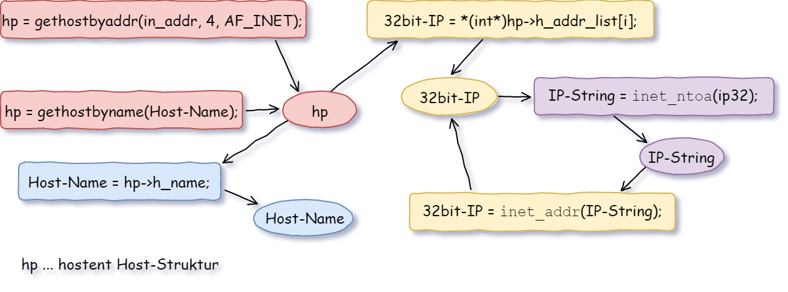
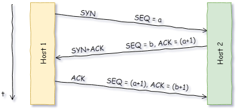

# Netz

## Basis-Strukturen

- *hostent*-Struktur - diese Struktur beinhaltet Informationen über einen Host: 

  ```c
  struct  hostent {
  	char	*h_name;
  	char	**h_aliases;
  	short	h_addrtype;
  	short	h_length;
  	char	**h_addr_list;
  #define h_addr h_addr_list[0]
  };
  ```

  - *h_name*: Kanonischer Name des Hosts
  - *h_aliases*: Alias-Liste, letztes Element = *NULL*
  - *h_addrtype*: Typ der Adresse, für IPv4: AF_INET
  - *h_length*: Länge der Adresse in Bytes (IPv4: 4)
  - *h_addr_list*: Liste von IP-Adressen für den Host, letztes Element = *NULL*
  - *h_addr*: üblicher Alias für *h_addr_list[0]*

  diese Informationen können ermittelt werden mittels:

  ```c
  struct hostent *gethostbyname(const char *name);
  struct hostent *gethostbyaddr(const char *addr, int len, int type);
  ```

  Beispiele:

  ```c
  struct hostend *remoteHost;
  char *host_name = "www.google.at";
  remoteHost = gethostbyname(host_name);
  
  struct in_addr addr;
  char *host_addr = "172.217.16.99";
  addr.s_addr = inet_addr(host_addr);
  remoteHost = gethostbyaddr((char *) &addr, 4, AF_INET);
  
  printf("Official name: %s\n", remoteHost->h_name);
  printf("First Alias: %s\n", *(remoteHost->h_aliases));
  char *myAddr = inet_ntoa(*(u_long *) remoteHost->h_addr_list[1]);
  printf("Second Address: %s\n", myAddr);
  ```

- *in_addr*  
  Struktur für die Spezifikation einer (IP-) Adresse.

  ```c++
  struct in_addr {
    uint32_t  s_addr; // 4-Byte-address/network byte order
  };
  ```

  - *s_addr*: IP-Adresse, wichtig: in Netzwerk-Byte-Order (die Byte-Order ist auf unterschiedlichen OS verschieden -> Konvertieren).

  Im Allgemeinen ist die Adresse nicht 32 Bit groß, das hängt selbstverständlich von den Protokollen ab (z.B. IPv4 oder IPv6). Daher werden die Strukturen in ihrer Verwendung immer nur als Zeiger mit der Größe übergeben. Je nach gewähltem Protokoll wird die Struktur dann entsprechend gecastet.

- *sockaddr_in*

  mit dieser Struktur wird der Adresstyp, die Adresse und der Port spezifiziert.

  ```c++
  struct sockaddr_in {
    short sin_family;
    u_short sin_port;
    struct in_addr sin_addr;
    char sin_zero[8]
  };
  ```

  - *sin_family*: meist *AF_INET* (IPv4)
  - *sin_port*: Port des Transport Protokolls in Network-Byte-Order  
    mittels `htons(51234)`.
  - *sin_addr*: wiederum eine Struktur - beinhaltet die (IPv4) Adresse
  - *sin_zero[]*: reserviert - gesamte Struktur auf Null Setzen

- *addrinfo*

  ```c++
  struct addrinfo {
    int              flags;
    int              family;
    int              socktype;
    int              protocol;
    socklen_t        addrlen;
    struct sockaddr *addr;
    char            *canonname;
    struct addrinfo *next;
  };
  ```

  - *flags*: Optionen die kombiniert werden können (AI_PASSIVE, AI_CANONNAME …)
  - *family*: gibt den Typ der Adresse an (*AF_INET*-IPv4, *AF_INET6*-IPv6, *AF_UNSPEC*-nicht näher definiert)
  - *socktype*: *SOCK_STREAM* oder *SOCK_DGRAM*
  - *protocol*: *IPPROT_UDP* oder *IPPROTO_TCP*
  - *addr_len*, *addr*: Zeiger auf die (eventuell 1te) Adresse des eben spezifizierten Typs 
  - *canonname*: (anerkannter) Name der Verbindung
  - *next*: mit der *addrinfo*-Struktur kann eine Liste gebaut werden. *next* verweist auf das nächste *addrinfo*-Element (oder ist NULL wenn nicht)

### GetAddrInfo

(Für Windows: include ws2tcpip.h) Für die Arbeit mit Sockets müssen obige Strukturen konfiguriert werden. Das übernimmt die Funktion *getaddrinfo()*:

```c++
int getaddrinfo(const char *node, const char *service, const struct addrinfo *hints, struct addrinfo **res)
```

- *node*: entweder Host-Name, Host-IP-Adresse (wenn Internet Protokoll) oder NULL für Server
- *service*: Portnummer (als String) oder Service-Name. Beispiel: "80" ist gleichbedeutend mit "http"
- *hints*: Einstellungen welcher Typ von Socket verwendet werden soll
- *res*: Zeiger auf eine Linked-List auf eine oder mehrere Addrinfo-Strukturen
- *return*: 0 wenn OK, Fehler können ansonsten mittels *gai_strerror* interpretiert werden (nicht Thread-Safe, besser Windows: *WSAGetLastError()*)

```c++
int iResult;
struct addrinfo hints;
struct addrinfo *servinfo;  			// will point to the results

memset(&hints, 0, sizeof hints); 	// make sure the struct is empty
hints.ai_family = AF_UNSPEC;     	// don't care IPv4 or IPv6
hints.ai_socktype = SOCK_STREAM; 	// TCP stream sockets
hints.ai_flags = AI_PASSIVE;     	// fill in my IP for me


if ((iResult = getaddrinfo("www.htl-salzburg.ac.at", "80", &hints, &servinfo)) != 0) {
  fprintf(stderr, "getaddrinfo error: %s\n", gai_strerror(iResult));
  exit(1);
  
  ...
  
freeaddrinfo(servinfo);
```

mit dem Parametern:

- *AF_UNSPEC*: nicht näher definiert, kann daher IPv4 oder IPv6 sein (alternativ z. B. *AF_INET* für IPv4)
- *AI_PASSIVE*: Adresse wird durch den Aufruf gegeben
- *SOCK_STREAM*: Stream-Socket im Gegensatz zu *Datagram*
- *gai_strerror*: Übersetzen eines Fehlercodes in einen String

Wenn die Verbindung nicht mehr benötigt wird, kann die allozierte Liste wieder mit *freeaddrinfo()* freigegeben werden.

Für eine Serveranwendung kann als erster Parameter *localhost* mitgegeben werden. Für eine Client-Anwendung (siehe Code) die Host-Adresse.

Die Auswertung des Ergebnisses kann beispielhaft so erfolgen (Variation je nach Protokoll), hier wird die IP-Adresse zu einer Host-Adresse ermittelt:

```c++
char adr[] = "www.google.at";
struct addrinfo hints;
struct addrinfo *servinfo;  			// will point to the results

memset(&hints, 0, sizeof hints); 	// make sure the struct is empty
hints.ai_family = AF_UNSPEC;     	// don't care IPv4 or IPv6
hints.ai_socktype = SOCK_STREAM; 	// TCP stream sockets
hints.ai_flags = AI_PASSIVE;     	// fill in my IP for me

if ((iResult = getaddrinfo(adr, "80", &hints, &servinfo)) != 0) {
  fprintf(stderr, "getaddrinfo error: %s\n", gai_strerror(iResult));
  exit(1);

}

printf("IP Addressen fuer %s:\n\n", adr);

for(addrinfo *p = servinfo;p != NULL; p = p->ai_next) {
  struct sockaddr_in *ipv4 = (struct sockaddr_in *)p->ai_addr;
  in_addr *addr = &(ipv4->sin_addr);

  // convert the IP to a string and print it:
  printf("  %s\n", inet_ntoa(*addr));
}

freeaddrinfo(servinfo);
```

Für die Adressstrukturen gibt es eine Vielzahl von Helfer-Funktionen. Leider variieren diese Funktionen je nach verwendeten [Betriebssystem](../../Softwareentwicklung/Betriebssysteme/{MOC}%20Operating%20Systems.md).

### Konvertierung Zwischen Host-Adressen

Ein Host wird als Kanonischer-Host-Name, als IP-String (12.333.123.222) oder als 32-Bit IP dargestellt (für IPv4, analog für andere Protokolle).



```c
char *inet_ntoa(struct in_addr in);
int inet_aton(const char *cp, struct in_addr *inp);
in_addr_t inet_addr(const char *cp);
```

n: Network-Byte-Order  
a: ASCII - IP als String der Form 123.123.123.123

Für diese Funktionen gibt es oft neuere Versionen die auch IPv6 kompatibel sind.

### Byte-Reihenfolge-Konvertierungen

```c
uint32_t htonl(uint32_t hostlong);
uint16_t htons(uint16_t hostshort);
uint32_t ntohl(uint32_t netlong);
uint16_t ntohs(uint16_t netshort);
```

n: Network-Byte-Order  
h: Host-Byte-Order  
s/l: short/long

### Peer-Name

```c
int getpeername(int sockfd, struct sockaddr *addr, int *addrlen);
```

Mit dieser Funktion kann der Host zu einer Socket-Deskriptor ermittelt werden. Die Information wird in addr eingetragen.

## TCP Three-Way-Handshake

Ein Aufbau einer Verbindung erfolgt in TCP mittels Three-Way-Handshake 



- *Host 1* möchte eine Verbindung zu *Host 2* aufbauen. Dazu sendet er ein Segment mit gesetzten **SYN**-Flag. Zusätzlich wird die eigene **SEQ**uenz-Nummer mitgeschickt (Nummer von *Host 1*: **a**). Die Nummer wird benötigt um ankommende Pakete im Anschluss richtig reihen zu können.
- *Host 2* nimmt die Verbindung an und sendet daher ein Segment mit gesetzten **SYN**- und **ACK**-Flags. Mit ACK wird die von *Host 1* empfangene Sequenznummer inkrementiert wieder zurückgesendet. Als Sequenz-Nummer wird die eigene Sequenznummer **SEQ** mitgesendet (**b**).
- *Host 1* prüft die empfangene ACK-Nummer und bestätigt den erhalt mit gesetztem **ACK**-Flag und der vom *Host 2* empfangenen und inkrementierten ACK-Nummer. Die eigene Sequenznummer wird erhöht und wiederum mitgesendet.

Damit ist ein Verbindungsaufbau erfolgt und es können Segmente gesendet/empfangen werden.

Beispiel *Wireshark*:

```
65239 -> 51234 [SYN] Seq=4216822417
51234 -> 65239 [SYN, ACK] Seq=388098023 Ack=4216822418
65239 -> 51234 [ACK] Seq=4216822418 ACK=388098024
```

Für diese Aufzeichnung wurde ein Server (Well-Known-Port 51234) mittels Telnet kontaktiert (eigener Port wurde auf 65239 gesetzt). (Üblicherweise stellt Wireshark die Sequenznummern auf *relative* Werte, da die angeführten Werte nicht so schnell zu erkennen sind).

## HTTP WEB-Server-Beispiel

Ein Browser (Client) kann etwa Senden (Anfragen/Request):

```
GET / HTTP/1.1\r\n
Host: 127.0.0.1:51234\r\n
User-Agent: Mozilla/5.0 (Windows NT 10.0; Win64; x64; rv:72.0) Gecko/20100101 Firefox/72.0\r\n
Accept: text/html,application/xhtml+xml,application/xml;q=0.9,image/webp,*/*;q=0.8\r\n
Accept-Language: de,en-US;q=0.7,en;q=0.3\r\n
Accept-Encoding: gzip, deflate\r\n
Connection: keep-alive\r\n
Upgrade-Insecure-Requests: 1\r\n
```

Die erste Zeile ist klar definiert. Mit GET wird nach dem Verzeichnis "/" gefragt (könnte auch /pfad/ching.html sein). Anschließend wird die HTTP-Version mitgegeben. Die weiteren Informationen sind zu einem guten Teil optional. Es gehört "zum guten Ton" gewisse Information mitzusenden. Als Anfragender soll bekannt gemacht werden wer man ist.

Ein Server kann darauf so antworten:

```
HTTP/1.1 200 OK\r\n
Content-Length: 94\r\n
Content-Type: text/html\r\n
\r\n
<!DOCTYPE html><html><h1>Hallo Welt! Welcome on the coolest webserver ever _[:]o</h1></html>\r\n
```

Auch hier gibt es jede Menge optionale Parameter. Wichtig ist hier: *HTTP/1.1 200 OK* - damit wird die Version und eine positive Bestätigung (2xx) gesendet (der Text ist "ein wenig" variabel).

Die Parameter werden mit *CRLF* (\r\n - 0x0d 0a) getrennt (nicht Betriebssystemabhängig).

**Wireshark Mitschnitt (die Teile vor dem HTTP-Inhalten sind TCP/IP-Daten):**

```
Anfrage:
0000   02 00 00 00 45 00 01 95 59 8e 40 00 80 06 00 00   ....E...Y.@.....
0010   7f 00 00 01 7f 00 00 01 d0 7e 00 50 d7 42 bd 62   .........~.P.B.b
0020   50 c3 c6 d9 50 18 27 f9 6e ad 00 00 47 45 54 20   P...P.'.n...GET 
0030   2f 20 48 54 54 50 2f 31 2e 31 0d 0a 48 6f 73 74   / HTTP/1.1..Host
0040   3a 20 31 32 37 2e 30 2e 30 2e 31 0d 0a 55 73 65   : 127.0.0.1..Use
0050   72 2d 41 67 65 6e 74 3a 20 4d 6f 7a 69 6c 6c 61   r-Agent: Mozilla
0060   2f 35 2e 30 20 28 57 69 6e 64 6f 77 73 20 4e 54   /5.0 (Windows NT
0070   20 31 30 2e 30 3b 20 57 69 6e 36 34 3b 20 78 36    10.0; Win64; x6
0080   34 3b 20 72 76 3a 37 32 2e 30 29 20 47 65 63 6b   4; rv:72.0) Geck
0090   6f 2f 32 30 31 30 30 31 30 31 20 46 69 72 65 66   o/20100101 Firef
00a0   6f 78 2f 37 32 2e 30 0d 0a 41 63 63 65 70 74 3a   ox/72.0..Accept:
00b0   20 74 65 78 74 2f 68 74 6d 6c 2c 61 70 70 6c 69    text/html,appli
00c0   63 61 74 69 6f 6e 2f 78 68 74 6d 6c 2b 78 6d 6c   cation/xhtml+xml
00d0   2c 61 70 70 6c 69 63 61 74 69 6f 6e 2f 78 6d 6c   ,application/xml
00e0   3b 71 3d 30 2e 39 2c 69 6d 61 67 65 2f 77 65 62   ;q=0.9,image/web
00f0   70 2c 2a 2f 2a 3b 71 3d 30 2e 38 0d 0a 41 63 63   p,*/*;q=0.8..Acc
0100   65 70 74 2d 4c 61 6e 67 75 61 67 65 3a 20 64 65   ept-Language: de
0110   2c 65 6e 2d 55 53 3b 71 3d 30 2e 37 2c 65 6e 3b   ,en-US;q=0.7,en;
0120   71 3d 30 2e 33 0d 0a 41 63 63 65 70 74 2d 45 6e   q=0.3..Accept-En
0130   63 6f 64 69 6e 67 3a 20 67 7a 69 70 2c 20 64 65   coding: gzip, de
0140   66 6c 61 74 65 0d 0a 43 6f 6e 6e 65 63 74 69 6f   flate..Connectio
0150   6e 3a 20 6b 65 65 70 2d 61 6c 69 76 65 0d 0a 55   n: keep-alive..U
0160   70 67 72 61 64 65 2d 49 6e 73 65 63 75 72 65 2d   pgrade-Insecure-
0170   52 65 71 75 65 73 74 73 3a 20 31 0d 0a 43 61 63   Requests: 1..Cac
0180   68 65 2d 43 6f 6e 74 72 6f 6c 3a 20 6d 61 78 2d   he-Control: max-
0190   61 67 65 3d 30 0d 0a 0d 0a                        age=0....
Antwort:
0000   02 00 00 00 45 00 00 cf 59 94 40 00 80 06 00 00   ....E...Y.@.....
0010   7f 00 00 01 7f 00 00 01 00 50 d0 7e 50 c3 c6 d9   .........P.~P...
0020   d7 42 be cf 50 18 27 f9 5d df 00 00 48 54 54 50   .B..P.'.]...HTTP
0030   2f 31 2e 31 20 32 30 30 20 4f 4b 0d 0a 43 6f 6e   /1.1 200 OK..Con
0040   74 65 6e 74 2d 4c 65 6e 67 74 68 3a 20 34 32 0d   tent-Length: 42.
0050   0a 43 6f 6e 74 65 6e 74 2d 54 79 70 65 3a 20 74   .Content-Type: t
0060   65 78 74 2f 70 6c 61 69 6e 0d 0a 0d 0a 3c 3f 78   ext/plain....<?x
0070   6d 6c 20 76 65 72 73 69 6f 6e 3d 22 31 2e 30 22   ml version="1.0"
0080   20 65 6e 63 6f 64 69 6e 67 3d 22 75 74 66 2d 38    encoding="utf-8
0090   22 3f 3e 3c 68 31 3e 48 61 6c 6c 6f 20 57 65 6c   "?><h1>Hallo Wel
00a0   74 21 20 57 65 6c 63 6f 6d 65 20 6f 6e 20 74 68   t! Welcome on th
00b0   65 20 63 6f 6f 6c 65 73 74 20 77 65 62 73 65 72   e coolest webser
00c0   76 65 72 20 65 76 65 72 20 5f 5b 3a 5d 6f 3c 2f   ver ever _[:]o</
00d0   68 31 3e                                          h1>
```