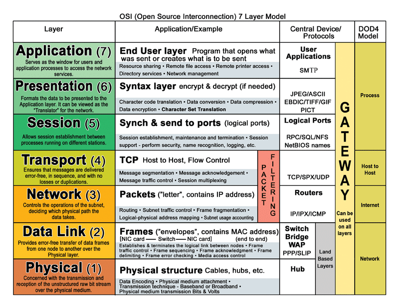

# 1 Netzwerke Allgemeines

## Netzwerk-Architektur

Es gibt unterschiedliche Formen der Architektur, welche verwendet wird, hängt von der konkreten Anwendung ab.

### Client-Server-Architektur

In einer solchen (logischen) Struktur wird zwischen Server und Client unterschieden. Ein Server ist nicht zwangsläufig ein eigener Computer (Hardware), er ist vielmehr ein Dienst der zur Verfügung gestellt wird. Ein Client ist eine Software die einem Dienst anfordert. Grundsätzlich können unterschiedliche Server und Clients auf ein und dem selben Rechner zur gleichen Zeit laufen.

Beispiele für gängige Server-Anwendungen sind:

- Mail-Server (der liefert meinem Client-Mailprogramm Mails wenn abgefragt wird)
- Drucker-Server: wird etwas im Netzwerk gedruckt, dann sendet ein Druckertreiber (Client) an den Drucker-Server (eventuell Software nur im Drucker)
- Web-Server: ein Browser (Client) fragt nach einer Seite (beim Web-Server)
- [Datenbank](../../Softwareentwicklung/Datenbanken/Datenbank.md): eine Datenbankanwendung (php, c# …) kommuniziert mit einer [Datenbank](../../Softwareentwicklung/Datenbanken/Datenbank.md) (DB-Server)
- Applikation-Server: Anwendung laufen auf Server

Ganz wichtig damit das funktionieren kann: die Sprache im Netzwerk muss geregelt sein. Der Anwender möchte sich nicht darum kümmern -> Protokolle.

Komponenten:

- Client: Dienstanforderer

- Server: Diensterbringer
- Abwicklungsprotokoll, wird von beiden Partnern verstanden

=> Vorteil dieser Struktur: Client und Server können auf unterschiedlichen Plattformen (Betriebssystemen/Hardware) laufen.

Die Server-Client-Struktur hat sich für sehr viele Anwendungen durchgesetzt. Der Grund liegt in der Einfachheit und klaren Definition der Rollen.

## Medizintechnische Netzwerk-Klassen

Im medizinischen Bereich:

- Netzwerkklasse A: allgemeine Computernetzwerke (Krankenhausinformationssysteme)

- Netzwerkklasse B: Computernetzwerke im klinischen Einsatz (z.B. Vernetzung klinische Abteilung mit zentralen medizinischen Bildarchiv)
- Netzwerkklasse C: hochsicherheitskritische klinische Bereiche, z.B. Monitoring in der Intesivmedizin. Diese Klasse ist (physisch) unabhängig von anderen Systemen zu verwirklichen.

## Anderes

- [[../MAC]]	
- **Port**	Ports werden in Transport-Protokollen (TCP, UDP) verwendet um mehrere Kommunikationskanäle zur Verfügung zu stellen und grob zu zeigen um welchen Dienst es sich handelt (siehe oben).
- **Socket**	Ein durch eine RFC definierter Begriff (Socket ~ Steckdose). Ein Socket ist ein Bündel aus Quell-/Ziel-IP und -Port. Zusätzlich noch mit dem verwendeten Protokoll. Es ist damit ein API zwischen Transport und Anwendungsebene für die Anbindung mittels TCP/IP oder IrDA (praktisch).
- **Repeater**	Verbinden von Netzwerksegmenten auf OSI1. Verbundene Netze dürfen keine Zyklen haben (ansonsten können Pakete kreisen). Sie dienen als Verstärker, mit ihnen können daher Netzwerke räumlich vergrößert werden.
- **Bridge**	Eine Bridge arbeitet auf OSI2 (MAC-Schicht). Eine Bridge puffert Pakete und wirkt damit als Buffer bei Kollisionen. Sie übermittelt den Datenverkehr der von einem Netzwerk-Segment in das benachbarte muss und blockiert die anderen. Damit können Kollisionen reduziert werden und räumlich Netzwerke vergrößert werden.
- **Hub**	*einfachste* Komponente an Schnittstellen in einem Netzwerk. Ein Hub leitet Pakete an sämtliche an ihm angeschlossene Hosts weiter. Dadurch müssen sich an einen Hub angeschlossene Geräte die verfügbare Bandbreite immer teilen und sind nur für den Anschluss von wenigen Geräten sinnvoll. 
- **Switch**	Ähnlich wie ein Hub. Im Gegensatz zu diesem kann ein Switch aber mehrere Geräte zur gleichen Zeit miteinander verbinden. Ein Switch kommuniziert nur mit der adressierten Komponente, er kann aber auch an mehrere gleichzeitig übertragen.
- **Router**	Ein Router verbindet zwei oder mehrere logische Netze. Er arbeitet auf OSI3. In TCP/IP Übertragungen sind in Schicht 3 die Adressen enthalten womit der Router das Paket lenkt. Dazu bedient er sich einer Routing-Tabelle. Ein Router kann unterschiedliche Wege aufgrund Laufzeit auswählen und damit auch Redundanzen oder Lastverteilung durchführen. Router können [DHCP](../Protokolle/DHCP.md) (dynamisches Zuweisen von IP-Adressen an angeschlossene Komponenten) und NAT. Häufig können sie auch MAC oder IP Adressen filtern und haben eine Firewall integriert.
- **NAT**	Network Address Translation. Erfolgt auf dem Router. Übersetzung lokaler Netzwerkadressen in eine ~globale. Damit weiß ein Router welcher lokale Host welchen Dienst im Internet verwendet und kann dementsprechend die Replys durch routen.
- **Gateway**		Ein Gateway kann zwei Geräte bis in die Schicht 7 verbinden. Damit können Anwendungsprotokolle übersetzt werden. Zur Konvertierung eines TCP/IP in ein IBM-SNA wird ein MS-SNA-Server (Gateway) verwendet. Auf einem Host ist der Standard-Gateway diejenige Adresse an die Anfragen weitergeleitet werden, wenn sie nicht im lokalen Adressbereich liegen.
- **CSMA/CD** 	Carrier Sense Multiple Access/Collision Detect: Dieses Verfahren wird in [Ethernet](../Ethernet.md) (nur wenn nicht via Switch) und abgewandelt in WLAN Netzen eingesetzt. Dabei wartet ein Busteilnehmer der Senden möchte auf einen freien Bus. Wenn dieser frei ist beginnt er zu Senden und hört dabei gleichzeitig mit ob seine Daten auf dem Bus ankommen. Wenn nicht (etwa weil ein zweiter genau gleichzeitig zu Senden begonnen hat) wird die Sendung sofort beendet. Ein Zufallsgenerator ermittelt ab wann dieser Sender einen erneuten Sende-Versuch startet (mit Warten auf freien Bus). Dieses Verfahren wird im [Ethernet](../Ethernet.md) verwendet (als IEEE 802.3). In Drahtlosen Netzen werden andere Verfahren eingesetzt. Ein Teilnehmer welcher sendet, kann nicht gleichzeitig hören ob ein zweiter Teilnehmer sendet, daher wird hier häufig ein CSMA/CA (A für Avoidance) eingesetzt. Dabei wird vor dem Senden Gehört.
- **[Ethernet](../Ethernet.md)**	Kombination gewisser Protokolle und Hardware für kabelgebundene Netze. [Ethernet](../Ethernet.md) ist sowohl auf Layer 1 und Layer 2 festgelegt. [Ethernet](../Ethernet.md) kann die Basis für TCP/IP bilden.
- **PPP/PPPoE**	Point-to-Point Protocol: Verbindung über Wählleitung. oE bedeutet over [Ethernet](../Ethernet.md). Wird bei ADSL verwendet. Ist ein Übliches Protokoll für Internetprovider den Kunden gegenüber.
- **Firewall**	Kann etwa auf einem Router aktiv sein. Damit wird jede Übertragung aus dem Heimnetzwerk in das Internet direkt ermöglicht, in die umgekehrte Richtung werden allerdings nur Antworten durchgelassen (einfachster Fall).

## IP-Adresse

# Windows

Telnet aktivieren: <https://praxistipps.chip.de/windows-10-telnet-client-aktivieren-und-deaktivieren_92627> 

## Referenzen

- Gute Protokoll-Zusammenfassung:

  <https://kompendium.infotip.de/netzwerktechnologie2-referenzmodelle-und-protokolle.html>

- Socket-Programmierung mit C#  
  <https://docs.microsoft.com/de-de/dotnet/framework/network-programming/sockets>

- Windows-Tools:  
  <https://kompendium.infotip.de/netzwerkbefehle-der-windows-kommandozeile.html>