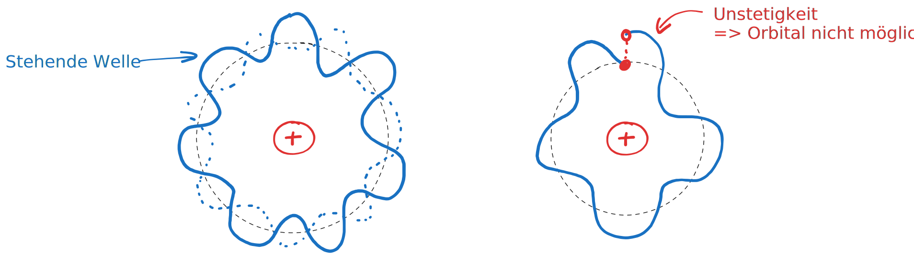

---
tags:
aliases:
created: 26th February 2026
title: De Broglie
release: false
subject:
  - VL
  - Einführung Elektronik
semester: WS24
professor:
---

# Atommodelle

## Bohrsches Atommodell

Das Bohrsche Atommodell war ein Experiment von Niels Bohr, um die Natur von Elementarteilchen mit der klassischen Physik zu beschrieben.

Elektronen kreisen auf einer bestimmten Bahn ([Schalen](Orbitalmodell.md)) um den Atomkern (Planetenmodell). 

### Widerspruch

Das Modell hat jedoch einen Fehler:

Ein elektron, das auf der festgelegten Bahn kreist wäre äquivalent zu einer Art **Stromfluss**. Bei weitere Betrachtung erkennt man, dass dadurch ein sich ständig ändernder Dipol entsteht ([Hertzscher Dipol](../HF-Technik/Hertzscher%20Dipol.md)).

- Es müsste daher Energie in Form von Elektromagnetischen Wellen Abgestrahlt werden.
- Geht Energie vom Elektron verloren, würde es langsam in den Kern fallen.

%%[🖋 Edit in Excalidraw](../_assets/Excalidraw/Atommodelle%202026-02-26%2021.19.42.excalidraw.md)%%

Das Modell versagt auch bei der beschreibung, auf welchen Schalen / Energieniveaus sich die Elektronen aufhalten können.

- Klassisch könnte man das Elektron auf eine Bahn in Beleibigem radius um den Nukleus mit der richtigen Geschwindigkeit schicken.
- In der Realität sind jedoch nur Bestimmte Energieniveaus erlaubt

## Welle-Teilchen Dualismus

Es gibt Messmethoden um Elektronen als massebehaftete Teilchen aufzufinden. Jedoch zeigt auch das [Doppelspalt Experiment](../Physik/Quantenmechanik/Doppelspalt%20Experiment.md) dass Elektronen, wie Wellen, Interferenzmuster aufweisen.

> [!info] **Teilchenbetrachtung)** Energie eines massebehafteten Teilchens
> $$
> E=mc^{2} \qquad p=mc
> $$

> [!info] **Wellenbetrachtung)** Energie einer Welle
>
> $$
> E = hf = h \dfrac{c}{\lambda}
> $$
 
Liefert den Zusammenhang zwischen Wellenlänge (bzw [Wellenzahl](../Feldtheorie/Wellenzahl.md)) und Impuls

$$
\implies \lambda = \frac{h}{p}\quad\text{und}\quad
k = \frac{2\pi}{\lambda} \implies k = \frac{p}{\hbar}\quad\text{mit}\quad \hbar=\frac{h}{2\pi}
$$

und den Zusammenhang zwischen Kreisfrequenz und der Energie

$$
\omega = 2 \pi f = \frac{2\pi E}{h} = \frac{E}{\hbar}
$$

### Materiewellen - Welleninterpretation von Teilchen

**Photonen**

- In der Wellendarstellung kann das Photon als Wellenpaket beschrieben werden.
- $\to$ Wellenzug von Elektromagnetischer Schwingung

**Elektronen**

Eine Möglichkeit
 
- sich Elektronen als Welle vorzustellen
- und auch Warum Elektronen nur in bestimmten Energieniveaus erlaubt sind

liefert die Überlegung des Elektrons als Stehende Welle um den Nukleus.

Nur bestimmte Wellenlängen und daher auch **Energieniveaus** (da $\omega = \frac{E}{\hbar}$) kann man um den Nukleus *wickeln*.

> [!hint] 2D Stehende Welle
> 
> Die Elektronen *sind* die Welle. Nicht etwa "Sie befinden sich Irgendwo auf dieser Welle"
> 
> 
> %%[🖋 Edit in Excalidraw](../_assets/Excalidraw/Atommodell-StehendeWelle-2D.md)%%

Der Radius der diesen Energieniveaus entspricht ist

$$
2\pi r = n\lambda = n \frac{h}{p}
$$

Wobei $n$ das ganzzahlige Energieniveau ist. Die Wellengleichung, die diese Stehende Welle beschreibt ist die [Schrödingergleichung](Quantenmechanik/Schrödingergleichung.md).

Misst man das Elektron in diesem Orbital, fällt die Welle zu einem Teilchen zusammen. (Daher stammt der Algorithus aus der Informatik [Wavefunction-Collapse](../Softwareentwicklung/DSA/Wavefunction-Collapse.md)).

## Referenzen

