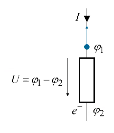

# [Elektrische Leistung](https://de.wikipedia.org/wiki/Elektrische_Leistung)

$$
P=U\cdot I=I^{2}\cdot R=\frac{U^{2}}{R}
$$

## Verlustleistung in einem Widerstand

> [!info] Energieumsatz im [Widerstand](../Elektrotechnik/Widerstand.md):
>  Ein Elektron verliert beim Durchlaufen der [Potenzialdifferenz](../Elektrotechnik/elektrische%20Spannung.md) die potenzielle Energie
> $$W_{e}=e\cdot(\varphi_{1}-\varphi_{2}) = e\cdot U$$
> Pro Zeiteinheit ($\frac{1}{t}$) strömen $\frac{I}{e}$ Elektronen ($n$) in den Widerstand bzw. Verlassen den Widerstand
> Diese Behauptung wird durch die Definition der Ladung gezeigt: $\underbrace{ \frac{n}{t}= \frac{I}{e} }_{ \text{Behauptung} }\implies n=\frac{I}{e}\cdot t\impliedby Q=n\cdot e$
> Energieverlust/Zeiteinheit = Verlustleistung:
> $$\frac{dW}{dt}=P_{V}=\cancel{ e }\cdot U\cdot \frac{I}{\cancel{ e }} = U\cdot I$$

# Komplexe Leistung

*Wirkleistung:* $P=U \cdot I \cdot \cos \varphi$ -> $\varphi = \varphi_{u} - \varphi_{i}$ 
Einheit: Watt

*Bildleistung:* $Q=U\cdot I\cdot \sin \varphi$

Einheit: VAR - Volt Ampere Reaktiv

*Scheinleistung:* $S=\sqrt{ P^2+Q^2 } = \mid S\mid$

Einheit: VA - Volt-Ampere

## Blindleistungskompensation

$\cos \varphi_{k}$ … Leistungsfaktor

$S=\frac{P}{\cos \varphi_{k}}$

![[assets/Elektrische Leistung 2024-01-26 10.52.55.excalidraw]]

> [!example]- 

>
> $$
> \begin{align}
> Y &= \frac{1}{R}+\frac{1}{X_{L}}+\frac{1}{X_{C}} \\
> &=\frac{1}{R}+\frac{1}{j\omega L}+j\omega C \\
> Z&=\frac{1}{Y} \\
> arg(Z) &= \varphi = \arccos(0.95) =-18.19°\\
> arg(Z) &= \varphi =\arctan\left( \frac{\mathrm{Im}}{\mathrm{Re}} \right)
> \end{align}
> $$