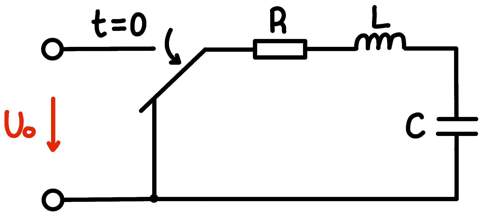
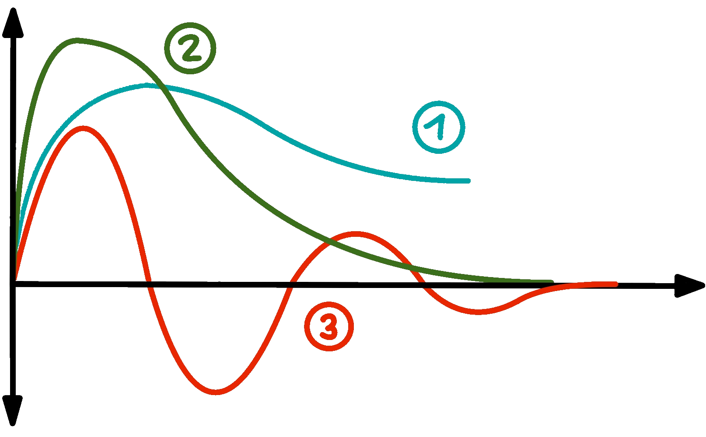
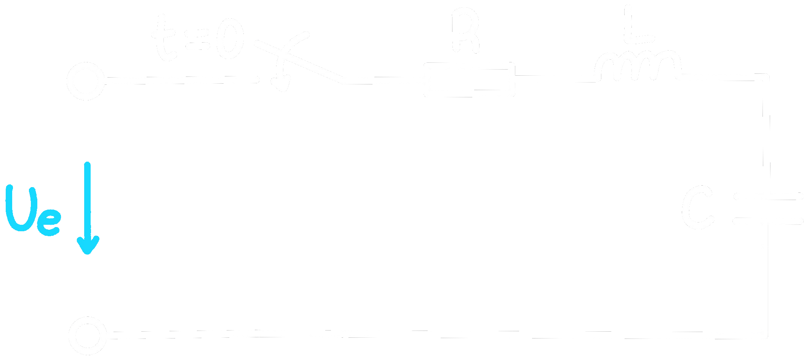
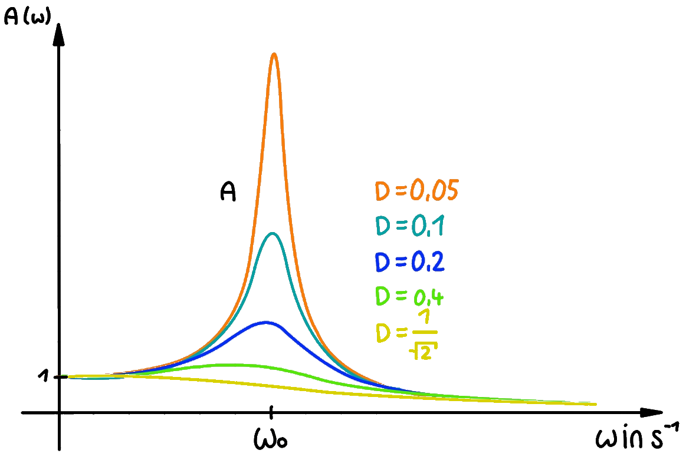

 

# Elektrische Schwingungen

> [!info] Arten von elektrischen Schwingkreisen
> - Freie Schwingung im realen Serienschwingkreis
> - Freie Schwingung im realen Parallelschwingkreis
> - Erzwungen / Angeregte Schwingung im realen Serienschwingkreis
> - Erzwungen / Angeregte Schwingung im realen Parallelschwingkreis

## Freie Schwingungen im realen Serienschwingkreis

Freie Schwingungen führt ein Schwingfähiges System aus, das – nach einer Störung/Auslenkung sich selbst überlassen – je nach [Dämpfung](../../Hardwareentwicklung/Dämpfung.md) oszillierend oder „kriechend“ in den Gleichgewichtszustand zurückkehrt. Die Frequenz der freien Schwingung ist die [Eigenfrequenz](https://de.wikipedia.org/wiki/Eigenfrequenz "Eigenfrequenz") des Schwingers.

Um die [Spannung](../Elektrotechnik/Spannung.md) der einzelnen Komponenten ab dem Zeitpunkt $t=0$ zu betrachten, wird nun aus den bekannten Eigenschaften der Bauteile eine [Differentialgleichung 2. Ordnung](../Mathematik/mathe%20(4)/lineare%20DGL%202.%20Ordnung.md) hergeleitet.

| Einfluss der [Spule](../Elektrotechnik/Impedanz.md) | Einfluss des [Kondensator](../Elektrotechnik/Impedanz.md)      | Einfluss des [Widerstand](../Elektrotechnik/Impedanz.md) |
| --------------------------------- | -------------------------------------------- | -------------------------------------- |
| $u_{L}(t)=L\cdot\frac{di}{dt}$    | $u_{C}(0) = U_{0}$                           | $u_{R}=i(t)\cdot R$                    |
|                                   | $q(t)=C\cdot u_{C}(t)$                       |                                        |
|                                   | $i(t)=C\cdot\frac{du_{c}}{dt}$               |                                        |
|                                   | $\frac{di}{dt}=C\cdot \frac{d^{2}u}{dt^{2}}$ |                                        |

$$
\begin{align*}
	u_{R}+u_{L}+u_{C} &= 0\\
	i\cdot R+L\cdot \frac{di}{dt}+u_{C} &= 0\\
	R\cdot C\cdot \frac{du_{c}}{dt}+L\cdot C\cdot \frac{d^{2}u}{dt^{2}} + u_{C} &= 0 \Big|:LC\\
	\frac{d^{2}u_{c}}{dt^{2}}+ \frac{du_{c}}{dt}\cdot \frac{R}{L}+u_{c}\cdot \frac{1}{LC} &= 0\\
\end{align*}
$$

>[!summary] $$\frac{d^{2}u_{c}}{dt^{2}}+ \frac{du_{c}}{dt}\cdot 2\delta+u_{c}\cdot \omega^{2}_{0} = 0$$

--- 

Ebenfalls kann die [Ladung](../Elektrotechnik/Statisches%20E-Feld.md) über die Zeit betrachtet werden, sodass man auf einen ähnlichen Ansatz für die Differentialgleichung kommt.

$$
\begin{align*}
R\cdot \frac{dq}{dt} + L\cdot \frac{d^{2q}}{dt^{2}} + \frac{q}{c} = 0 \qquad \Big{|}:L
\end{align*}
$$

>[!summary] $$\frac{d^{2}q}{dt^{2}} + \frac{dq}{dt}\cdot \frac{R}{L}+q\cdot \frac{1}{LC} = 0$$

--- 

Nun kann man aus einer der [DGL](../Mathematik/{MOC}%20DGL.md) die [charakteristische Gleichung](../Mathematik/mathe%20(4)/lineare%20DGL%202.%20Ordnung.md) erzeugen

$$
\begin{align*}
	\lambda^{2}+ \underbrace{\frac{R}{L}}_{2\delta}\lambda + \underbrace{\frac{1}{LC}}_{\omega_{0}^{2}} &= 0\\	
\end{align*}
$$

>[!summary] $$\lambda^{2}+ 2\delta\cdot\lambda + \omega_{0}^{2} = 0$$

### Bezeichnungen

| Ausdruck                                                | Bezeichnung                                                        |
| ------------------------------------------------------- | ------------------------------------------------------------------ |
| $2\delta = \frac{R}{L} \rightarrow \frac{R}{2L}=\delta$ | [Abklingkonstante](https://de.wikipedia.org/wiki/Abklingkonstante) |
| $\omega_{0} = \frac{1}{\sqrt{LC}}$                      | Resonanzkreisfrequenz                                              |

### Lösung der Gleichung

$\lambda_{1} = -\delta+\sqrt{\delta^{2}-\omega^{2}_{0}}$

die 3. Fälle der [DGL 2. Ordnung](../Mathematik/mathe%20(4)/lineare%20DGL%202.%20Ordnung.md) sind wiefolgt

| Fall | Bedingung | Bezeichnung |  |
| ---- | :--: | ---- | ---- |
| [Fall 1.](../Mathematik/mathe%20(4)/lineare%20DGL%202.%20Ordnung.md#1.%20Fall%20Eindeutige%20Lösung) | $\delta>\omega_{0}$ | Kriechfall |
| [Fall 2.](../Mathematik/mathe%20(4)/lineare%20DGL%202.%20Ordnung.md#2.%20Fall%20Doppellösung) | $\delta=\omega_{0}$ | [aperiodischer Grenzfall](https://de.wikipedia.org/wiki/Aperiodischer_Grenzfall) |
| [Fall 3.](../Mathematik/mathe%20(4)/lineare%20DGL%202.%20Ordnung.md#3.%20Fall%20konjugiert%20[komplexe](../mathe%20(3)/Komplexe%20Zahlen.md)%20Lösungen) | $\delta<\omega_{0}$ | Schwingfall |

## Erzwungene Schwingung im realen Serienschwingkreis

Bei einem erzwungenen Schwingkreis leigt am Eingang eine beliebige [Spannung](https://de.wikipedia.org/wiki/Ohmsches_Gesetz) $U_{e}$, oder auch eine funktion der Spannung $U_{e}(t)$ an.

| Einfluss der [Spule](../Elektrotechnik/Impedanz.md) | Einfluss des [Kondensators](../Elektrotechnik/Impedanz.md)      | Einfluss des [Widerstands](../Elektrotechnik/Impedanz.md) |
| -------------------------------- | -------------------------------------------- | -------------------------------------- |
| $u_{L}(t)=L\cdot\frac{di}{dt}$   | $i(t)=C\cdot\frac{du_{c}}{dt}$               | $u_{R}=i(t)\cdot R$                    |
|                                  | $\frac{di}{dt}=C\cdot \frac{d^{2}u}{dt^{2}}$ |                                        |

$$
\begin{align*}
	u_{R}+u_{L}+u_{C}&=U_{e}\\
	
	R\cdot i + L\cdot\frac{di}{dt} + u_{C}&=U_{e}\\
	
	R\cdot C\cdot\frac{du_{c}}{dt} + L\cdot C\cdot \frac{d^{2}u}{dt^{2}} + u_{C} &= U_{e} \Big| :LC\\
	
	\frac{d^{2}u}{dt^{2}} +\frac{R}{L}\cdot\frac{du_{c}}{dt} + \frac{1}{LC}\cdot u_{C} &= \frac{U_{e}}{LC}\\
\end{align*}
$$

$$
\underline{\underline{
	\frac{d^{2}u_{C}}{dt^{2}} +2\delta\cdot\frac{du_{C}}{dt} + \omega^{2}\cdot u_{C} = \omega^{2}\cdot U_{e}\\
}}
$$

Mit dem Auflösen der  ergibt sich eine /lineare%20DGL%202.%20Ordnung.md#Lösung%20der%20inhomogenen%20DGL%202%20Ordnung%20mit%20Störterm|lineare%20inhomogene%20DGL%202.%20Ordnung%20mit%20konstanten%20koeffizienten)$(R,L,C)$.

### Bestimmung der Amplituden-Phasen-Form

Die Lösung in der Amplituden-Phasen-Form hat die Form $y(t)_{p} = \hat{y}_{p}\cdot \sin(\omega\cdot t+\varphi)$ und beschreibt nur die Funktion nach dem Einschwingvorgang.

> [!EXAMPLE]  
> Serienschwingkreis mit einer Eingangsspannung der Funktion: $u_{e}(t)=\hat{u}_{e}\cdot\sin(\omega\cdot t)$
> 
> 
> 
> Zu ermitteln ist eine Funktion für die Kondensatorspannung $u_{c}$  
> Um den eingeschwungenen Zustand zu definieren, wird zunächst $u_{h}$ - die homogene Lösung - ignoriert.
>
> $$
> \omega^{2}_{0}\cdot\hat{u}_{e}\sin(\omega\cdot t) = \ddot u_{c} + 2\delta\dot u_{c} + \omega^{2}_{0}\cdot u_{c}
> $$
>
> Die [partikuläre Lösung](../Mathematik/mathe%20(4)/lineare%20DGL%202.%20Ordnung.md) wird daher ermittelt:
>
> $$
> \begin{align*}
> 	u_{cp} &= a\cdot\sin(\omega t)+b\cdot\cos(\omega t)\\
> 	\dot u_{cp} &= a\omega\cdot\cos(\omega t)-b\cdot\sin(\omega t)\\
> 	\ddot u_{cp} &= -a\omega^{2}\cdot\sin(\omega t) - b\omega^{2}\cdot\cos(\omega t)\\
> \\
> 	\omega^{2}_{0}\cdot\hat{u}_{e}\sin(\omega\cdot t)
> 	&= -a\omega^{2}\cdot\sin(\omega t) - b\omega^{2}\cdot\cos(\omega t)\\
> 	&+ 2\delta\cdot (a\omega\cdot\cos(\omega t) - b\omega\cdot\sin(\omega t))\\
> 	&+ \omega^{2}_{0}\cdot (a\cdot\sin(\omega t) + b\cdot\cos(\omega t))\\
> \\
> 	\omega^{2}_{0}\cdot\hat{u}_{e}\sin(\omega\cdot t)
> 	&= -a\omega^{2}\cdot\sin(\omega t) - b\omega^{2}\cdot\cos(\omega t)\\
> 	&+ 2\delta\cdot a\omega\cdot\cos(\omega t) - 2\delta\cdot b\omega\cdot\sin(\omega t)\\
> 	&+ \omega^{2}_{0}\cdot a\cdot\sin(\omega t) + \omega^{2}_{0}\cdot b\cdot\cos(\omega t)\\
> \\
> 	0 &= \left.
> 		-b\cdot\omega^{2}+2\delta\cdot a\cdot\omega + \omega^{2}_{0}\cdot b
> 	\right|t=0\\
> 	\omega^{2}_{0}\cdot\hat{u}_{e} &= \left.
> 		-a\cdot\omega^{2}-2\delta\cdot b\cdot\omega + \omega^{2}_{0}\cdot a
> 	\right|{t=\frac{\pi}{2\omega}}
> \end{align*}
> $$

#### Koeffizienten $a$ und $b$ der partikulären Lösung

Durch umformen erhält man einer Formel für $a$ und $b$, die sich allgemein für die Berechnung von Schwingungen, mit einer trigonometrischen Funktion als Störterm, anwenden lässt:

$$
\begin{align*}
	a&= \frac{\omega^{2}_{0}\cdot\hat{u}_{e}(\omega^{2}_{0}-\omega^{2})}{(\omega^{2}_{0}-\omega^{2})^{2}+4\delta^{2}\omega^{2}}\\
	b&= \frac{-\omega^{2}_{0}\cdot\hat{u}_{e}\cdot2\delta\omega}{(\omega^{2}_{0}-\omega^{2})^{2}+4\delta^{2}\omega^{2}}
\end{align*}
$$

#### Amplitude von $u_{cp}$ (Allgemein auch als $A(\omega)$)

$$
\begin{align*}
	\hat{u}_{cp} &= \sqrt{a^{2}+b^{2}}\\
	&=\frac{\omega^{2}_{0}}{\sqrt{(\omega^{2}_{0} - \omega^{2})^{2}+4\delta^{2}\omega^{2}}}\cdot\hat{u}_{e}
\end{align*}
$$

#### Phase von $u_{cp}$

$$
\begin{align*}
	\varphi_{p}&=\arctan\left(\frac{b}{a}\right)\\
	&=\arctan\left(\frac{-2\delta\omega}{\omega^{2}_{0} - \omega^{2}}\right)
\end{align*}
$$

#### Frequenzgang der Amplitude:

Die Amplitude ist maximal, wenn der Ausdruck unter der Wurzel minimal ist. $d$ ist der Ausdruck unter der Wurzel.

$$
\begin{align*}
	d(\omega) &= (\omega^{2}_{0} - \omega^{2})^{2}+4\delta^{2}\omega^{2}\\
	d'(\omega) &= 2(\omega^{2}_{0} - \omega^{2})\cdot(-2\omega)+4\delta^{2}2\omega\\
\end{align*}
$$

> [!NOTE] Das [globale Minimum](../Mathematik/{MOC}%20Kurvendiskussion.md) wird durch das Null setzen der [ersten Ableitung](../Mathematik/mathe%20(3)/Differenzialrechnung.md) ermittelt.

$$
\begin{align*}
	d'(\omega) &= 0\\
	4\delta^{2}\cdot2\omega &= -4\omega(\omega_{0}^{2} - \omega^{2})\\
	2\delta^{2} &= \omega_{0}^{2} - \omega^{2}\\
	\omega_{r} &= \sqrt{\omega_{0}^{2}-2\delta^{2}}
\end{align*}
$$

$$
\begin{align*}
	\omega_{r} = \sqrt{\omega_{0}^{2}-2\delta^{2}} &\dots\text{Resonanzkreisfrequenz}\\
	D = \frac{\delta}{\omega_{0}} &\dots\text{Dämpfungsgrad}
\end{align*}
$$

 >

## Freie Schwingung im realen Parallelschwingkreis

# Tags

![[../Mathematik/mathe (4)/assets/Schwingkreise 2024-01-17 09.08.32.excalidraw]]