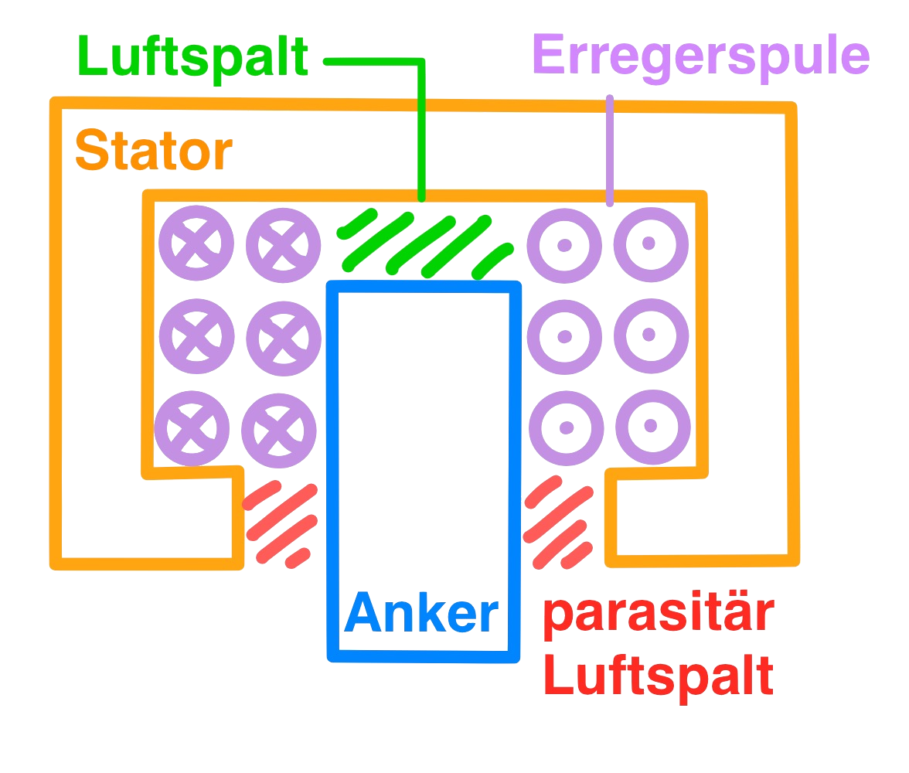
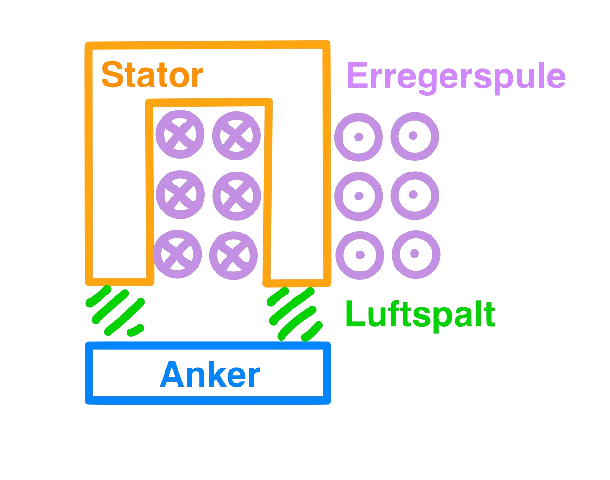
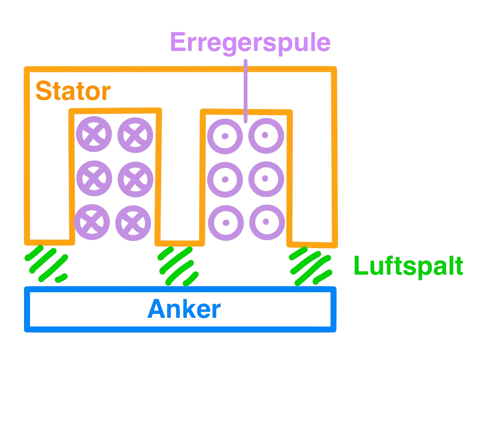

 

# Elektromagnet

> [!info] Elektronmagnete als Energiewandler
> 
> Elektromagnete sind eine Schnittstelle zwischen den Elektrischen Kräften und der Kinematik.
> 
> 

## Elektromagente als Antriebe

Elektromagnete sind **Antriebselemente** für rotatorische und lineare Bewegungen.

**Raststellen**
- 1 Raststellung: Stanz und Druckmagnete
- 2 Raststellungen: *Betätigungsmagnete*
- \>2 Raststellungen: Doppelhubmagnet, Stepper-Motor (Schrittmotoren)

**Betätigungsmagnete:** Anfangslage des Ankers $S_{1}$, Endlage des Ankers $S_{2}$ 
- Nur eine aktive Wirkungsrichtung: $S_{1} \to S_{2}$
- Rückstellbewegung muss extern erfolgen z.B. Feder (Passive Wirkungsrichtung)

## Grundformen von EM

> [!def] Funktionsrelevante Elemente jedes Elektromagneten
> 
> - **Eisenkreis**
>     - **Anker** als bewegliches Teil
>     - **Stator** / **Eisenrückschluss** fest mit Erregerspule verbunden.
> - **Erregerspule** (Permanentmagnet bei klassischem Magnetkreis)
> - **Arbeitsluftspalt**. Die gestalt des ALS ist wesentlich für den verlauf der Magnetkraft-Hub Kennlinie

Drei Relevante Elektromagnet-Grundformen:

|             Topfmagnet              |             U-Magnet              | E-Magnet                        |
| :---------------------------------: | :-------------------------------: | :-----------------------------: |
|  |  |  |

Ziel ist der Entwurf von EM mit verschiedenen **Magnetkraft-Hub** Kennlinien entsprechend der Anwendung. Durch Modifikationen der Grundformen komplexere Magnetkreise erstellbar.

---

# Quellen
