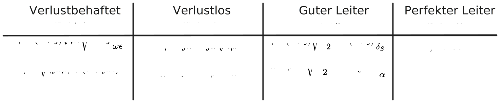

---
tags:
aliases:
  - Ausbreitungskonstante
  - Phasenkonstante
  - Fortpflanzungskonstante
  - Ausbreitungskoeffizient
keywords:
subject:
  - VL
  - Grundlagen der Hochfrequenztechnik
semester: WS25
created: 18th January 2026
professor:
  - Reinhard Feger
release: true
title: Wellenzahl
---

# Wellenzahl

> [!def] **D) Wellenzahl**  $k$ (auch Phasenkonstante)
> 
> $$
> k = \omega \sqrt{ \mu\epsilon } = \frac{\omega}{v_{p}} \qquad [k] = \frac{1}{m}
> $$
>
> In einem verlustlosen Medium gilt $\mu,\epsilon \in \mathbb{R} \implies k \in \mathbb{R}$.

- $\epsilon$, $\mu$ ... [Materialparameter](../../Elektrotechnik/Materialgesetze.md)
- $v_{p}$ ... [Phasengeschwindigkeit](Phasengeschwindigkeit.md)

## Verlustbehaftung

Für [Verlustbehaftete dielektrische Materialien](../../Elektrotechnik/Verlustwinkel.md) wird die Wellenausbreitung durch die komplexwertige Fortpflanzungskonstante beschreiben. Diese Ausbreitungskonstante ist definiert durch die [Helmholtzsche Differenzialgleichung](../../HF-Technik/Helmholtzsche%20Differenzialgleichung.md#Verlustbehaftetes%20Medium)

> [!info] Zusammenfassung der Fortpflanzungskonstante $\gamma$ in unterschiedlichen Medien
> 
> 
> %%[🖋 Edit in Excalidraw](../../_assets/Excalidraw/ZusammenfassungWellenzahl.md)%%

> [!def] **D) Komplexe Fortpflanzungskonstante** $\gamma$
> 
> $$
> \gamma = \alpha + j \beta = j\omega \sqrt{ \mu\epsilon (1-j\tan\delta) } \qquad [\gamma] = \frac{1}{m}
> $$

Man sieht sofort, dass ein verlustloses Material mit $\tan\delta=0$ dazu führt, dass $\gamma=jk \iff\beta=k$. Dabei ist:

- $\alpha$ die *Dämpfungskonstante* und
-  $\beta$ die *Phasenkonstante*
- $\tan\delta$ der [Verlustwinkel](../../Elektrotechnik/Verlustwinkel.md)

Der Verlust in einem dielektrischen Medium kann zum einen mit der Permittivität als komplexer Wert *oder* der einführung eines intrinsischen Leitwertes modelliert werden. Man kann nun eines der beiden Modelle für den Verlustwinkel einsetzen.

## Einsetzen der Modelle

> [!satz] **S)** $\gamma$ - Verlust als komplexe Permittivität: $\tan \delta=\frac{\epsilon''}{\epsilon'}$
> 
> $$
> \gamma = j\omega \sqrt{ \mu\epsilon'\left( 1-j \frac{\epsilon''}{\epsilon'} \right) } = j\omega \sqrt{ \mu \epsilon },\quad \epsilon=\epsilon'-j\epsilon'' \in\mathbb{C}
> $$

- Diese Betrachtung folgt aus der einsetzung einer komplexen Permittivität $\epsilon = \epsilon'-j\epsilon''$ in $\gamma=jk$.

> [!satz] **S)** $\gamma$ - Verlust als intrinsischer Leitwert: $\tan\delta=\frac{\sigma}{\omega\epsilon}$
> 
> $$
> \gamma = j\omega\sqrt{ \mu\epsilon } \sqrt{ 1-j \frac{\sigma}{\omega\epsilon} }, \quad \epsilon \in\mathbb{R}
> $$

- Diese Betrachtung folgt aus der [Herleitung der Helmholtzschen DGL](../../HF-Technik/Helmholtzsche%20Differenzialgleichung.md#Herleitung%20der%20Wellengleichung) für verlustbehaftete Medien aus den [Maxwell](../../Elektrotechnik/Maxwell.md)-Gleichungen.

## $\gamma$ in gut leitfähigen Materialien

In dielektrischen Materialien ist die Leitfähigkeit $\sigma$ eine parasitäre größe. In Leitfähigkeiten ist das jedoch erwünscht. Im übergan von dielektrika zu leitern gilt $\sigma\gg\epsilon$ bzw. $\epsilon''\gg\epsilon'$. Dann gilt mit guter näherung

$$
\gamma = \alpha + j\beta \approx j\omega\sqrt{ \mu\epsilon } \sqrt{\frac{\sigma}{j\omega\epsilon} } = (1+j)\sqrt{ \frac{\omega\mu\sigma}{2} }
$$