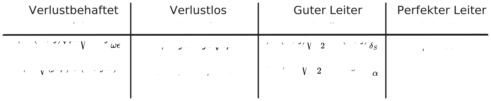

---
tags:
aliases:
  - Ausbreitungskonstante
  - Phasenkonstante
  - Fortpflanzungskonstante
  - Ausbreitungskoeffizient
  - Grenzwellenzahl
keywords:
subject:
  - VL
  - Grundlagen der Hochfrequenztechnik
semester: WS25
created: 18th January 2026
professor:
  - Reinhard Feger
release: true
title: Wellenzahl
---

# Wellenzahl

Für dielektrische Materialien ist die Wellenzahl die anzahl an Wellenlängen die in einem Meter des Mediums platz haben.

> [!def] **D) Wellenzahl**  $k$ (auch Phasenkonstante)
> 
> $$
> k = \frac{2\pi}{\lambda} = \frac{\omega}{v_{p}} = \omega \sqrt{ \mu\epsilon } \qquad [k] = \frac{1}{m}
> $$
>
> In einem verlustlosen Medium gilt $\mu,\epsilon \in \mathbb{R} \implies k \in \mathbb{R}$.

- $\epsilon$, $\mu$ ... [Materialparameter](../../Elektrotechnik/Materialgesetze.md)
- $v_{p}$ ... [Phasengeschwindigkeit](Phasengeschwindigkeit.md)

## Verlustbehaftete Medien

Für [Verlustbehaftete dielektrische Materialien](../../Elektrotechnik/Verlustwinkel.md) wird die Wellenausbreitung durch die komplexwertige Fortpflanzungskonstante beschreiben. Diese Ausbreitungskonstante ist definiert durch die [Helmholtzsche Differenzialgleichung](../../HF-Technik/Helmholtzsche%20Differenzialgleichung.md#Verlustbehaftetes%20Medium)

Die Forpflanzungskonstante ist die Werweiterung der Wellenzahl mit $\epsilon$ erweitert als Komplexe zahl mit dem Verlustwinkel.

> [!def] **D) Komplexe Fortpflanzungskonstante** $\gamma$
> 
> $$
> \gamma = \alpha + j \beta = j\omega \sqrt{ \mu\epsilon (1-j\tan\delta) } \qquad [\gamma] = \frac{1}{m}
> $$

Man sieht sofort, dass ein verlustloses Material mit $\tan\delta=0$ dazu führt, dass $\gamma=jk \iff\beta=k$. Dabei ist:

- $\alpha$ die *Dämpfungskonstante* und
-  $\beta$ die *Phasenkonstante*
- $\tan\delta$ der [Verlustwinkel](../../Elektrotechnik/Verlustwinkel.md)

> [!warning]-  Im Allgemeinen Fall gilt nicht $\beta = k$
> siehe [TEM-Welle](../../HF-Technik/TEM-Welle.md)

> [!info] Zusammenfassung der Fortpflanzungskonstante $\gamma$ in unterschiedlichen Medien
> 
> 
> %%[🖋 Edit in Excalidraw](../../_assets/Excalidraw/ZusammenfassungWellenzahl.md)%%

### Einsetzen der Modelle

Der Verlust in einem dielektrischen Medium kann zum einen mit der Permittivität als komplexer Wert *oder* der einführung eines intrinsischen Leitwertes modelliert werden. Man kann nun eines der beiden Modelle für den Verlustwinkel einsetzen.

> [!satz] **S)** $\gamma$ - Verlust als komplexe Permittivität: $\tan \delta=\frac{\epsilon''}{\epsilon'}$
> 
> $$
> \gamma = j\omega \sqrt{ \mu\epsilon'\left( 1-j \frac{\epsilon''}{\epsilon'} \right) } = j\omega \sqrt{ \mu \epsilon },\quad \epsilon=\epsilon'-j\epsilon'' \in\mathbb{C}
> $$

- Diese Betrachtung folgt aus der einsetzung einer komplexen Permittivität $\epsilon = \epsilon'-j\epsilon''$ in $\gamma=jk$.

> [!satz] **S)** $\gamma$ - Verlust als intrinsischer Leitwert: $\tan\delta=\frac{\sigma}{\omega\epsilon}$
> 
> $$
> \gamma = j\omega\sqrt{ \mu\epsilon } \sqrt{ 1-j \frac{\sigma}{\omega\epsilon} }, \quad \epsilon \in\mathbb{R}
> $$

- Diese Betrachtung folgt aus der [Herleitung der Helmholtzschen DGL](../../HF-Technik/Helmholtzsche%20Differenzialgleichung.md#Herleitung%20der%20Wellengleichung) für verlustbehaftete Medien aus den [Maxwell](../../Elektrotechnik/Maxwell.md)-Gleichungen.

### Ausbreitung in gut leitfähigen Materialien

In dielektrischen Materialien ist die Leitfähigkeit $\sigma$ eine parasitäre größe. In Leitfähigkeiten ist das jedoch erwünscht. Im übergan von dielektrika zu leitern gilt $\sigma\gg\epsilon$ bzw. $\epsilon''\gg\epsilon'$. Dann gilt mit guter näherung

$$
\gamma = \alpha + j\beta \approx j\omega\sqrt{ \mu\epsilon } \sqrt{\frac{\sigma}{j\omega\epsilon} } = (1+j)\sqrt{ \frac{\omega\mu\sigma}{2} } = \frac{1+j}{\delta_{S}}
$$

> $\delta_{S}$ ... [Eindringtiefe](../../HF-Technik/Skineffekt.md)

## Grenzwellenzahl

Die Grenzwellenzahl ist der Grenzwert, bei dem sich eine Welle (z.B in einem Wellenleiter) gerade noch ausbreiten kann.

> [!def] **D)** Grenzwellenzahl (*Cutoff Wavenumber*) $k_{c}$
> 
> $$
> k_{c}^{2} = k^{2}-\beta^{2} \iff \beta = \sqrt{ k^{2}-k_{c}^{2} }
> $$

In Wellenleitern:

- Wellenleiter mit dem Einleiter-Modell funktionieren nicht bis zur Gleichspannung herunter. Die Grenzwellenzahl ist die Wellenzahl bei der geringsten Frequenz (größten Wellenlänge), bei der sich eine Welle gerade noch auf dem Leiter ausbreiten kann.

Es lassen sich **Grenzwellenlänge** und **Grenzfrequenz** ermmitteln mit:

$$
\lambda_{c} = \frac{2\pi}{k_{c}} \qquad f_{c} = \frac{k_{c}}{2\pi\sqrt{ \epsilon\mu }}
$$

Man kann erkennen, dass wenn in der Wurzel $k^{2}<k_{c}^{2}$ ist, $\beta$ komplex wird:

$$
k<k_{c} \implies \beta \in \mathbb{C}
$$

Für ein Komplexes $\beta$ hat der Term $-j\beta z$ einen Realteil und $e^{ -j\beta z }$ weist eine Dämpfung auf. Durch diese Dämpfung klingen die Felder schnell ab. Ab einer gewissen unteren Frequenz wird die Welle direkt beim eintreffen in den Leiter ab $z>0$ gedämpft und sie wird zu einer Evaneszenten Welle.