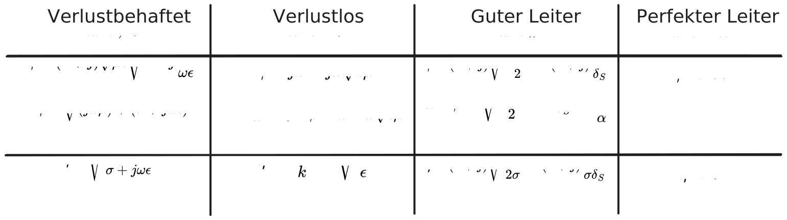
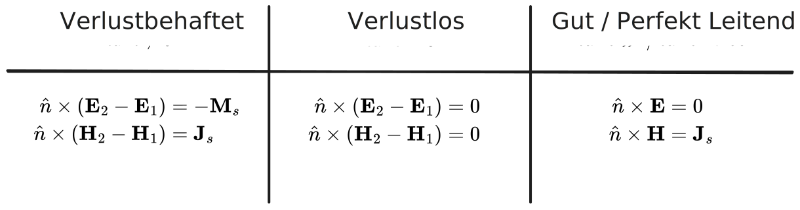

---
tags:
  - index
aliases:
  - EM-Wellen
  - Raumwelle
  - Elektromagnetische Welle
  - EM-Welle
  - EM-Feld
  - Elektromagnetismus
  - Elektromagnetische Wellen
  - Feldtheorie
subject:
  - VL
  - Grundlagen der Hochfrequenztechnik
created: 15th January 2026
keywords:
semester: WS25
professor:
  - Reinhard Feger
release: true
title: Elektromagnetische Wellen
---

# Feldtheorie - Elektromagnetische Wellen

Elektrische und Magnetische Wechselfelder können sich als Wellen über die Zeit im Raum ausbreiten. Das $\mathbf{E}$ und $\mathbf{H}$-Feld ist über die [Maxwell](../../Elektrotechnik/Maxwell.md)-Gleichungen miteinander verkoppelt, weshalb man von Elektromagnetischen Wellen spricht, da das eine nicht ohne das andere existiert.

Ein mathematisches Modell zur beschreibung von der zeitlichen und örtlichen Ausbreitung von elektromagnetischen Wellen bieten die [Telegrafengleichung](../../Elektrotechnik/Telegrafengleichung.md).

> [!info] Feldwirkung in einem Medium
> Im Freiraum (Vakuum) sind reelle, eindimensionale Naturkonstanten ([$\epsilon_0$](../../Elektrotechnik/Dielektrikum.md), [$\mu_0$](Konstanten/Permeablität.md)) ausreichend, um Feldwirkungen zu beschreiben. Wenn die Felder mit Materie in Berührung kommen muss berücksichtig werden, wie das Material mit den Feldern wechselwirkt. 
> 
> Die [Materialeigenschaften](../../Elektrotechnik/Materialgesetze.md) können auch linear/nichtlinear und (oder) auch isotrop/anisotrop sein.

## Wellenparameter

> [!info]  Wellenparameter sind im allgemeinen von [Materialparameter](../../Elektrotechnik/Materialgesetze.md) ($\epsilon,\mu,\sigma$) und der Frequenz $\omega$ abhängig.

- [Ausbreitungskonstante](Wellenzahl.md) ... $k$ bzw. $\gamma$
- [Phasengeschwindigkeit](Phasengeschwindigkeit.md) ... $v_{p}$
- [Wellenlänge](Wellenlänge.md) ... $\lambda$
- [Wellenimpedanz](Konstanten/Wellenwiderstand.md) ... $\eta$
- [Eindringtiefe](../../HF-Technik/Skineffekt.md) ... $\delta_{S}$

### Zusammenfassung der Größen

%%[🖋 Edit in Excalidraw](../../_assets/FeldtheorieGroessen.md)%%

## Wellenausbreitung

- [Helmholtzsche Differenzialgleichung](../../HF-Technik/Helmholtzsche%20Differenzialgleichung.md)
- [Felder an Grenzflächen](../../Elektrotechnik/Felder%20an%20Grenzflächen.md)
- [Leitungstheorie](../../HF-Technik/Leitungstheorie.md)

### Zusammenfassung Felder An Grenzflächen

## Bänder des EM-Spektrums

- [Mikrowellenbänder](../../HF-Technik/Mikrowellenbänder.md)
- [PDF](../../_assets/pdf/spectrum_20090210.pdf)

