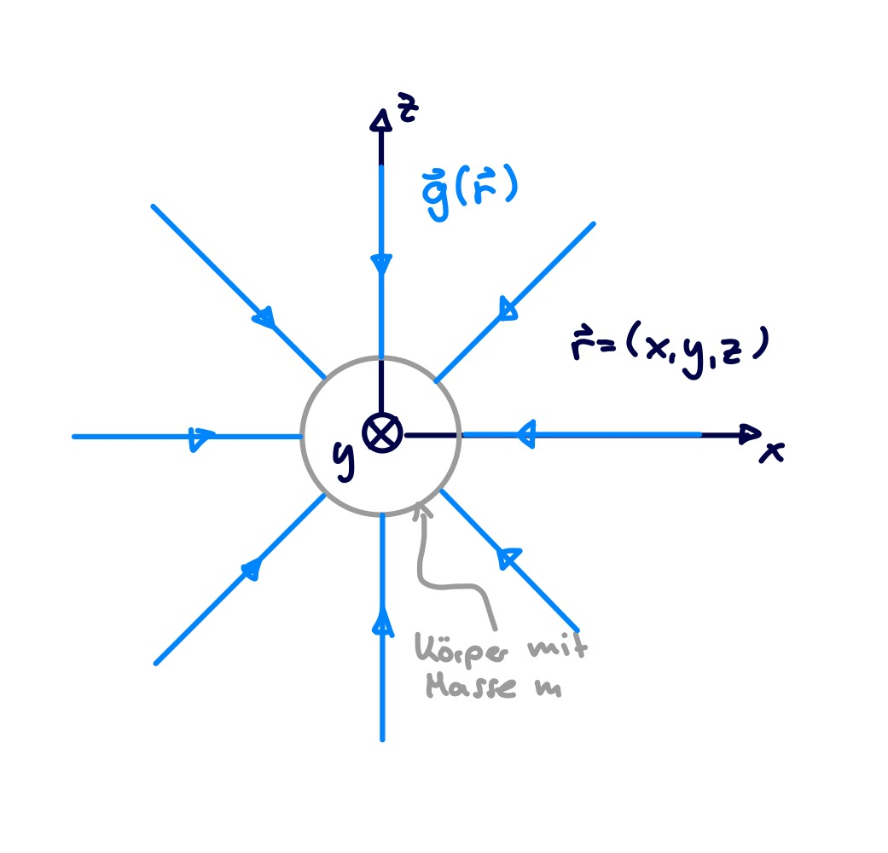

---
tags:
aliases:
subject:
  - VL
  - Theoretische Elektrotechnik
semester: SS26
created: 6th May 2026
professor:
release: false
title: Gravitationsfeld
---

# Gravitationsfeld

Eine Masse $m$ am Ort $\mathbf{r}$ erfährt eine Kraft $\mathbf{F}=m\mathbf{g}$

$$
\mathbf{g}(\mathbf{r}) = -GM \frac{1}{\lVert r \rVert_{2}^3 } \mathbf{r}
$$

Anmerkung

1. In der obigen Darstellung wird der Ortsvektor verwendet, um die Richtung des [Feldvektor](../Mathematik/Analysis/Vektoranalysis/index.md) anzugeben. Diese einfache Darstellung ergibt sich daraus, dass der Schwerpunkt der Masse, im Koordinatenursprung liegt.
2. Feldlinien im Inneren der Masse ("Erde") nicht dargestellt!