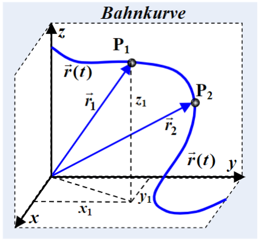

---
tags:
  - Physik/Kinematik
aliases:
  - "#Physik/Kinematik"
keywords:
  - x-t Diagramm
  - v-t Diagramm
  - a-t Diagramm
subject:
  - Physik für TechnikerInnen
  - "322.005"
semester: 1
created: 11. Oktober 2023
professor:
  - Gunther Springholz
---
 

# Kinematik

> [!INFO] Die *Kinematik* beschäftigt sich mit der Beschreibung der Bewegung von Körpern  
> Sie beschreibt *wie* sich Körper bewegen, ohne zu fragen *warum*

## 1 Bewegung in einer Dimension

> [!INFO] Definition der Geschwindigkeit  
> Wie stark ändert sich der Weg über die Zeit.  
> Durchschnitts Geschwindigkeit: $\langle v \rangle=\frac{x_{2}-x_{1}}{t_{2}-t_{1}} = \frac{\Delta x}{\Delta t}$  
> Momentangeschwindigkeit: $\lim_{ \Delta t \to 0 } \frac{\Delta x}{\Delta t}=\frac{dx}{dt}=\dot{x}(t)$  
Einheit: $[v] = \frac{m}{s}$

> [!INFO] Definition der Beschleunigung  
> Wie stark ändert sich die Geschwindigkeit über die Zeit  
> Durchschnitts-Beschleunigung: $\langle a \rangle = \frac{v_{2}-v_{1}}{t_{2}-t_{1}}=\frac{\Delta v}{\Delta t}$  
> Momentane Beschleunigung: $a(t)=\lim_{ t \to 0 } \frac{\Delta v}{\Delta t}=\frac{dv}{dt}= \dot{v}$  
> $a(t)=\frac{dv}{dt} = \frac{d}{dt}\left( \frac{dx}{dt} \right)=\frac{d^{2}x}{dt^{2}}=\ddot{x}(t)$  
> Einheit: $\frac{m}{s^{2}}$

$$
\begin{align}
&s(t)\\
\frac{d}{dt}\downarrow &\quad \uparrow \int  \, dt  \\
v(t) &= \dot{s}(t) \\
\frac{d}{dt}\downarrow &\quad\uparrow \int  \, dt  \\
a(t) &= \ddot{s}(t)
\end{align}
$$

  

> [!WARNING] Bei [Integrieren](Integralrechnung.md) sind die Anfangswerte zu beachten
> ($+C$… Integrationskonstante)

## 2 Bewegung in 2/3-Dimensionen

> [!TLDR] Vektorschreibweise  
> Die räumliche Bewegung eines Massenpunktes können wir einfach behandeln, wenn wir die Position des Massenpunktes, seine Geschwindigkeit und seine Beschleunigung als [Vektoren](../Mathematik/Algebra/Vektor.md) auffassen. [Vektoren](../Mathematik/Algebra/Vektor.md) sind Größen, die sowohl einen [Betrag](../Mathematik/Algebra/Betrag.md) als auch eine Richtung im Raum haben (Größen, die nur einen [Betrag](../Mathematik/Algebra/Betrag.md) haben, heißen Skalare).

$$
\vec{r} = x\cdot \vec{e_{x}} + y\cdot \vec{e_{y}}+ z\cdot \vec{e_{z}}
$$

bzw in Koordiantenschreibweise

$$
\vec{r}=\begin{pmatrix}
x \\ y \\ z
\end{pmatrix}
$$

$r_{i}$ sind Ortsvektoren

## 3 Kreisbewegungen

$$
\begin{align}

\end{align}
$$

$$
\begin{align}
\vec{a}(t) = \dot{\vec{v}}(t) = \begin{pmatrix}
-r \omega^{2} \cos(\omega t) \\
-r \omega^{2} \sin(\omega t)
\end{pmatrix}
\end{align}
$$
