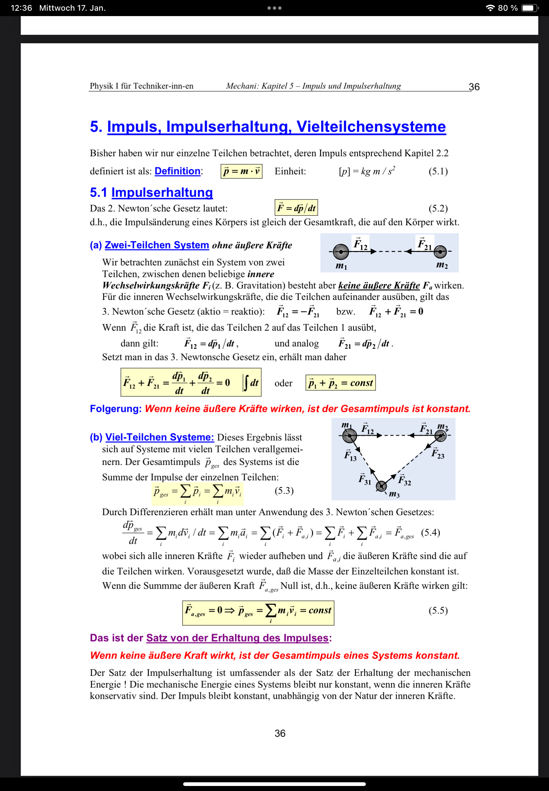

---
tags:
aliases:
  - Impulserhaltung
keywords:
subject:
  - Physik für TechnikerInnen
  - VL
semester: WS23
created: 17th January 2024
professor:
  - Gunther Springholz
title: Impulsantwort
---
 

# Impuls

$$
(1) \quad \vec{F} = \frac{d\vec{p}}{dt} = \frac{d}{dt}(m\vec{v})
$$

# Tags

[Stoßprozesse](Kinematik/Stoßprozesse.md)  
[Vielteilchen-Systeme](Vielteilchen-Systeme.md)  
[Drehimpuls](Kinematik/Drehimpuls.md)
