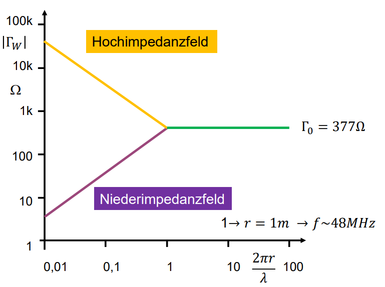

---
tags:
  - Konstante
  - Physik
aliases:
  - Wellenwiderstand des Vakkum
  - Feldwellenwiderstand des Vakuums
symbol: $Z_{F}$
value: $376.730313412(59)$
unit: $\Omega$
subject:
  - EMV und SI
rel-uncertainty: 1.6e-10
---

# Freiraumwellenwiderstand

> [!def] $\eta=376.730313412(59)~\Omega$
> $=\mu_{0} \cdot c\approx 120\pi ~\Omega$
> - $\mu$ ... [Permeabilitätskonstante](Permeablität.md)

Allgemein für nichtleitende Medien ist der Wellenwiderstand:

$$
Z_{W} = \sqrt{ \frac{\mu}{\varepsilon} }  =\sqrt{ \frac{\mu_{0}\cdot\mu_{r}}{\varepsilon_{0}\cdot \varepsilon_{r}}  }
$$

Beim Hertzschen Dipol ist der Feldwellenwiderstand im Nahbereich ([Nahfeld](../../HF-Technik/Fernfeld%20und%20Nahfeld.md)) deutlich größer als $377 \Omega$, beim magnetischen Dipol deutlich kleiner

Feld des Hertzschen Dipols $\rightarrow$ Hochimpedanzfeld
Feld des magnetischen Dipols $\rightarrow$ Niederimpedanzfeld