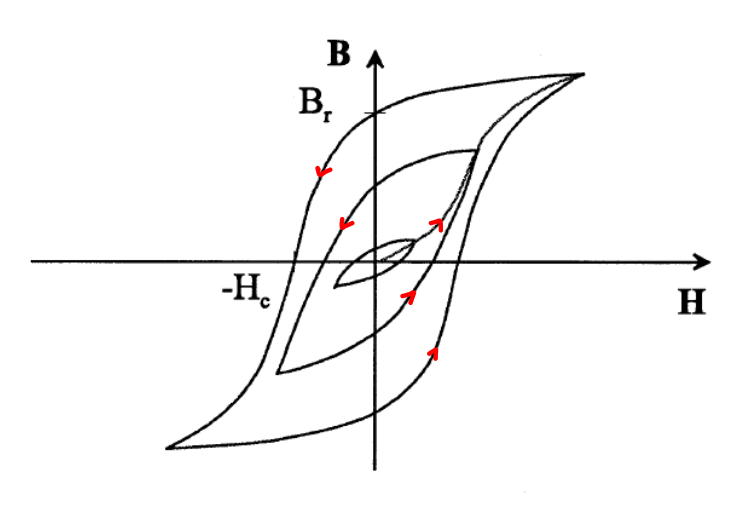

---
tags:
  - Konstante
  - Physik
aliases:
  - Permeabilitätskonstante
  - Permeabilität
  - Hysterese
  - Magnetisierungskurve
  - magnetische Sättigung
  - Koerzitvfeldstärke
  - Remanenzinduktion
keywords:
  - Materialgesetz
subject:
  - Elektrische Maschinen und Antriebselektronik
  - VL
semester: SS25
created: 10. März 2025
professor:
  - Reinhard Feger
release: true
title: Permeabilität
symbol: $\mu_{0}$
value: $1.25663706127(20) \cdot 10^{-6}$
unit: $\mathrm{\dfrac{Vs}{Am}}$
rel-uncertainty: 1.6e-10
---

# Permeabilität des Vakuums

> [!def] $\mu_{0} = 1.25663706127(20) \cdot 10^{-6} \mathrm{\frac{Vs}{Am}}$ ^DEF

# Materialgesetz - Permeabilität

> [!question] Themenkreis: [Magnetisches Feld](Magnetisches%20Feld.md), [Materialgesetze](../../Elektrotechnik/Materialgesetze.md)

---

Die **Permeabilität** $\mu$ bezeichnet die magnetische Leitfähigkeit von Werkstoffen.

Zwischen der **Flussdichte** $\mathbf{B}$ und der magnetischen Feldstärke $\mathbf{H}$ gilt für [isotrope](../../Dictionary/Isotrop.md) Stoffe folgender **nichtlinearer** Zusammenhang

> [!def] [[../../Elektrotechnik/Materialgesetze#^MATG|Materialgesetz]] für isotrope und nicht dispersive Stoffe
> $$\mathbf{B}= \mu \mathbf{H} = [\mu_{0}] = \mathrm{\frac{Vs}{Am} = \frac{H}{m}}$$
> 
> - $\mu_{0}$ ... [Permeabilität des Vakuums](#^DEF)
> - $\mu_{r}$ ... relative Permeabiltät des Materials (Einheitenlos)

Ein gut magnetisch leitfähiges Material möchte in einem Magnetfeld den Luftspalt minimieren.

- **ferromagnetisch**: $\mu_{r} \gg$ 
	- z.B.: Weicheisen
- **paramagnetisch**: $\mu_{r}>1$
- **diamagnetisch**: $\mu_{r} < 1$ 
	- Material wirkt dem B-Feld leicht entgegen
	- z.B.: Aluminium ist zwar gut elektrisch Leitfähig aber nicht magnetisch

## Magnetisierung

### Ferromagnetisch

Typischer Verlauf einer Weicheisenkennlinie bei Erregung mit einem Wechselfeld. Hier ist auch die nichtlinearität zu erkennen. 

- Das Material bleibt nach jedem Zyklus des Wechselfeldes magnetisiert.
- Die relative Permeabilität $\mu_{r}$ ist abhängig von des magnetischen Feldes

#### Kenngrößen

- **Remanenzinduktion** $B_{r}$: verbleibende Restinduktion wenn $H = 0$
- **Koerzitivfeldstärke** $H_{C}$: erforderliche Feldstärke für den induktionsfreien Zustand.
- **Sättigungsinduktion** $B_{S}$: Maximal mögliche Flussdichte im Material

#### Magnetische Sättigung

> [!question] **Manetische Sättigung:** Ab einem Gewissen Strom wird der Kern des Magnetkreises nicht weiter Magnetisiert
> - Ursache: Alle **Weißschen Bezirke** sind gleichgerichtet
> - Querschnitt des Magnetkreises größer machen um Sättigungsinduktion zu minimieren

Abbildung: Verschiebung der Weißschen Bezirke beim Aufmagnetisieren eines ferromagnetischen Materials

Entfernt man das externe Magnetfeld, verbleiben die Bezirke noch ausgerichtet, wodurch ein Teil des $\mathbf{B}$-Feldes erhalten bleibt (Remanenz). Gemeinesam mit der magnetischen Sättigung ist dadurch die starke nichtlinearität der Permeabilität begründet.

|                                                                  |                                                                     |
| ------------------------------------------------------------------------------------------------------ | --------------------------------------------------------------------------------------------------------- |
| Durch das Einbringen eines Magnetfeldes durch eine Spule in den Eisenkreis, wird der kern Magnetisiert | Damit ergibt sich für die Magnetische Flussdichte über dem Strom die Hysterese- oder Magnetisierungskurve |

## Elektrostatik

> [!satz] **S)** Permeabilität im statischen Fall ^STAT-PERM
>
> $$
> \mu = \mu_{0}\mu_{r} \quad\text{mit}\quad \mu_{r}\in \mathbb{R}
> $$

## Elektrodynamik

In Wechselfeldern müssen die dynamischen Eigenschaften des Materials berücksichtigt werden.

> [!question] Unterstrichene Symbole deuten darauf hin, dass diese als [Phasor](Wechselstromtechnik.md) notiert sind.

---

# Quellen

[Elektromagente-Kallenbach](../../xEDU/xLiteratur/Antriebstechnik/Elektromagente-Kallenbach.pdf) [p. 40]