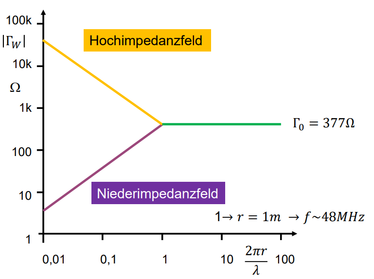

---
tags:
  - Konstante
  - Physik
aliases:
  - Feldwellenwiderstand
  - intrinsische Impedanz
  - Freiraumwellenwiderstand
symbol: $Z_{F}$
value: $376.730313412(59)$
unit: $\Omega$
subject:
  - EMV und SI
  - VL
  - Grundlagen der Hochfrequenztechnik
rel-uncertainty: 1.6e-10
keywords:
semester: WS25
created: 15th January 2026
professor:
  - Reinhard Feger
release: true
title: Freiraumwellenwiderstand
---

# Freiraumwellenwiderstand

> [!def] $\eta_{0}=376.730313412(59)~\Omega$
> $=\mu_{0} \cdot c\approx 120\pi ~\Omega$
> - $\mu$ ... [Permeabilitätskonstante](Permeablität.md)

# Wellenwiderstand

Wenn entweder $\mathbf{E}$ oder $\mathbf{H}$ bekannt ist, kann der andere Feldvektor mit den [Maxwell](../../Elektrotechnik/Maxwell.md)-Gleichungen 1 oder 2 berechnet werden. Der Zusammenhang der felder ist die intrinsische Impedanz $\eta$ des dielektrischen Mediums.

> [!satz] **S)**  Für *verlustlose* dielektrische Medien gilt
> 
> $$
> \eta = \frac{\omega\mu}{k} = \sqrt{ \frac{\mu}{\epsilon} }
> $$

> [!satz] **S)** Für *verlustbehaftete* dielektrische Medien gilt
> $$
> \eta = \frac{j\omega\mu}{\gamma}
> $$

Beim Hertzschen Dipol ist der Feldwellenwiderstand im Nahbereich ([Nahfeld](../../HF-Technik/Fernfeld%20und%20Nahfeld.md)) deutlich größer als $377 \Omega$, beim magnetischen Dipol deutlich kleiner.

Feld des Hertzschen Dipols $\rightarrow$ Hochimpedanzfeld
Feld des magnetischen Dipols $\rightarrow$ Niederimpedanzfeld