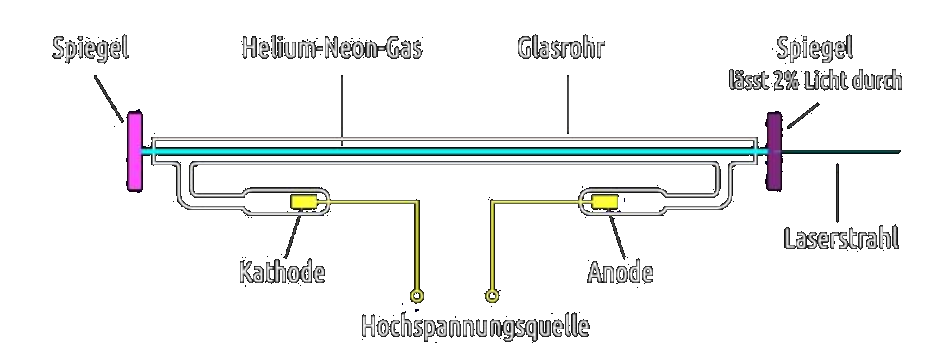

# Laser

> [!info] Akronym ***LASER***: ***L***ight ***A***mplification by ***S***timulated ***E***mission of ***R***adiation

## Eigenschaften

- **Laserlicht** ist nahezu paralleles Licht und kann gut gebündelt werden.
- **Laserlicht** hat eine hohe Energiedichte.
- **Laserlicht** ist monochromatisch, hat also eine ganz bestimmte Frequenz und damit eine ganz bestimmte Farbe, die von der chemischen Zusammensetzung des Energiespeichers abhängig ist.

## Helium Neon Laser

