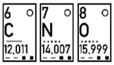
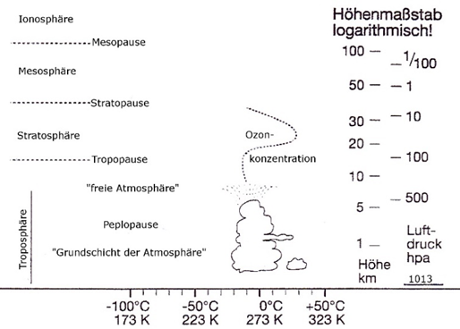

---
tags:
  - Physik
aliases:
  - Luft
material:
  - C
  - N
  - O
  - Ag
  - CO2
dielectric: "1"
tan-loss:
at: 10GHz
title: Lufthülle der Erde
created: 15th January 2026
release: false
---

# Lufthülle der Erde

| Anteil | Element           |
| ------ | ----------------- |
| 78%    | Stickstoff        |
| 20.94% | Sauerstoff        |
| 0.93%  | Argon             |
| 0.04%  | Kohlenstoffdioxid |  

\+ Spuren von Anderen Edelgasen  

  

