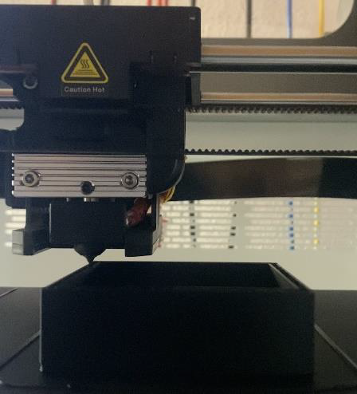

# Schmelzschichtverfahren

*Fused Deposition Modeling* (FDM) ist die Bezeichnung einer [3D-Druck](3D-Druck.md)technologie,
bei der ein thermoplastischer Kunststoff geschmolzen und anschließend in Lagen aufgeschichtet wird (Schmelzschichtverfahren) [^1].

Eine Spritzdüse, aus der heißer Kunststoff fließt, fährt für jede Schicht die Kontur des MCAD-Modells nach.

# Quellen