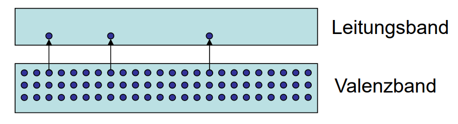

---
tags:
  - Halbleiter
aliases:
  - "#Halbleiter"
  - Halbleiterelektronik
keywords: 
subject:
  - Einführung Elektronik
  - VL
semester: WS24
created: 7. Februar 2025
professor:
  - Bernhard Jakoby
---
 
# Halbleiterphysik

## Bändermodell des [Siliziums](Silizium.md)

Bandstruktur: Aufpreizung der erlaubten Energieniveaus (siehe [Teilchen im Kasten](../../Elektrotechnik/Teilchen%20im%20Kasten.md)) durch Wechselwirkungen mit Nachbaratomen.

## Valenz und Leitungsband

Das Innere des reinen Siliziums kann als Atomgitter

Bei einem Intrinsischen[^1] halbleiter existieren grundsätzlich keine 
Durch thermische Anregung werden einzelne Elektronen in das Leitungsband gehoben und hinterlassen freie Plätze („Löcher“). Dichte der erzeugten Ladungsträger:

$$
n_i^2=C \cdot e^{\left(-\tfrac{W_G}{k_b T}\right)}
$$

Dadurch können auch im [Valenzband](../../Chemie/Valenzelektronen.md) wieder Elektronen verschoben werden.

Statt der Bewegung dieser Valenzelektronen kann man auch das Wandern des Loches betrachten das sich wie ein positiv geladener Ladungsträger verhält. Die Löcher bewegen sich unabhängig von den „zugehörigen“ Elektronen.

## pn-Übergang

### Eigenleitungsdichte

---

[^1]: Intrinsisch: 
