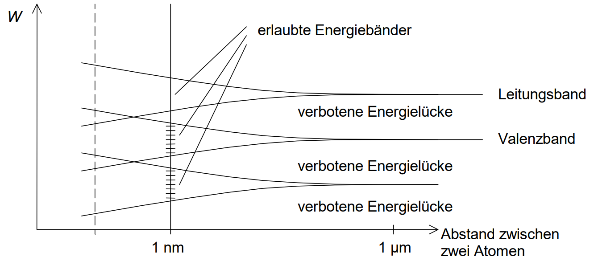
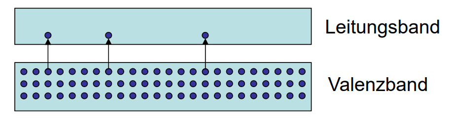

---
tags:
  - Material/Substrate
  - Halbleiter
  - incomplete
aliases:
  - Silizium
  - Halbleiter
subject:
  - VL
  - Einführung Elektronik
material:
  - Si
dielectric: 11.7
tan-loss: 0.005
at: 10GHz
semester: WS24
---

# Silizium

Bandstruktur: Aufpreizung der Energieniveaus (siehe [Teilchen im Kasten](../../Elektrotechnik/Teilchen%20im%20Kasten.md)) durch Wechselwirkungen mit Nachbaratomen

## Valenz und Leitungsband

Durch thermische Anregung werden einzelne Elektronen in das Leitungsband gehoben und hinterlassen freie Plätze („Löcher“). Dichte der erzeugten Ladungsträger:

# Tags

[Transistoren]({MOC}%20Transistor.md)  
[Diode](Diode.md)  
[Chemische Bindungen](../../Chemie/Chemische%20Bindungen.md)