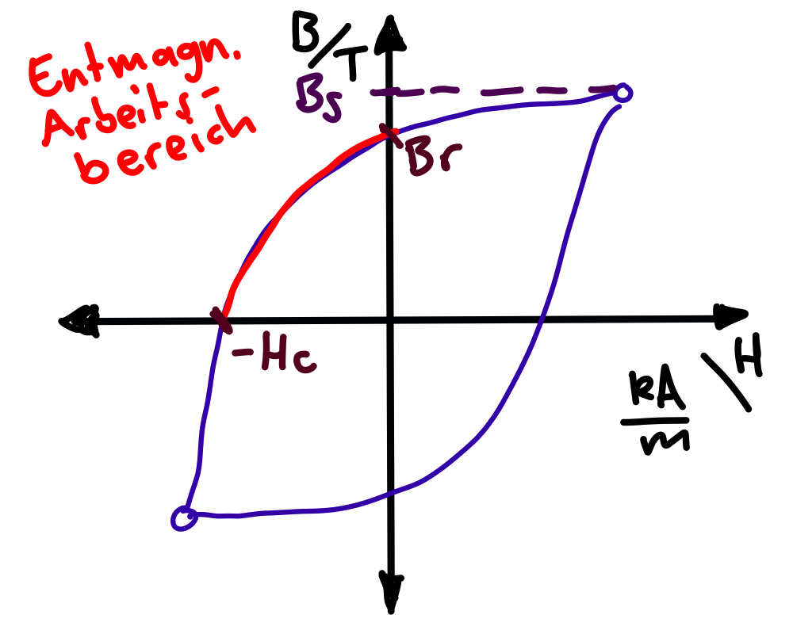
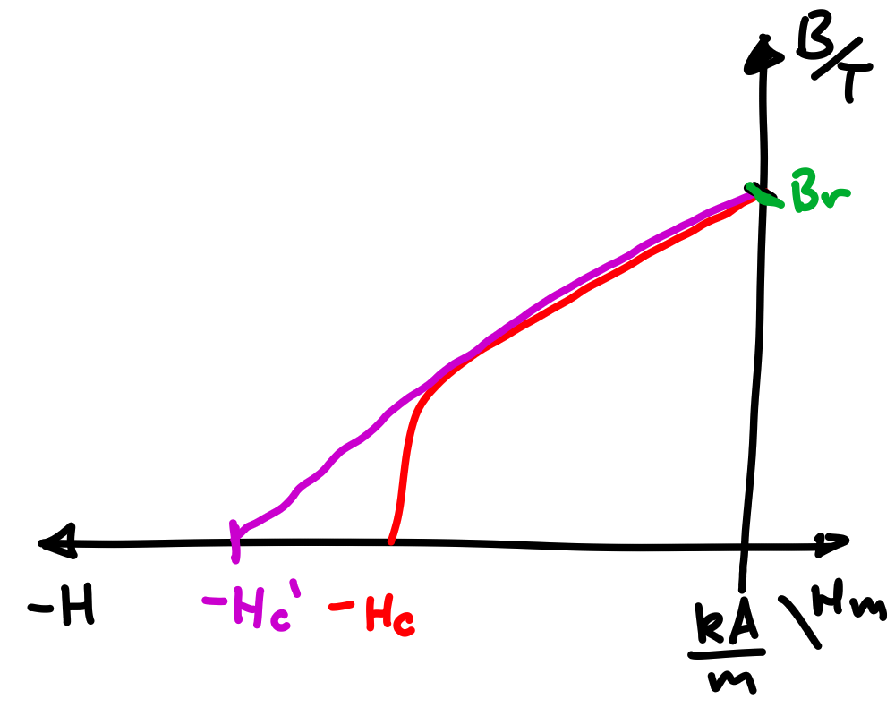

 
# Permanentmagnet

> [!question] [magnetische Feld](../Elektrotechnik/Magnetisches%20Feld.md), [Permeablität](Konstanten/Permeablität.md)

$$ B_{m} = B_{r} \mp \mu_{0}\mu_{r}H_{m} $$

**Vorzeichen:** $H_{m}$ ist im Arbeitspunkt negativ

Man rechnet oft in der Physik mit positiven H werten (konvention) deshalb 

- Wenn $H_{m}$ ein positiver Wert ist: Man rechnet mit $-$ in der Kennlinie
- Wenn $H_{m}$ ein negativer Wert ist: Man rechnet mit $+$ in der Kennlinie

## Linearisierung im Arbeitspunkt

Für Betreibt man den Magneten im Linearen Bereich, kann man das Materialgesetz anwenden.

$$ B_r = \mu_{0}\mu_{r}H_{C}' \implies B_{m} = \mu_{0}\mu_{r}(H_{C}' \mp H_{m}) $$

$H_{C}'$ ist konstant. Daher ist zu beachten, dass durch eine externe belastung $H_{m}$ des Magneten niemals eine Flussdichte unterschritten wird, in der die Magnetkennlinie den linearen Bereich verlässt. Sonst tritt eine unmkehrbare Entmagnetisierung des Permanentmagneten auf.

## Kennlinie

| Gesamte Magnethysteresekurve                 | **Lineareisierte** Entmagnetisierungs Kennlinie (2. Quadrant) |
| -------------------------------------------- | ------------------------------------------------------------- |
|  |                  |
