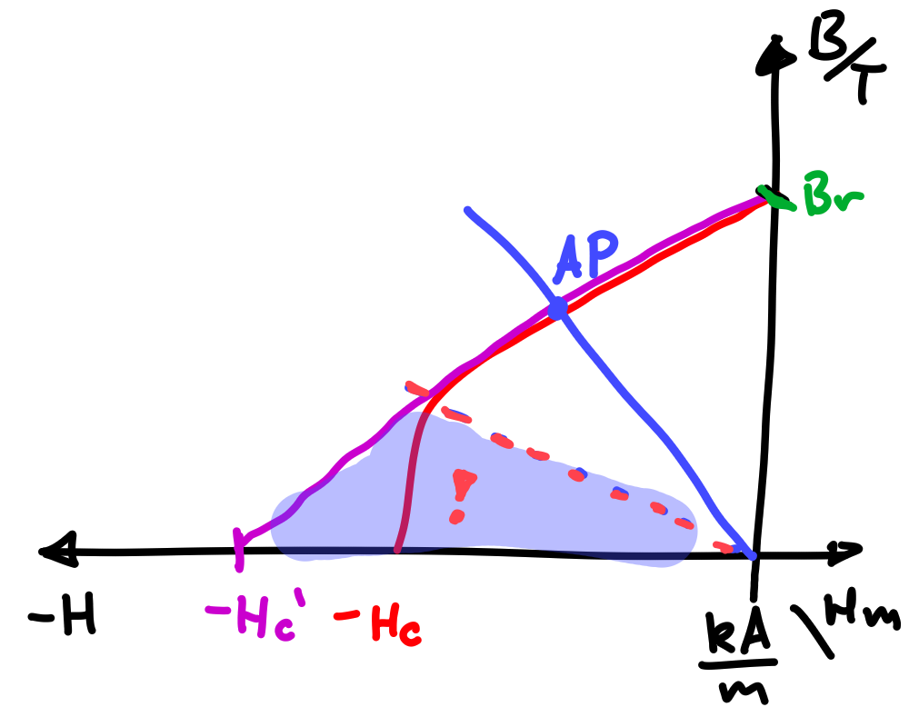

 

# Permanentmagnet

> [!question] Themengebiet [Magnetisches Feld](../Elektrotechnik/Magnetisches%20Feld.md)

---

## Magnetkennlinie

## Linearisierte Entmagnetisierungs Kennlinie

> [!def] **D1 - ENTM)** Linearisierte Entmagnetisierungs Kennlinie ^ENTM
> $$ B_{m} = B_{r} \mp \mu_{0}\mu_{r}H_{m} \tag{ENTM}$$

**Vorzeichen:** $H_{m}$ ist im Arbeitspunkt negativ

Man rechnet oft in der Physik mit positiven H werten (konvention) deshalb 

- Wenn $H_{m}$ ein positiver Wert ist: Man rechnet mit $-$ in der Kennlinie
- Wenn $H_{m}$ ein negativer Wert ist: Man rechnet mit $+$ in der Kennlinie

| Gesamte Magnethysteresekurve                 | **Lineareisierte** Entmagnetisierungs Kennlinie (2. Quadrant) |
| -------------------------------------------- | ------------------------------------------------------------- |
|  |                  |

### Arbeitsgerade und Arbeitspunkt

Die Arbeitsgerade ist jene Gerade, die durch die **Magnetische Rückwirkung** des angeschlossenen Magnetkreises entsteht. Der Schnittpunkt der Arbeitsgerade mit der Magnetkennlinie bezeichnet man als Betriebspunkt/Arbeitspunkt des Permanentmageneten.

Beispiel eines Einfachen Eisenkreises mit Permanentmagneten und Luftspalt

- Durchflutung: Masche aufstellen wie [hier](../Elektrotechnik/Maschinen/Magnetkreis.md#^MK-EX-3): $H_{m}l_{m} + H_{\delta}l_{\delta}+\underbrace{ H_{\text{Fe}}l_{\text{Fe}} }_{\approx 0} = 0$
- Daraus folgt die Arbeitsgerade des PMs

$$
B_{\mathrm{m}} = -\mu_{\mathrm{ges}} \mu_{0} \frac{l_{\mathrm{m}}A_{\delta}}{l_{\delta}A_{\mathrm{m}}}H_{m}
$$

### Energiedichte

