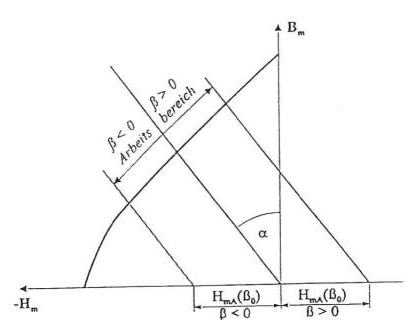
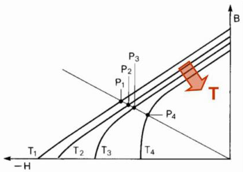
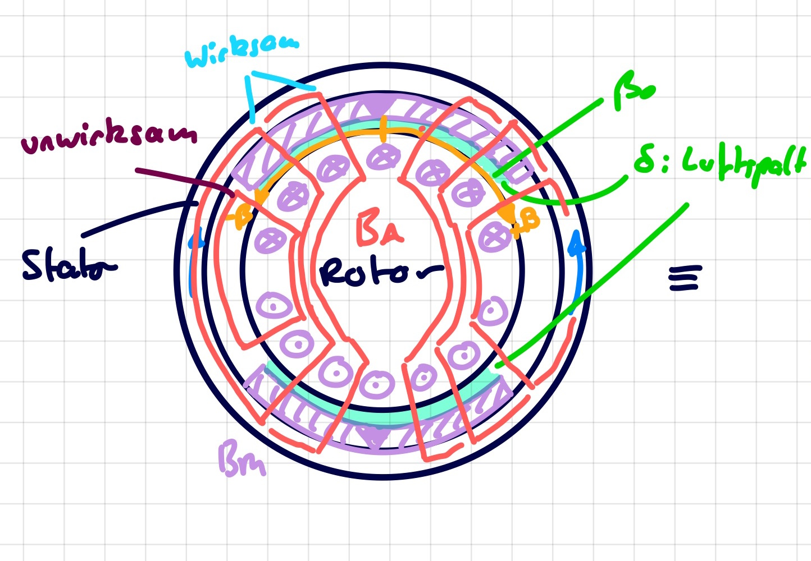
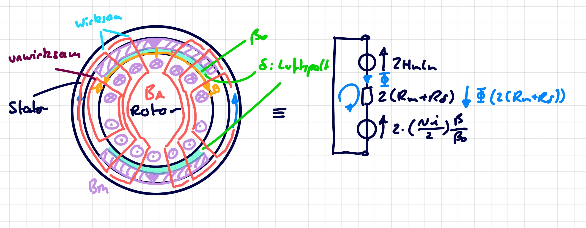

 

# Permanentmagnet

> [!question] Themengebiet [Magnetisches Feld](../Elektrotechnik/Magnetisches%20Feld.md)

---

## Magnetkennlinie

## Arbeitspunkt

> [!def] **Arbeitsgerade** 
Die Arbeitsgerade ist jene Gerade, die durch die **Magnetische Rückwirkung** des angeschlossenen Magnetkreises entsteht. Dabei müssen externe Gegenfelder berücksichtigt werden, welche Verschiebungen der Arbeitsgerade verusrsachen können.

> [!def] **Arbeitspunkt / Betriebspunkt**
> Der Schnittpunkt der Arbeitsgerade mit der **Magnetkennlinie** bezeichnet man als Betriebspunkt / Arbeitspunkt des Permanentmageneten.

### Verschiebung der Arbeitsgerade durch Gegenfelder

|                        |                                            |
| --------------------------------------------------------------------- | ----------------------------------------------------------------------------------------- |
| Einfluss des Ankerfeldes auf den Arbeitsbereich des Permanentmagenten | Entmagnetisierung durch Veränderung der Magnetkreisgeometrie (z.B. Entfernung des Rotors) |
|                        |                                            |
| Enmagnetisierug durch hohe Gegenfelder                                | Entmagentisierung durch Veränderung der Magentkennlinie infloge einer Temperaturerhöhung  |

## Linearisierte Entmagnetisierungs Kennlinie

| Gesamte Magnethysteresekurve                 | **Lineareisierte** Entmagnetisierungs Kennlinie (2. Quadrant) |
| -------------------------------------------- | ------------------------------------------------------------- |
|  |                  |

> [!def] **D1 - ENTM)** Linearisierte Entmagnetisierungs Kennlinie ^ENTM
>
> $$
> \begin{align}
> B_{m} &= B_{r} \mp \mu_{0}\mu_{r}H_{m}\\
> \mp H_{m} &= \frac{B_{\mathrm{m}}-B_{\mathrm{r}}}{\mu_{0}\mu_{\mathrm{m}}}
> \end{align}
> $$

**Vorzeichen:** $H_{m}$ ist im Arbeitspunkt negativ

Man rechnet oft in der Physik mit positiven H werten (konvention) deshalb 

- Wenn $H_{m}$ ein positiver Wert ist: Man rechnet mit $-$ in der Kennlinie
- Wenn $H_{m}$ ein negativer Wert ist: Man rechnet mit $+$ in der Kennlinie

### Beispiel: Einfacher Magnetkreis mit PM

Beispiel eines Einfachen Eisenkreises mit Permanentmagneten und Luftspalt **ohne** externe Gegenfelder.

Man berechnet die Masche des Eisenkreises mit **abgeschaltetem** Permanentmagenten um die reine Wirkung des Magnetkreises zu ermitteln.

> [!important] **PM-Arbeitsgerade** $B_{\mathrm{m}0}(H_{\mathrm{m}})$ einfacher Permanentmagnetischer Kreis
> $$
> B_{\mathrm{m}0}(H_{\mathrm{m}}) = -H_{\mathrm{m}} \mu_{0} \frac{l_{\mathrm{m}}A_{\delta}}{l_{\delta}A_{\mathrm{m}}}
> $$

> [!hint]- Herleitung
> 

Für den Betreibspunkt setzt man in die Arbeitsgerade die [lin. Emtmagnetisierungskennlinie](#^ENTM) ein.

> [!important] **PM-Betriebspunkt** einfacher Permanentmagnetischer Kreis
> $$
> B_{\mathrm{m}0} = \frac{B_{\mathrm{r}}}{1+\frac{\mu_{\mathrm{m}}l_{\delta}A_{\mathrm{m}}}{\mu_{\mathrm{ges}}l_{\mathrm{m}}A_{\delta}}}
> $$

> [!hint]- Herleitung
> 

### Beispiel: Gleichstrommaschine mit Ankerrückwirkung

Beispiel einer Gleichstrommaschine bei der Ankerrückwirkungen, also die Induktion der rotierenden Ankerwicklung ein Gegenfeld erzeugen. Bei der Arbeisgerade ist eine zusätzliche Verschiebung abhängig von der Ankerflussdichte durch den Permanentmagneten $B_{\mathrm{mA}}$ zu erkennen.

$$
B_{\mathrm{mA}}(\varphi) = \frac{Ni}{2} \cdot \frac{\beta(\varphi)}{\beta_{0}} \cdot \frac{\mu_{0}}{\frac{l_{\mathrm{m}}}{\mu_{\mathrm{m}}}+\frac{A_{\mathrm{m}}}{A_{\mathrm{\delta}}l_{\delta}}}
$$

$\frac{\beta(\varphi)}{\beta}$ ist dabei ein Verhältnis das die tatsächliche Wirkung des Ankerfeldes beschreibt, da sich abhängig vom Winkel $\varphi$ die Überlappung der wirksamen Flächen verändert.

> [!hint]- Herleitung
> 

> [!important] **PM-Arbeitsgerade** 
> 
> $$
> \begin{align}
> B_{\mathrm{m}}(H_{\mathrm{m}}) &= B_{\mathrm{m}0} (H_{\mathrm{m}}) \pm B_{\mathrm{mA}}(\varphi) \\
> &= -H_{\mathrm{m}} \mu_{0} \frac{l_{\mathrm{m}}A_{\delta}}{l_{\delta}A_{\mathrm{m}}} \pm \frac{Ni}{2} \frac{\beta(\varphi)}{\beta_{0}}  \frac{\mu_{0}}{\frac{l_{\mathrm{m}}}{\mu_{\mathrm{m}}}+\frac{A_{\mathrm{m}}}{A_{\mathrm{\delta}}l_{\delta}}}
> \end{align}
> $$
> 

### Energiedichte

---

# Anhang

## Herleitung 1

Ziel: $B_{\mathrm{m}}(H_{\mathrm{m}})$

- [Durchflutung](../Elektrotechnik/Durchflutung.md): Masche aufstellen, dabei wird der Eisenkreis als ideal angenommen.

$$
H_{\mathrm{m}}l_{\mathrm{m}} + H_{\delta}l_{\delta}+\underbrace{ H_{\text{Fe}}l_{\text{Fe}} }_{\approx 0} = 0
$$

- [Materialgesetz](Konstanten/Permeablität.md) anwenden: $\mu_{0}H_{\delta}= B_{\delta}$
- Mit der Luftspaltfläche Erweitern: $A_{\delta} / A_{\delta}$

$$
H_{\mathrm{m}}l_{\mathrm{m}} = -\frac{B_{\delta}}{\mu_{0}}l_{\delta}\cdot \frac{A_{\delta}}{A_{\delta}}
$$

- [Magnetischer Fluss](../Elektrotechnik/Magnetischer%20Fluss.md) einsetzen: $\Phi = B_{\delta}A_{\delta}$
- Es gibt nur eine Masche. Der Fluss durch den PM der gleiche wie durch den Luftspalt: $\Phi=B_{\mathrm{m}}A_{\mathrm{m}}$

$$
H_{\mathrm{m}}l_{\mathrm{m}} = -\frac{\Phi}{\mu_{0}A_{\delta}}l_{\delta} = -\frac{B_{\mathrm{m}}A_{\mathrm{m}}}{\mu_{0}A_{\delta}}l_{\delta}
$$

- Umformen auf $B_{\mathrm{m}}$ liefert die Arbeitsgerade

$$
B_{\mathrm{m}}(H_{m}) = -\mu_{0}H_{\mathrm{m}} \frac{l_{\mathrm{m}}A_{\delta}}{l_{\delta}A_{\mathrm{m}}}
$$

## Herleitung 2

Gesucht ist die Flussdichte im Permanentmagent während des Betriebs. D.h. den Schnittpunkt zwischen Arbeitskennlinie und Magnetkennlinie.

- Einsetzen von $H_{m}$ der [linearisierte Entmagnetisierungsgleichung](#^ENTM) liefert:

$$
\begin{align}
&B_{\mathrm{m}} = -\mu_{\mathrm{ges}} \cancel{ \mu_{0} } \frac{l_{\mathrm{m}}A_{\delta}}{l_{\delta}A_{\mathrm{m}}} \frac{B_{\mathrm{m}}-B_{\mathrm{r}}}{\cancel{ \mu_{0} }\mu_{\mathrm{m}}}\\
&B_{\mathrm{m}} = (B_{\mathrm{r}}-B_{\mathrm{m}}) \frac{\mu_{\mathrm{ges}}l_{\mathrm{m}}A_{\delta}}{\mu_{\mathrm{m}}l_{\delta}A_{\mathrm{m}}} \\
&B_{\mathrm{m}}\left(1+\frac{\mu_{\mathrm{ges}}l_{\mathrm{m}}A_{\delta}}{\mu_{\mathrm{m}}l_{\delta}A_{\mathrm{m}}}\right) = B_{\mathrm{r}} \frac{\mu_{\mathrm{ges}}l_{\mathrm{m}}A_{\delta}}{\mu_{\mathrm{m}}l_{\delta}A_{\mathrm{m}}} \\
&B_{\mathrm{m}}\left(1+\frac{\mu_{\mathrm{m}}l_{\delta}A_{\mathrm{m}}}{\mu_{\mathrm{ges}}l_{\mathrm{m}}A_{\delta}}\right) = B_{\mathrm{r}} \\
&B_{\mathrm{m}} = \frac{B_{\mathrm{r}}}{\left(1+\frac{\mu_{\mathrm{m}}l_{\delta}A_{\mathrm{m}}}{\mu_{\mathrm{ges}}l_{\mathrm{m}}A_{\delta}}\right)}
\end{align}
$$

## Herleitung 3

Bei der alleinigen Berechnung des Ankerfeldanteils gilt der Permanentmagent als Abgeschaltet:

$$ H_{\mathrm{m}}l_{\mathrm{m}} = 0 $$

Durch die Masche ergibt sich die Gleichung.

$$
\cancel{2}\Phi (\mathfrak{R}_{\mathrm{m}}+\mathfrak{R}_{\delta})-\cancel{2}\frac{Ni}{2} \frac{\beta(\varphi)}{\beta_{0}} = 0
$$

Es wird jener Fluss durch den Permanentmagenten $\Phi = B_{\mathrm{mA}}A_{\mathrm{m}}$ eingesetzt, und die [Reluktanz](../Elektrotechnik/Maschinen/Reluktanz.md#^RELU) des PMs und des Luftspalts in deren Geometrien zerlegt

$$
\begin{align}
B_{\mathrm{mA}}A_{\mathrm{m}} \left( \frac{l_{\mathrm{m}}}{\mu_{0}\mu_{\mathrm{m}}A_{\mathrm{m}}} + \frac{l_{\delta}}{\mu_{0}A_{\delta}} \right) &= \frac{Ni}{2} \frac{\beta(\varphi)}{\beta_{0}} \\
\frac{B_{\mathrm{mA}}}{\mu_{0}} \left( \frac{l_{\mathrm{m}}}{\mu_{\mathrm{m}}} + \frac{l_{\delta}A_{\mathrm{m}}}{A_{\delta}} \right) &= \frac{Ni}{2} \frac{\beta(\varphi)}{\beta_{0}} \\
B_{\mathrm{mA}}(\varphi) = \frac{\mu_{0}}{\frac{l_{\mathrm{m}}}{\mu_{m}}+\frac{l_{\delta}A_{\mathrm{m}}}{A_{\delta}}} & \frac{Ni}{2} \frac{\beta(\varphi)}{\beta_{0}} \\
\end{align}
$$

