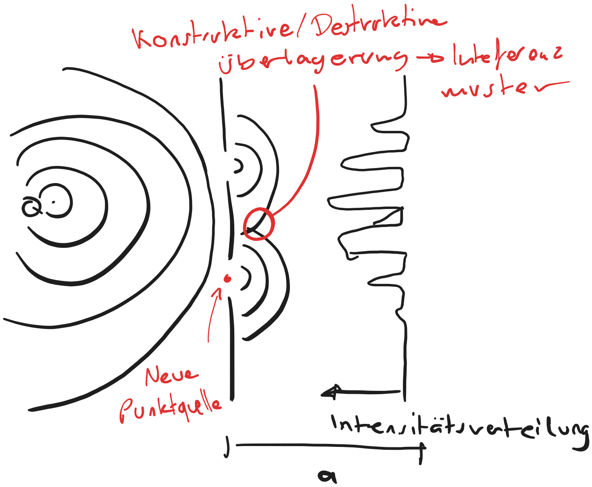

---
tags:
  - Quantenmechanik
aliases:
  - Heugensches Prinzip
subject:
  - VL
  - Einführung Elektronik
semester: WS24
created: 26th February 2026
professor:
  - Bernhard Jakoby
release: false
title: Doppelspalt Experiment
---

# Doppelspalt Experiment

%%[🖋 Edit in Excalidraw](../../_assets/Excalidraw/inteferentmuster.md)%%

> [!info] Heugensche Prinzip
> Jeder Punkt einer Wellenfront, kann als Ausgangspunkt einer neuen Punktquelle betrachtet werden. Die Ausbreitung der Wellenfront ohne Hindernis ergibt sich durch überlagerung (superposition) Automatisch.

Dieses Experiment gilt offenbar für Wellen wie z.B. Wasserwellen. Jedoch stellt sich heraus, dass auch Vermeindliche Teilchen wie Elektronen diesem Muster Folgen:

- Hat man in $Q$ eine Teilchenquelle, die Elektronen in alle Richtungen schießt, ergibt sich wiederum ein solches interferenzmuster
- Die Verteilung eines Elektrons ist stets ein [Statistisches](../../Mathematik/Statistik/index.md) Maß, welches schließlich dazu führte, dass die Lösung der [Schrödingergleichung](Schrödingergleichung.md) als Aufenthaltswahrscheinlichkeitsdichte interpretiert wurde.

%%[🖋 Edit in Excalidraw](../../_assets/Excalidraw/Doppelspalt%20Experiment%202026-02-26%2018.59.30.excalidraw.md)%%

Um alle Elektronen bei einer Beobachtung zu erfassen benötigt man eine starke Lichtquelle (d.h. viele Photonen abstrahlen)

Während der Beobachtung interagieren Photonen mit der Wellenfunktion des Elektrons. Durch die Energie übertragung des Photons an das Elektron ($E=hf$) fällt das Elektron in einen definierten Zustand. Es verhält sich bis zum Auftreffen auf dem Schirm wie ein Teilchen, wodurch das Inteferenzmuster Verschwindet.

Das ist jedoch auch nur der Fall wenn die Photonen genügend Energie haben. Das heißt die Frequenz muss hoch genung sein. Bei Langen Wellenlängen verschwindet das Inteferenzmuster z.B. nicht, egal wie stark die Lichtquelle ist.
