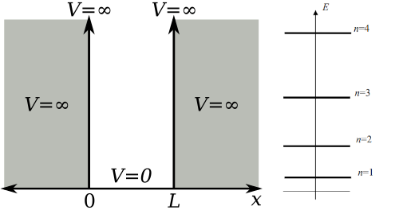

 

# Teilchen im Kasten Modell

> [!success] Modell für Atom, Stationäre Zustände

$$
\psi(x)= \sqrt{ \frac{2}{L} }\cdot \sin\left( \frac{n\pi}{L}\cdot x \right)
$$

Für stationäre Zustände sind nur diskrete Energieniveaus $n$ möglich
$$
E_{n}=\frac{\hbar^{2}n^{2}}{8mL^{2}}
$$

Diese Energie niveaus begründen die Schalen in der Chemie

---

- [Pauli-Prinzip – Wikipedia](https://de.wikipedia.org/wiki/Pauli-Prinzip)