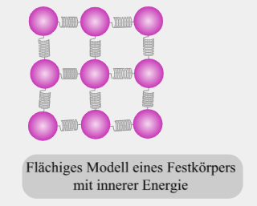

# Temperatur und Teilchenmodell

## 1 Teilchenmodell

 - Alle Körper sind aus kleinen, sich ständig bewegenden Teilchen aufgebaut.
 - Im Festkörper haben alle Teilchen einen festen Platz, um den sie sich bewegen.
 - Je *mehr* ein Stoff *erwärmt* wird, desto *mehr* *bewegen* sich die Teilchen des Stoffes.

## 2 Brown'sche [Bewegung](Kinematik.md) und Innere Energie

- Die Atome eines Körpers sind auch ohne Krafteinwirkung von außen immer in [Bewegung](Kinematik.md).
- Einen Festkörper kannst du dir als *Feder-Kugel-Modell* vorstellen.
- 
- Die Summe aller kinetischen und potentiellen Energien der Atome eines Körpers wird als **innere Energie** bezeichnet.

---

# Tags

[LEIFIphysik](https://www.leifiphysik.de/waermelehre/temperatur-und-teilchenmodell)
