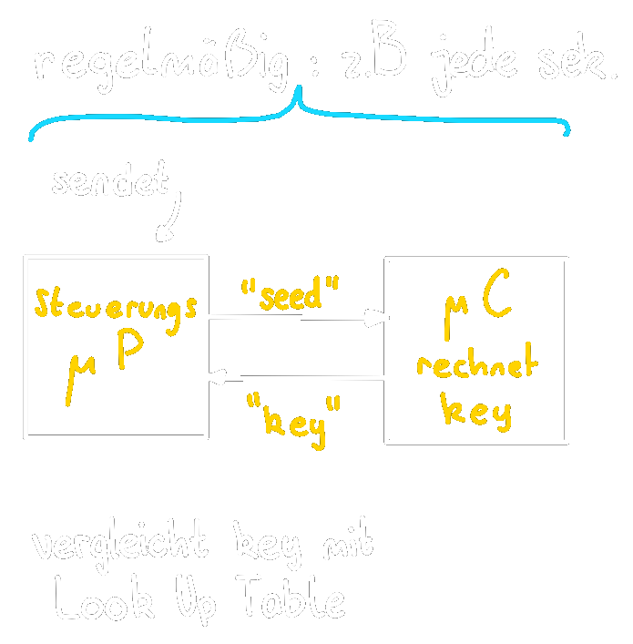

# Reset Generierung

> [!todo] Aufgaben
> Beim Systemstart:
> - Deaktivieren aller Systemkomponenten bis die Versorgungspannung stabil ist.
> - Zurücksetzen aller Systemkomponenten in einen definierten Anfangszustand.
> 
> Im laufenden Betrieb:
> - Aufheben von Systemblockaden
> - zurücksetzen aller Systemkomponenten in einen definierten Anfangszustand

# Watchdog
$\rightarrow$ "seed-key" Prinzip

# Tags