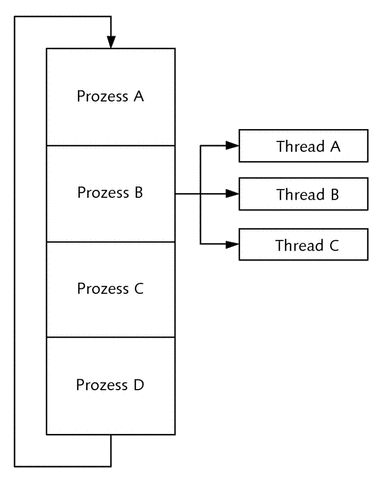

# Betriebssysteme

## 1. Allgemein

Ein Betriebssystem ist die **Software**, die **den Betrieb Computers ermöglicht**.


Es **verwaltet Betriebsmittel** wie Speicher, Ein- und Ausgabegeräte (und stellt sie somit zur Verfügung) und steuert die Ausführung von Programmen. 

### Aufgaben

Ein Betriebssystem hat folgende grundlegende Aufgaben:  

1. Verwaltung
   - CPU: Prozessor(en)

   - RAM: Hauptspeicher, virtueller Speicher (Swap-Space)

   - HD: externe Speicher (Platte, Band, …, Dateisysteme)  	

   - Peripheriegeräte (Terminal, Drucker, Plotter, etc.)  	

   - Rechenzeit 
     Dispatcher: Laden/Starten/Stoppen von Programmen (Prozessen)  	

2. Rechte

   Schutzstrategien bei dieser Ressourcenbereitstellung 

3. Benutzerschnittstelle
   - Shell - Bereitstellen einer **Benutzerschnittstelle** ("Kommandointerpreter", "Shell") 
   - API - Bereitstellen einer (normierten) Programmierschnittstelle (API), ggf. auch Compiler, Linker, Editor	

4. Dispatcher

   Prozessverwaltung (Starten, Stoppen, Synchronisation, Kommunikation)

5. Netzwerk

   Anbieten/Nutzen von Diensten

### Abstrakte Maschine

**Verbergen der Komplexität** der Maschine vor dem Anwender (Abstraktion), Abstraktion des Maschinenbegriffes (nach Coy):  


- Reale Maschine = Hardware (CPU + RAM + Peripheriegeräte)
- Abstrakte Maschine = Reale Maschine + Betriebssystem
- Benutzermaschine = Abstrakte Maschine + Anwendungsprogramm  	

###  Klassifizierung von Betriebssystemen

http://de.wikipedia.org/wiki/Liste_der_Betriebssysteme

Je nach den verschiedenen Aufgabenbereichen entstanden verschiedene Arten von Betriebssystemen:

- [Parallele Systeme, Verteilte Systeme](http://de.wikipedia.org/wiki/Verteilte_Systeme),  

- Personal-Computer-Systeme (PC),  

- Time-Sharing-Systeme,  

- Real-Time-Systeme und  

- Mobile- / Handheld-Systeme.


Im **PC-Bereich** sind derzeit die meist genutzten Betriebssysteme die verschiedenen Varianten von **Microsoft Windows, Apple Mac OS X, Linux** (GNU-Lizenz).

Für spezielle Anwendungen (Beispiel: **industrielle Steuerung**) werden auch experimentelle Betriebssysteme für Forschung- und Lehrzwecke eingesetzt.

Bei bestimmten Betriebssystemen spielt die Verarbeitungszeit eine Rolle. Bei (Echtzeit-)Betriebssystemen für Steuerungs- und Regelungsaufgaben (sog. Prozessrechner) spielt die Antwortzeit eine Rolle. Informationen werden hier zum Teil von Sensoren gewonnen. Das Programm reagiert auf äußere Ereignisse in angemessen kurzer Zeit (Maschinenregelung: 1 - 10 ms, Prozessregelung: 10 - 100 ms, Prozesssteuerung: 0,1 - 1 s). Es wird spezielle Hard- und Software benötigt.  

###  Schichtenmodell eines Betriebssystems

Zur logischen Strukturierung wird das Betriebssystem normalerweise in mehrere **Schichten** oder Schalen eingeteilt.  

- Die unterste Schale beinhaltet alle **hardwareabhängigen** Teile des Betriebssystems, insbesondere auch die **Verarbeitung von** **Interrupts**. 
  Auf diese Weise ist es möglich, das BS leicht an unterschiedliche Rechnerausstattungen anzupassen.  
- Die nächste Schicht enthält die grundlegenden **Ein-/Ausgabe**-Dienste für Plattenspeicher und Peripheriegeräte. (**BIOS**)
- Die darauf folgende Schicht behandelt **Kommunikations- und** **Netzwerkdienste**, **Dateien und** **Dateisysteme**. Weitere Schichten können je nach Anforderung folgen. Ein Betriebssystem besitzt also drei oder mehr logische Schichten.


**Jede** **Schicht** bildet eine abstrakte (virtuelle) Maschine, die mit ihren benachbarten Schichten über **wohldefinierte Schnittstellen kommuniziert**.  

Sie kann Funktionen der nächst niedrigeren Schicht aufrufen und ihrerseits Funktionen für die nächsthöhere Schicht zur Verfügung stellen.  

Die Gesamtheit der von einer Schicht angebotenen Funktionen wird auch als "**Dienste" dieser Schicht bezeichnet**. Die Gesamtheit der Vorschriften, die bei der Nutzung der Dienste einzuhalten sind, wird als "Protokoll" bezeichnet.  

Die unterste Schicht setzt immer direkt auf der Rechner-Hardware auf. Sie verwaltet die *realen Betriebsmittel* des Rechners und stellt stattdessen virtuelle Betriebsmittel bereit. Oft wird diese Schicht als "BIOS" (Basic I/O-System) bezeichnet. Alle weiteren Schichten sind von der Hardware unabhängig.  

Durch jede Schicht wird eine zunehmende "**Veredelung**" der Hardware erreicht (z. B. wachsende Abstraktion, wachsende Benutzerfreundlichkeit).  


 

Durch die Programmierschnittstelle (**API**, Application Programmer Interface) der höheren Schichten wird auch vermieden, dass jeder Programmierer die grundlegenden Routinen für den Zugriff auf Ein-/Ausgabegeräte und Massenspeicher selbst programmieren muss.  

**Das BS stellt also eine** **definierte Programmierschnittstelle** **zur Verfügung**. Änderungen am BS oder der Hardware wirken sich so nicht auf die Anwenderprogramme aus, die nach wie vor über die gleichen Betriebssystem-Aufrufe die Dienste des BS in Anspruch nehmen.


###  Multitasking

Wenn mehrere Prozesse **quasiparallel/nebenläufig** nebeneinander laufen, dann benötigt das durch den zusätzlichen Aufwand durch die Aufteilung / Organisation der Mittel länger als wenn die Prozesse komplett hintereinander laufen.

Wird allerdings einer der Prozesse in seinem Ablauf blockiert, dann wird solange kein weiterer ausstehender Prozess ausgeführt. Das passieren relativ häufig durch das Warten auf eine Benutzereingabe oder auf sonstige langsame Ereignisse (Festplattenzugriff, Drucker, Netzwerk ...). Für diese Fälle ist das quasiparallele Ausführen eine große Beschleunigung.


## 2. Prozesse

- **Programm**

  Die Lösung einer Programmieraufgabe (=Algorithmus) wird in Form eines Programms realisiert. Teillösungen werden dabei als Prozeduren (Unterprogramme) formuliert, welche nach Beendigung ihrer Arbeit zum aufrufenden übergeordneten Programm zurückkehren. Damit die Leistungen des Betriebssystemkerns problemlos in Anwenderlösungen eingebunden werden können, sind sie ebenfalls als Prozeduren realisiert. 

  Ein Programm besteht aus:  

  - **Codesegment** - Befehlen
  - **Datensegment** - Programmdaten	
  - **Stacksegment** - Organisation des Prozeduraufrufes, lokale Variablen

- **Prozess**

  Wird ein Programm/Prozedur in einem Betriebssystem **ausgeführt**, so wird dieser Ablauf als **Prozess** (**Task**) bezeichnet. Bei der Ausführung von Prozessen entstehen Statusinformationen (Registerinhalte ...).

  **Prozess:**

  

  Alle vier Komponenten, die bei der Ausführung eines Programms (einer Prozedur) beteiligt sind, werden als Instanz zusammengefasst. 

- **Instanz** besteht aus

  ​	C: Code-Segment -> problemorientiert

  ​	D: Daten-Segment -> problemorientiert

  ​	S: Stack-Segment -> System-/problemorientiert

  ​	I: Status-Information -> systemorientiert

- **Thread**

  Damit ein Prozess wiederum quasiparallele Abläufe realisieren kann, können Prozesse (mehrere) Threads starten. Dabei handelt es sich um sogenannte *leichtgewichtige Prozesse*.  
  
  

 - Letztendlich besteht ein Prozess mindestens aus einem Thread. 	

 - Ein Prozess endet dann, wenn alle seine Threads enden.  	
- Der erste Thread der weitere Threads startet wird *Haupt-Thread* genannt
- Threads teilen sich (abgesehen vom Stacksegment und dem Befehlszähler) die Ressourcen.

Prozesse werden gegenüber Threads immer als *schwergewichtig* dargestellt. Das kommt daher, dass bei der Erstellung eines Prozesses der komplette Namensraum dupliziert werden muss. 

Diesen Aufwand spart man bei der Verwendung von Threads, da diese in einem gemeinsamen Adressraum ablaufen. 

Somit stehen den einzelnen Threads dasselbe Codesegment, Datensegment, der Heap und alle anderen Zustandsdaten, die ein *gewöhnlicher* Prozess besitzt, zur Verfügung – was somit auch die Arbeit beim Austausch von Daten und bei der Kommunikation untereinander erheblich erleichtert. 

Weil aber kein Speicherschutzmechanismus unter den Threads vorhanden ist, bedeutet dies auch, dass ein Thread, wenn er abstürzt, alle anderen Threads mit abstürzen lässt.


 


Zusammenfassend:

- **Prozess / Task** = Instanz eines Programms während der Ausführung
  
  **Thread** = einer von mehreren gleichzeitig laufenden Teilen eines Prozesses - besitzt kein eigenes Datensegment, aber ein eigenes Stacksegment und eigene Statusinformation (Befehlszähler)

- In modernen Betriebssystemen können sich mehrere Prozesse gleichzeitig im Speicher befinden, es können jedoch nur so viele Prozesse gleichzeitig ausgeführt werden wie Rechnerkerne vorhanden sind

  **parallel** = gleichzeitig (in eigenen CPUs) laufend
  **quasiparallel** = gleichzeitig im Speicherbefindlich und abwechselnd in geteilter CPU ausgeführt

- **Scheduler** = Teil des OS - weißt CPU einem Prozess zu
  **Multitasking** = pseudo-parallele Prozesse - eine CPU wird eine *Zeitscheibe* lang zugeteilt

- **Instanz** = Gesamtheit der Prozesszustände eines Prozesses - wird im OS in einer Prozesstabelle gespeichert

- Prozesse können Prozesse erzeugen (fork) und mit anderen Prozessen kommunizieren (read, write)
  [Demo: pstree, forkdemo.c, pipe-fork.c, mkfifo] 

- **Kooperierende Prozesse** = Prozesse die voneinander abhängen und **synchronisiert** sein müssen

- **Priorität** = Dringlichkeit mit der ein Prozess CPU-Zeit zugeordnet wird


### Prozesszustände

Mögliche Zustände, die ein Prozess einnehmen kann (hier am Beispiel ein einfaches 3-Zustands-Prozessmodell - das kann in unterschiedlichen OS ähnlich implementiert sein)

- aktiv (**running**): Prozess wird aktuell von der CPU bearbeitet
- bereit (**ready**): Prozess ist zur Ausführung durch die CPU bereit, wird allerdings aktuell durch einen anderen Prozess verdrängt
- **blockiert**: Prozess ist noch nicht zur Ausführung durch die CPU bereit. Er wartet auf das Eintreten eines bestimmten Ereignisses (z. B. Drucker bereit, Benutzereingabe, etc.). Der Einfachheit halber wird hier ein Rechnersystem mit nur einer CPU angenommen, d. h. ein Prozess ist aktiv, alle anderen sind bereit oder blockiert.
- Für **bereite** und **blockierte Prozesse** wird jeweils eine **eigene** **Warteliste** geführt.
- Ein neu gestartetes Programm wird am Ende der Bereit-Liste eingetragen.
- Ein spezieller Teil des Betriebssystems, der **Scheduler**, teilt den Prozessen die CPU zu. 
  Für die Zuteilung existieren unterschiedliche Algorithmen, die das Ziel haben, die CPU möglichst gerecht unter allen Prozessen aufzuteilen. Für die Steuerung der Zeitscheiben ist ein in regelmäßigen Zeitabständen auftretender Hardwareinterrupt notwendig --> der Scheduler wird regelmäßig aufgerufen. Die Situation in der Hardware stellt sich etwa folgendermaßen dar:

Im Speicher liegen die einzelnen Instanzen der Prozesse.  

Jeweils einem Prozess wird die CPU zugeteilt. In der folgenden Abbildung sind 4 Instanzen dargestellt mit ihren Code, Daten, Stack Daten und ein Prozessor der den Prozessen zugeteilt wird:


 Der Wechsel der Prozess-Zustände erfolgen wie hier dargestellt:


Übergänge:

- **Dispatch**: bereit -> aktiv - Zuteilung der CPU an einen Prozess.
- **Timerrunout**: aktiv -> bereit - Nach Ablauf einer Zeitscheibe wird dem Prozess die CPU wieder entzogen.
- **Block**: aktiv -> blockiert  - ein aktiver Prozess wird durch eine Ressource blockiert (wartet auf Eingabe oder Ausgabe ...). Einziger Wechsel den ein Prozess selbst auslösen kann.
- **Wakeup**: blockiert -> bereit - Das Ereignis, auf das der Prozess gewartet hat, ist eingetreten. Signal an den Prozess 	

###  Process Control Block (PCB):  

Zu jedem Prozess legt das OS einen Prozesssteuerblock (**process control block = PCB**) in der Prozesstabelle ab, der alle notwendigen **Informationen über einen Prozess** enthält, z. B.: 

- **PID**- dies ist eine eindeutige Zahl, über die der Prozess im System identifiziert wird
- **Prozesszustand** (bereit, aktiv, blockierend)
- **Blockadeursachen** bei einem schlafenden Prozess (z.B. anderer Prozess schreibt gerade in eine Log-Datei, Drucker, .... gemeinsames Betriebsmittel)
- Verweise auf die dem Prozess zugeteilten Speicherseiten (*Pages*)
- Benutzerkennungen (bestimmen die *Rechte* des Prozesses)
- Identifikation empfangener, aber noch nicht bearbeiteter *Signale*


Zusätzlich zum PCB werden noch weitere, zum Prozess gehörige Daten geführt, auf die er aber nur im Zustand *running* Zugriff hat. Dazu gehören:  

- Eine **Signal-Tabelle**, in der die Reaktion des Prozesses auf jedes mögliche Signal festgelegt ist (=Sprungtabelle)
- Verweis auf das zugeordnete **Terminal**
- Verweis auf das aktuelle **Inhaltsverzeichnis**
- Die Tabelle der **Dateideskriptoren**
- Eine Bitmaske, die die **Zugriffsrechte** von Dateien mitbestimmt, die vom jeweiligen Prozess erzeugt werden

### Prozesshierarchie

In UNIX(-ähnliche) OS kann aus einem Prozess ein neuer Prozess gestartet werden (fork()). Ein solcher Prozess heißt **Kind-Prozess** (*child process*) und der Erzeuger-Prozess wird **Eltern-Prozess** (*parent process*) genannt. Beim forken wird der Kindprozess als Kopie des aufrufenden Prozesses erzeugt.

- Jeder Kind-Prozess hat genau einen Eltern-Prozess  
- Ein Eltern-Prozess kann mehrere Kind-Prozesse besitzen  


[Unix: pstree, ps aux,  top]

###  Prozess-Operationen des BS

|          |                                                              |
| -------- | ------------------------------------------------------------ |
| Create   | Erzeugen eines Prozesses (z.B. Laden eines Programms)<br />Vergabe einer PID,<br />Anlegen eines PCB in der Prozesstabelle Allokieren des benötigten Speichers<br />Reservieren der benötigten Ressourcen<br />Vergabe einer Priorität |
| Kill     | Löschen eines Prozesses<br />Löschen aller Einträge aus den Systemtabellen<br />Freigabe von Speicher und Ressourcen (z.B. Dateien schließen)<br />Löschen aller Abkömmlinge (Kindp., Enkelp., usw.) |
| Suspend  | Die Ausführung eines Prozesses wird unterbrochen<br />Suspendierung normalerweise nur bei Systemüberlastung durch Prozesse höherer Priorität, Wiederaufnahme erfolgt sobald möglich. |
| Resume   | Wiederaufnehmen eines suspendierten Prozesses                |
| Block    | Blockieren eines Prozesses                                   |
| Wakeup   | Aufwecken eines blockierten Prozesses                        |
| Dispatch | CPU an einen Prozess zuteilen                                |
| Change   | Priorität eines Prozesses ändern                             |

Durch die Suspendierungsmöglichkeit erweitert sich das Diagramm der Prozesszustände. Im suspendierten Zustand wird der Prozess in einen Sekundär-Speicher ausgelagert:  


##  3. Prozess-Synchronisation

In einigen Multitasking-Betriebssystemen teilen sich verschiedene Prozesse *gemeinsame Betriebsmittel* (Ressourcen). Bei gleichzeitigem Zugriff mehrerer Prozesse auf diese Betriebsmittel kann es zu Inkonsistenzen der Daten kommen, die oft sehr schwer aufzuspüren sind.  

Kooperierende nebenläufige Prozesse müssen daher wegen der zwischen ihnen vorhandenen Abhängigkeiten miteinander **synchronisiert** (koordiniert) werden. 


Prinzipiell lassen sich zwei Klassen von Abhängigkeiten unterscheiden:  

- **Sperrsynchronisation**:
  Die Prozesse konkurrieren um die Nutzung gemeinsamer, exklusiv nutzbarer Betriebsmittel 
  Beispiel: Zwei Prozesse greifen verändernd auf gemeinsame Daten zu. Der Zugriff zu den gemeinsamen Daten muss koordiniert werden, um eine Inkonsistenz der Daten zu vermeiden -> Sperrsynchronisation (gegenseitiger Ausschluss, *mutual exclusion*).
- **Ereignissynchronisation**:
  Die Prozesse sind voneinander datenabhängig. 
  Beispiel: Ein Prozess erzeugt Daten, die von einem anderen Prozess weiter verarbeitet werden. Es muss eine bestimmte Abarbeitungsreihenfolge eingehalten werden -> Zustands- oder Ereignissynchronisation (z. B. Produzenten-Konsumenten-Synchronisation)  


Ohne eine solche Sperrung entstehen Datenverluste: Problem des **Lost Update**.


###  Das *Lost Update*-Problem

- **Beispiel 1 für *Lost Update*-Problem:**
  Thread1 und Thread2 greifen schreibend auf eine gemeinsame Variable namens `mCount` zu. Sie wollen jeweils die Variable `mCount` um 1 erhöhen. 

  Annahme beim Start: `mCount = 7`

  Das Erhöhen einer Variablen kann durch folgende Elementaroperationen realisiert werden:
  
  ​	 read  -> inc -> write
  
  Ein Thread kann zwischen jeden dieser Schritte vom Scheduler unterbrochen werden. Daraus kann sich folgendes Scenario ergeben:
  
  ```
  T1: read variable mCount (7)
							T2: read variable mCount (7)
							T2: inc variable mCount (8)
							T2: write variable mCount (8)
  T1: inc variable mCount (8)
  T1: write variable mCount (8)
  ```
  
  
  Eigentlich müsste `mCount` den Wert 9 haben, da `mCount` ja 2 mal erhöht wurde, es wurde jedoch einer der Updates verloren -> **Lost Update**

- **Beispiel 2:**  
  
  - Prozess A informiert sich in der Spooler-Warteschlange über den nächsten freien Eintrag und notiert dessen Adresse, z. B. 7 in der Variable next_free_slot. Danach wird ihm der Prozessor entzogen.  
  - Prozess B findet die gleiche Adresse (7) und trägt sie in next_free_slot ein. Danach schreibt er an die Position 7 der Warteschlange den Namen der auszugebenden Datei und erhöht die Variable next_free_slot auf 8.  
  - Prozess A erhält nun den Prozessor wieder zugeteilt und macht dort weiter, wo er unterbrochen wurde. Er kennt noch next_free_slot mit dem Wert 7 und trägt den Namen der von ihm auszugebenden Datei in Position 7 der Spooler-Warteschlange ein und erhöht die Variable next_free_slot ohne zu bemerken, dass der Wert 8 dort schon eingetragen war.
  - **Folge:** Prozess A überschreibt den Dateinamen, den Prozess B in der Spooler-Warteschlange auf Position 8 eingetragen hatte. Diese Datei wird vom Spooler *vergessen*.  

###  Kritische Abschnitte / Wechselseitiger Ausschluss

Die oben angeführten Situationen sind **zeitkritische Abläufe**.

> Programmabschnitte, die auf gemeinsam benutzte Daten zugreifen, heißen **kritische Abschnitte**.  

Fehler in zeitkritischen Abläufen sind sehr schwer erkennbar (sie treten nur selten auf). Kritische Abschnitte können überall da auftreten, wo mehrere Prozesse um eine Ressource konkurrieren, die sie schreibend benutzen. Das trifft besonders auf Datenbankserver zu (z. B. Reservierungssysteme o. ä.). 

> Zeitkritische Abläufe können nur durch **wechselseitigen Ausschluss** geschützt werden.  


Vier Bedingungen für eine gute Lösung (nach Tanenbaum):  

1. **Höchstens ein Prozess** darf sich in einem kritischen Abschnitt aufhalten.
2. Es dürfen **keine Annahmen** über Ausführungsgeschwindigkeit und Anzahl der Prozessoren gemacht werden.
3. **Kein Prozess**, der sich **in** einem **kritischen Abschnitt** befindet, **darf andere blockieren.**
4. **Kein Prozess soll unendlich lange warten** müssen, bis er in einen kritischen Bereich eintreten darf.  

Die letzten beiden Punkte dienen der Stabilität, sie verhindern Prozessverklemmungen.

###  Erzeuger-Verbraucher Problem: ein typ. Beispiel v. Kritischen Abläufen

- **Das Erzeuger-Verbraucher-Problem:**
  Der Erzeuger E stellt ein Produkt her und stellt es in einen begrenzten Pufferspeicher. Verbraucher V entnimmt dem Puffer ein Stück des Produktes, um es zu verbrauchen. Beides geschieht zu zufälligen Zeitpunkten. Der **Puffer wird von beiden gemeinsam verwaltet**. Solche Erzeuger-Verbraucher-Probleme treten beispielsweise bei Pipes auf (ein Prozess erzeugt Daten, der andere verarbeitet sie weiter).

- Der **Erzeuger** muss zuerst prüfen, **ob noch Platz** im Puffer ist, bevor er ein Produkt ablegen kann. 
  Er muss dann auch den Produktzähler count erhöhen. 

  **Ist der Puffer voll, muss er schlafen gehen.**

- Der **Verbraucher** muss prüfen, ob der Puffer nicht **leer** ist, bevor er etwas entnimmt. 
  Er muss dann count dekrementieren. 

  **Ist der Puffer leer, muss er schlafen gehen.**

- Wenn der **Erzeuger** ein Produkt in den Puffer stellt, **muss er den Verbraucher wecken**. 
  Analog muss der **Verbraucher den Erzeuger wecken,** wenn er ein Produkt aus dem Puffer entnimmt.  


Tanenbaum verwendet dafür die Funktionen SLEEP und WAKEUP. Er zeigt eine Lösung für das Erzeuger-Verbraucher-Modell, die einen fatalen Fehler zulässt:   

```c
#define N 100                     /* Puffergröße   */
int count = 0;                    /* Tatsächlicher Pufferinhalt */

void producer (void){
    tinhalt item;
    while (1) {                   /*  Endlosschleife */
        item = produce_item();    /*  Erzeuge 1 Stück */

        if(count == N) SLEEP();   /*  Falls Puffer voll, schlafen */
        enter_item(item);         /*  lege erzeugtes Stück in Puffer  */
        count++;
    
                                  /*  wenn Puffer vor dem Weiterzählen leer war, */
    					                   /*  Verbraucher wecken */
        if (count == 1) WAKEUP(consumer);
     
    }
}

void consumer (void){
    tinhalt item;
    while (1){                    /*  Endlosschleife */
        if (count == 0) SLEEP();  /*  Falls Puffer leer, schlafen */
        item = remove_item();     /*  entnehme dem Puffer ein Stück */
        count--;                  /*  Pufferinhalt korrigieren */

                                  /*  wenn Puffer vor Korrigieren voll war, */
                                  /*  Erzeuger wecken */
        if (count == N-1) WAKEUP(producer);  
        consume_item (item);      /* verbrauche 1 Stück */
    }
}
```

Die Funktionen producer(), consumer() sollen selbstständig laufende Prozesse repräsentieren, die beide zu beliebigen Zeitpunkten durch einen Scheduler-Eingriff unterbrochen oder wieder aktiviert werden können. 

Wenn der Consumer schläft, weil der Puffer leer ist, muss man nicht davon ausgehen, dass der Puffer immer leer bleibt. Der Producer kann ja zwischendurch den Prozessor zugeteilt bekommen, etwas in den Puffer legen und den Consumer wieder wecken. 

Umgekehrt schläft der Producer, wenn der Puffer voll ist. Während er schläft, kann der Consumer den Prozessor zugeteilt bekommen, etwas verbrauchen (so dass im Puffer wieder Platz wird) und den Producer wieder wecken.

Der Fehler tritt bei folgendem Szenario auf:  

- **Verbraucher: **
  Der Puffer ist LEER und der Verbraucher stellt das fest (count == 0) und möchte in den **SLEEP** wechseln.
  Genau zu diesem Zeitpunkt unterbricht der Scheduler den Verbraucher und startet den Produzenten.  

- **Produzent:**
  Dieser legt ein Produkt in den Puffer, setzt count auf 1 und startet **WAKEUP**. 
  
- Wenn der **Verbraucher** vom Scheduler wieder die CPU zugeteilt bekommt, ist er gerade noch wach. Der **Weckruf** bleibt folgenlos, weil ja der Verbraucher noch wach ist. 

Der **Verbraucher** wechselt nun in den **SLEEP** Zustand. 

- Für den Produzenten gibt es keinen Anlass, nochmals zu wecken. 

  **Der Verbraucher wird nie mehr geweckt!** Ursache für diese **Blockade** ist  
  
- eine **Prozessunterbrechung im kritischen Abschnitt** zwischen Erkennung der Bedingung, die zum Aufruf von SLEEP führt und dem SLEEP-Kommando selbst.   

###  Lösungsversuche für das Problem der kritischen Abschnitte

1. Einfachste Lösung: Vor Eintritt in den kritischen Bereich alle Interrupts sperren und sie nach Verlassen des kritischen Bereichs wieder freigeben. Damit kann der Scheduler nicht während des kritischen Abschnitts den Prozess unterbrechen.
   Nachteil: Kein verdrängendes Multitasking mehr. Der Anwender-Prozess kann den Scheduler blockieren (gewollt oder ungewollt durch einen Programmfehler).

2. **Verfahren mit gegenseitigem Ausschluss**
   Der Programmabschnitt, in dem ein Zugriff zu dem nur exklusiv nutzbaren Betriebsmittel (z. B. die gemeinsamen Daten) erfolgt, wird **kritischer Abschnitt** genannt. Es muss verhindert werden, dass sich zwei Prozesse gleichzeitig in ihren kritischen Abschnitten befinden.

   **Sperrvariable**: Es wird eine logische Variable geführt, die mit 0 den Eintritt in den kritischen Bereich erlaubt und mit 1 sperrt. Der in den kritischen Bereich eintretende Prozess muss dann  	

   - **vor seinem Eintritt** prüfen, ob der Bereich frei ist, 

   - die Sperrvariable auf 1 setzen und  		

   - nach Ende wieder freigeben.

     Der Abschnitt von der Prüfung der Sperrvariablen bis zu ihrem Setzen ist selbst ein kritischer Abschnitt! Er ist zwar kürzer und damit die Konfliktwahrscheinlichkeit geringer, aber die Gefahr des Konfliktes ist nicht beseitigt! Es gibt bei vielen CPUs jedoch Befehle von der Form **Teste und Setze**, bei denen der kritische Abschnitt innerhalb eines Maschinenbefehls abgehandelt wird. 
     Damit ist folgende Lösung möglich:

   - Aktives Warten:

     ```c
     bool v;
     /* 	Warten/Eintreten: Warteschleife, bis Riegelvariable 	RV[i]= 0 ist */
     do
         v = test_and_set(&RV[i]);
     while (v);
        	
     /* Eintreten: kritischer Abschnitt zur Datenmenge i */
     RV[i] 	= 1;  	
     ...
     /* Austreten: kritischer Abschnitt zur Datenmenge i verlassen */
     RV[i] = 0;
     ```

     Die Ver- bzw. Entriegelung wird häufig mit den Funktionen LOCK und UNLOCK formuliert:
   
     ```c
     LOCK(RV[i]);
     ...
     /* 	kritischer Abschnitt zur Datenmenge i */
     ...
      UNLOCK(RV[i]); 	 	
     ```

     **Nachteil**: Aktives Warten verbraucht CPU-Zeit durch Warteschleifen.
     

     Eine bessere Lösung, weil das Betriebssystem selbständig die Synchronisation leisten kann, sind sogenannte Semaphore.


### Semaphore


Bisher haben die Prozesse ihren Eintritt in den kritischen Abschnitt selbst gesteuert. 

> Die folgenden Techniken erlauben es dem Betriebssystem, Prozessen den Zutritt zum kritischen Abschnitt zu verwehren. 

Im Zusammenhang mit Algol 68 entwickelte Dijkstra das Prinzip der Arbeit mit Semaphoren. Für jeden gemeinsamen Speicher/Betriebsmittel wird ein Semaphor eingeführt.


 Ein **Semaphor** (auch Sperrvariable genannt) besteht aus  

-  einem **Zähler** und  
-  einem **FIFO-Speicher**

```c
struct Semaphore{
    int count=1;

    FIFO queue;
}
```


Der Semaphor unterstützt zwei (nicht unterbrechbare) Operationen

-  **P() … Passieren** auch:
  wait()  … Eintreten in den kritischen Abschnitt  
  
-  **V() … verlassen** auch:
  signal()  … Verlassen des kritischen Abschnittes 
  
-  Ein **Semaphor** ist mit einer Ampel vergleichbar.
  Denn wenn ein Prozess in einen kritischen Abschnitt eintreten will, verwendet er wait(). Wenn der kritische Abschnitt frei ist, kann der Prozess eintreten, sonst muss der Prozess warten. Beim Verlassen des kritischen Abschnitts gibt der Prozess durch signal() bekannt, dass er den Abschnitt verlassen hat.
  Sollte ein anderer Prozess auf den Eintritt in den kritischen Abschnitt warten, wird dieser darüber informiert.


- Semaphore-Operationen:

  ```c
  struct Semaphore sema;
  
  ...
  
  wait(sema):
  
  if (sema.count>0){
      sema.count= sema.count – 1;
  } else{
      addProcess(pid,sema.queue);
      suspend(pid);
  }
  
  signal(sema) :  
  
  if (isEmpty(sema.queue)== false){
      pid= removeProcess(sema.queue);
      resume(pid); 
  } else {
      sema.count= sema.count + 1;
  }
  ```

**Ein Semaphor**

-  **signalisiert einen Zustand** (Belegungszustand) und  
-  **gibt** (in Abhängigkeit von diesem Zustand) den Eintritt in den kritischen Abschnitt **frei** oder
-  versetzt den betreffenden **Prozess in den Wartezustand.**  


Die binären Semaphore werden auch **Mutexe** (von *Mutual Exclusion*) genannt, jene vom Typ Integer auch "Zähl-Semaphore". 

- **Semaphore für die Sperr-Synchronistion (den gegenseitigen Ausschluss)**
  sind dem jeweiligen exklusiv nutzbaren Betriebsmittel zugeordnet und **verwalten eine Warteliste** für dieses Betriebsmittel. Sie sind allen Prozessen zugänglich. 
  
- **Semaphore für die Ereignis-Synchronisation** 
  zweier voneinander datenabhängiger Prozesse sind diesen Prozessen direkt zugeordnet. Sie dienen zur Übergabe einer Meldung über das Ereignis zwischen den Prozessen.  

###  Semaphore für Erzeuger-Verbraucher-Synchronisation  


Vorbesetzung der Semaphore: `start = 0; finish = 0`:   

| Erzeuger:                                                    | Verbraucher:                                                 |
| ------------------------------------------------------------ | ------------------------------------------------------------ |
| while (1)    {<br />  while (!buffer_full) <br />  write_into_buffer();<br />  **signal(start)**;   /* V-Oper. */ <br />  wait(finish);    /* P-Oper. */<br />} | while (1)    {<br />  **wait(start)**;  /* P-Operation */<br />     while(!buffer-empty) <br />     read_from_buffer();<br />    signal(finish);      /* V-Operation */<br />    } |

Der Verbraucher wird gleich schlafend gelegt. Warum?
Wenn der Erzeuger Daten abgelegt hat, signalisiert er dies durch signal(start).
Damit kann der Erzeuger nun loslegen.

…

## 4. Prozess-Kommunikation

Einige Möglichkeiten der Interprocess Communication (IPC):

- Kommunikation über **gemeinsame Speicherbereiche**
  Prozesse können gemeinsame Datenbereiche, Variablen etc. anlegen und gemeinsam nutzen.

- Kommunikation über **gemeinsame Dateien**
  Prozesse schreiben in Dateien, die von anderen Prozessen gelesen werden.

  Beispiel:
  
  ```
  mkfifo /tmp/bla; ls -l /tmp/bla
  shell2: cat /tmp/bla 
  shell1: cat /etc/passwd > /tmp/bla
  ```
  
  Beispiel:
  
  ```
  sudo vi /etc/syslog.conf .... . |/dev/xconsole
  sudo /etc/init.d/sysklogd restart
  shell1: cat /dev/xconsole
  shell2: su - 
  shell2: logger "Dies ist ein Test f. syslog und named pipe /dev/xconsole"
  ```
  
- Kommunikation über **Pipes**
  Dies sind unidirektionale Datenkanäle zwischen zwei Prozessen. Ein Prozess schreibt Daten in den Kanal (Anfügen am Ende) und ein anderer Prozess liest die Daten in der gleichen Reihenfolge wieder aus (Entnahme am Anfang). Realisierung im Speicher oder als Dateien. Lebensdauer in der Regel solange beide Prozesse existieren.

  [Beispiel: POSIX: cat /etc/passwd | cut -d":" -f1 | sort > usernames.txt]  

- Kommunikation über **Signale**
  Signale sind asynchron auftretende Ereignisse, die eine Unterbrechung bewirken (-> Software Interrupt). In der Regel zur Kommunikation zwischen BS und Benutzer-Prozess.

  [Beispiel: POSIX: selfalarm.c; id-code.c; control-c.c; kill-usr1-usr2.c]  

  - Auslösung vom Benutzer (z. B. Tastendruck)  	
  - Auslösung durch Programmfehler (z. B. Division durch 0)  	
  - Auslösung durch andere Prozesse (z. B. Plattenzugriff durch BS-Dienstroutine, "Daten sind 	bereit")  	
  - ...

- Kommunikation über **Nachrichten** (Botschaften, Messages)
  Nachrichten werden vom BS verwaltet. Dieses stellt eine für die beteiligten Prozesse gemeinsam nutzbare Transportinstanz (z. B. "Mailbox") zur Verfügung. Auf diese greifen die Prozesse über bestimmte Transport-Funktionen des BS (Systemaufrufe) zu. Prozess A sendet z. B. eine Botschaft an Prozess B, indem er sie in der Mailbox ablegt (`send(message);`). Der Prozess B holt die Nachricht dann von der Mailbox ab (`receive(message);`).

- Kommunikation über **Streams (Sockets)**
  Streams ermöglichen die Kommunikation über Rechnernetze. Logisch gesehen haben Streams dieselbe Aufgabe wie die lokalen Pipes.
  [Beispiel: Socket: t_fileclient.c/t_fileserver.c; t_fileclient.c/t_popenserver.c]  

- Kommunikation über **Prozedurfernaufrufe** (remote procedure call)
  Ein Prozess ruft eine in einem anderen Prozess angesiedelte Prozedur auf (also über seine Adressgrenzen hinweg). Besonders für Client-Server-Beziehungen geeignet.  

Selbst bei sehr einfachen Betriebssystemen ist eine IPC notwendig, da zumindest eine Kommunikation zwischen einem Prozess und dem Scheduler möglich sein muss.  

## 5. Prozess-Scheduling

In Multitasking-Betriebssystemen ist ein spezieller Prozess notwendig, der aus den bereiten Prozessen den nächsten aktiven Prozess auswählt. Sobald mehr als ein Prozess den Zustand *bereit* besitzt, muss der Scheduler des Betriebssystems entscheiden, welcher Prozess die CPU erhält (wir gehen zur Vereinfachung von einem System mit nur einem Prozessor aus). Kriterien für einen guten Scheduler sind:


- **Gerechtigkeit:** Jeder Prozess erhält einen *gerechten* CPU-Anteil  
- **Effizienz:** Die CPU sollte immer zu 100% ausgelastet sein  
- **Antwortzeit:** Minimale Antwortzeit für interaktive Benutzer  
- **Verweilzeit:** Angemessen kurze Verweilzeit für Batch-Aufträge  
- **Durchsatz:** Möglichst viele Aufträge/Zeitraum abarbeiten  
- **Terminerfüllung:** Bereitstellung bestimmter Ergebnisse zu festgelegten Zeitpunkten  


Bei Multitasking-Betriebssystemen werden zwei Grundsysteme für das Scheduling unterschieden:  

- **kooperatives Multitasking** (**non preemptive**) 
  Der aktive Prozess gibt **von sich** aus die CPU zu einem geeigneten Zeitpunkt frei. Es ist nur ein geringer Verwaltungsaufwand nötig. Es besteht jedoch die Gefahr, dass ein "unkooperativer" oder fehlerhafter Prozess alle anderen Prozesse blockiert. 

- **verdrängendes Multitasking** (**preemptive=unterbrechbar**) Der Scheduler kann einem Prozess die CPU entziehen (z. B. ausgelöst durch einen Timer-Interrupt). Dadurch kann die Bearbeitung dringlicherer Aufgaben jederzeit begonnen werden (z. B. bei Echtzeit-BS). Ein fehlerhafter Prozess kann das System nicht blockieren). 

  [Beispiel: POSIX: selfalarm.c, ./selfalarm.exe 1 & ./selfalarm.exe 0] 

  Anstoß für den Prozesswechsel durch Verdrängung:

  - **Zeitgesteuerte** Strategien
    Jeder Prozess erhält die CPU für eine bestimmte Zeitspanne (Zeitscheibe). Danach wird die CPU dem nächsten Prozess zugeteilt (**Zeitscheibenverfahren, round robin**).

  - **Ereignisgesteuerte** Strategien
  	Ein Prozesswechsel findet statt, wenn ein Ereignis (z. B. ein Hardwareinterrupt) einen anderen Prozess benötigt. Hier werden allgemein den einzelnen Prozessen Prioritäten zugeordnet, die sich dynamisch ändern. Ein bestimmtes Ereignis verleiht *seinem* Prozess eine höhere Priorität.


###  Scheduling-Strategien

Einige Strategien, die in der Praxis verwendet werden, sind:  

- Wer zuerst kommt, wird zuerst bedient (**first come, first served**): 
  Verteilung der Prioritäten nach Ankunftszeit, ohne Vorrechte. Kommen zwei Prozesse genau gleichzeitig, wird eine zufällige Auswahl getroffen. Gute Systemauslastung, aber schlechtes Antwortzeitverhalten (lang laufende Prozesse behindern Kurzläufer). Einfach zu implementieren.

- **Zeitscheibenverfahren (round robin**):
  Jeder Prozess erhält eine feste Zeitspanne (time slice) zugeordnet. Nach Ablauf dieser Zeitspanne wird er verdrängt und der nächste Prozess erhält die CPU -> zyklische Zuteilung. Alle Prozesse haben immer die gleiche Priorität. Die Zeitspanne kann konstant sein oder abhängig von der Prozessorbelastung variieren. Kurze Antwortzeiten bei kleinen Zeitscheiben, aber dann höhere Verluste durch die häufigen Prozesswechsel.

- **Prioritätssteuerung:**
  Jedem bereiten Prozess wird eine Priorität zugeordnet. Vergabe der CPU in absteigender Priorität. Ein Prozess niedrigerer Priorität kann die CPU erst erhalten, wenn alle Prozesse höherer Priorität abgearbeitet sind. 

  Ein **bereit werdender** Prozess höherer Priorität **verdrängt** einen aktiven Prozess niedrigerer Priorität. Alle Prozesse gleicher Priorität werden i. a. in jeweils einer eigenen Warteschlange geführt.

  Realisierung mehrerer unterschiedlicher Verfahren, z. Teil gemischt mit anderen Strategien , z. B.  

  - Reine Prioritätssteuerung: Prozesse gleicher Priorität werden nach der Eingangsreihenfolge 	abgearbeitet (z. B. in Echtzeit-BS)  	
  - Prioritätssteuerung mit unterlagertem Zeitscheibenverfahren: Prozesse gleicher Priorität werden nach dem Zeitscheibenverfahren abgearbeitet  	
  - Dynamische Prioritätsvergabe: Die Priorität auf die CPU wartender Prozesse wird allmählich 	erhöht  	
  - Mehrstufiges Herabsetzen (multilevel feedback): Festlegung einer maximalen Rechenzeit für jede Prioritätsstufe. Hat ein Prozess die maximale Rechenzeit seiner Priorität verbraucht, bekommt er die nächstniedrigere Priorität, bis er die niedrigste Stufe erreicht hat.

- Es gibt noch zahlreiche weitere Scheduling-Strategien.  


In **Dialogsystemen** wird normalerweise **Round Robin** verwendet, um den Benutzern akzeptable Antwortzeiten zu bieten.

**Betriebssystemdienste** dürfen **keine globalen Speicherbereiche** verwenden, da diese von allen laufenden Prozessen aufgerufen werden können und sonst bei der Prozessumschaltung Werte des verdrängten Prozesses durch den BS-Aufruf des nun aktiven Prozesses überschrieben würden. Man nennt diese Eigenschaft **Wiedereintrittsfähigkeit** (engl. **reentrance**).  

Manche Singletasking-BS (z. B. MS-DOS) sind nicht reentrant und daher nicht oder nur schwer auf Multitaskingbetrieb erweiterbar.  

##  6. Gemeinsame Nutzung von Betriebsmitteln/Deadlocks  

Manche Betriebsmittel dürfen nicht gleichzeitig von mehreren Prozessen genutzt werden. Klassisches Beispiel ist hier der Drucker. Die Ausgaben mehrerer Prozesse würden vermischt. Abhilfe bietet hier die Nutzung des Druckers durch einen einzigen Prozess, den Druckerspooler. Alle Prozesse übergeben ihre Ausgaben an diesen Prozess, der die Druckaufträge in einer Warteschlange speichert und nacheinander abarbeitet.  

Beim Wettbewerb mehrerer Prozesse um Betriebsmittel (Ressourcen), zu denen ja primär Speicher, Dateien und die (als Dateien eingebundenen)Geräte gehören, kann es zu sogenannten **Verklemmungen (dead locks)** kommen.


Eine Verklemmung tritt bei **Anforderungen von Ressourcen durch mehrere Prozesse** dann auf, wenn ohne drastische Aktionen des BS all diese Anforderungen **niemals erfüllt werden** können. Folge: Die Prozesse blockieren sich gegenseitig.  

Beispiel aus dem täglichen Leben:


Das Problem wurde schon vor vielen Jahren behoben. Die Abbiegevorschriften wurden so geändert, dass die Autos **voreinander** abbiegen dürfen.  

Die speisenden Philosophen


Dieses Beispiel stammt von Dijkstra und ist als Demonstrationsmodell für das Entstehen von Deadlocks gedacht. Es wird seither auch immer als Testproblem für neue Prozess-Synchronisations-Algorithmen verwendet. Bei Tanenbaum essen die Philosophen Spaghetti und zwar immer mit zwei Gabeln.  

Programm für einen Philosophen mit zwei Gabeln: 

```c
#include "prototypes.h"
#define   N 5
void philosoph (int i) {   
    while (1)              # Endlosschleife
    {  
        denke();
        NimmGabel(links);
        NimmGabel(rechts);
        esse();
        LegeGabel(links);
        LegeGabel(rechts);
    }
}
```

Unterstellt man, dass die Philosophen pseudoparallel, also in Zeitscheiben arbeiten, ist das Modell gleichzeitig auch als Modell für die Beschreibung kritischer Abschnitte (zeitkritischer Situationen) geeignet. 

Die Funktion `NimmGabel(Seite)`, müsste logischerweise zuerst prüfen, ob die Gabel frei ist, und erst dann die Gabel aufnehmen. Der zeitkritische Charakter der Funktion `NimmGabel(Seite)` besteht darin, dass zwischen der Prüfung "Gabel frei" und der Ausführung `NimmGabel(Seite)`ein zeitkritischer Abschnitt besteht. 

Die Lösung kann zur Verklemmung führen, wenn alle Philosophen sich an den Tisch setzen und jeder zunächst die links von ihm liegende Gabel nimmt.

```
            NimmGabel(links);
```

Jeder wartet anschließend auf das Freiwerden der anderen Gabel.

```
            NimmGabel(rechts);
```


Keiner kann essen, keiner wird die reservierte Gabel wieder freigeben, das Programm muss von außen abgebrochen werden.


Verklemmungen treten bei konkurrierendem Zugriff auf Ressourcen auf, die exklusiv nur von einem Prozess benutzt werden sollen. Ressourcen können z.B. E/A-Geräte, Dateien, Datenbanktabellen, oder Daten im Hauptspeicher sein.

Oder bei einer Verkehrssteuerung, das Recht, eine Kreuzung zu passieren:


 **Beispiel: System mit Drucker und Magnetband, 2 Prozesse**  

- **Prozess A** fordert den **Drucker** an,  

- ​                                                                **Prozess B** die **Bandstation.** 

   

- ​                             Beiden Anforderungen wird entsprochen.

   

- Nun fordert A die **Bandstation** an, 
  ohne den Drucker freizugeben.  

- ​                                                               Prozess B fordert dagegen den **Drucker** an 
  ​                                                               ohne die Bandstation freizugeben.

   

- ​                            Folge: gegenseitige Blockierung 

  

Setzt man für "Drucker" und "Bandstation" zwei Datensätze einer Datenbankdatei, so führt auch diese Situation zur Verklemmung. Nahezu jede Situation, in der Prozesse Ressourcen **exklusiv** anfordern, kann zur Verklemmung führen. 

Jedes exklusive Betriebsmittel kann immer nur von einem Prozess angefordert werden. Solange das Betriebsmittel nicht frei ist, verbleiben andere Prozesse im Zustand "blockiert". Nicht jede Anforderung von exklusiven Ressourcen führt zur Verklemmung. 

Für das Auftreten einer Verklemmung müssen folgende Bedingungen erfüllt sein:  

- **Exklusive Nutzung:** Das BM wird entweder von genau einem Prozess verwendet oder es ist frei (z. B. Druckerspooler).  
- **Wartebedingung:** Prozesse belegen verfügbare BM, während sie auf zusätzliche BM warten.  
- **Nichtentziehbarkeit:** Einem Prozess können zugeordnete BM nicht zwangsweise entzogen werden; er muss sie explizit freigeben.  
- **Geschlossene Kette:** Es existiert eine geschlossene Kette von 2 bis n Prozessen. Jeder von ihnen wartet auf ein BM, das durch den nächsten Prozess in der Kette gehalten wird.  


Im allgemeinen werden vier **Strategien zur Behandlung von Verklemmungen** verwendet:  

- **Ignorieren des Problems**
  Die Frage ist, wie oft eine Verklemmung auftritt. Bei durchschnittlich einer Verklemmung pro Monat kann das Problem durchaus ignoriert werden. Interaktiv arbeitende Benutzer werden sowieso bald die Geduld verlieren und den Prozess abbrechen. Bei Batch-Systemen wird die Verklemmung bei der täglichen oder wöchentlichen Systemwartung entdeckt.

- **Entdecken und Beheben von Verklemmungen**
  Das BS hält Anforderungen und Freigaben von BM fest und stellt sie in Form eines BM-Grafen dar. Bei jeder Anforderung/Freigabe wird der Graf auf Zyklen untersucht. Billigere Methode: Zyklisch prüfen, ob ein Prozess längere Zeit (einige Stunden) blockiert ist und diesen dann entfernen. Nachteil: möglicherweise inkonsistente Daten.

- **Verhindern von Verklemmungen durch Negation einer der 4 Bedingungen**

  Beispiel Drucker: Es wird ein Prozess eingeführt, der als einziger Prozess den Drucker exklusiv 		*besitzt*.

- **Vermeiden der Verklemmungen durch sorgfältige BM-Vergabe**
  Durch geeignete BM-Zuweisung kann eine Verklemmung vermieden werden, wenn einige Informationen im voraus verfügbar sind.

 ## Ressourcen

- Andrew S. Tanenbaum: Moderne Betriebssysteme.
- [www.netzmafia.de](http://www.netzmafia.de/) 	(Prof. Jürgen Plate)
- http://openbook.galileocomputing.de/c_von_a_bis_z
- http://de.wikipedia.org/wiki/Betriebssystem