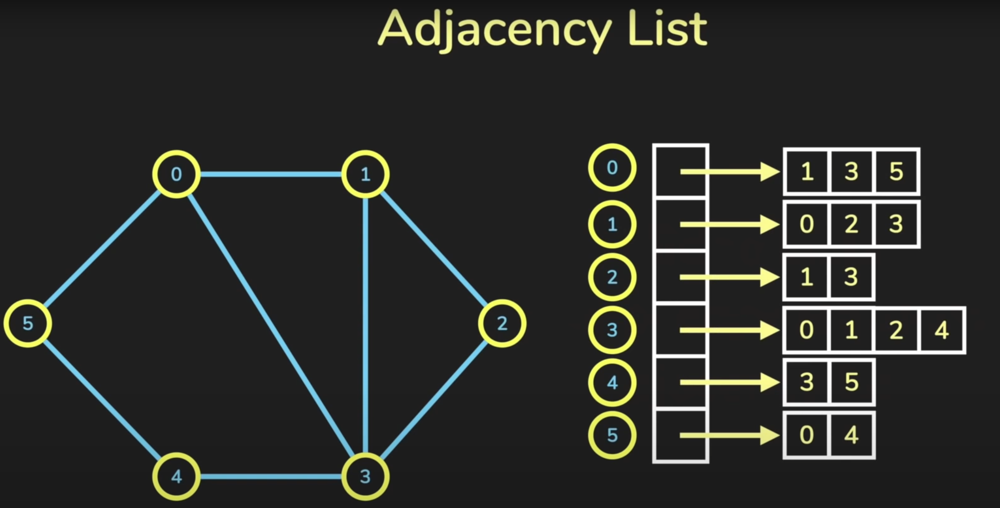

# Map of Content - Data-Structures
## Lists
### Arrays
### [Hash Maps](Hash%20Maps.md)
### [Linked Lists](Linked%20Lists.md)
### [Stack](Stack.md) ([LIFO](Stack.md)])
### [Queue](../C/Queue.md) ([FIFO](../C/Queue.md)
#### [Ringbuffer](../../digitaltechnik/Ringbuffer.md)
## [Tree](Tree.md)
### Graph-Representation
#### Edge List
#### [Adjezenzmatrix](https://de.wikipedia.org/wiki/Adjazenzmatrix)

#### Adjezenzliste

### [Heap](Heap.md)
---
# Tags