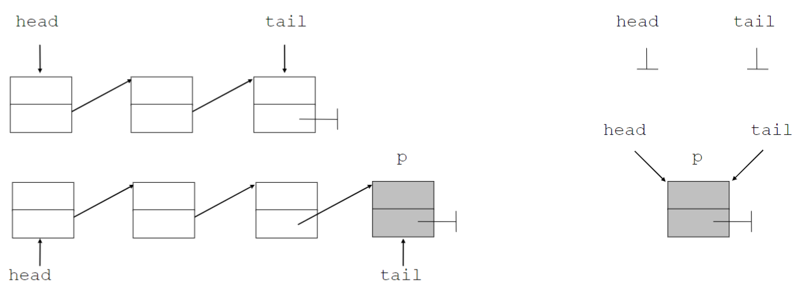

---
tags:
aliases:
keywords:
subject:
  - VL
  - Algorithmen und Datenstrukturen
semester: SS24
created: 24. April 2024
professor:
  - Rick Rabiser
---
 

# Lineare [Liste](Linked%20Lists.md)

> [!question] Rick Rabiser
> Laut seiner Erfahrung lohnt es sich nicht eine Liste zu sortieren. Man findet die zufällig angeordneten Elemente im durch schnitt genauso schnell. 

## Listen Operationen

- Löschen
- Suchen
- Einfügen

### Unsortierte Liste

#### Einfügen

```Java title:"Einfügen (am Listenanfang)"
void insert (int val) {
  Node p = new Node(val);
  p.next = head;
  head = p;
}
```


---

```Java title:"Einfügen (am Listen anfang)"
class List {
  Node head = null, tail = null;
  
  void insert (int val) {
    Node p = new Node(val);
    if (tail == null) head = p;
    else tail.next = p
    
    tail = p
  }
}
```



#### Suchen

```Java title:"Suchen eines Knoten mit dem Schlüsse6l val"
Node search (int val) {
  Node p = head;
  while (p != null && p.val != val) p = p.next
  // Assertion: p == null || p.val == val
  return p
}
```

#### Löschen

```Java title:"Löschen (am Listenanfang)"
Node remove() {
  Node p = head;
  if (head != null) {
    head = head.next;
    p.next = null
  }
  return p // gibt das entfernte Element zurück
}
```

```Java title:"Löschen (eines Knotens mit dem Schlüssel val)"
Node delete (int val) {
  Node p = head;
  Node prev = null;
  while (p != null && p.val != val) {
    prev = p;
    p = p.next;
  }
  // Assertion: p == null || p.val == val
  if (p != null) { // p.val == val
    if (p == head)
      head = head.next;
    else // prev.next == p
      prev.next = p.next;
  
    p.next = null;
  }
  return p;
}
```

### Sortierte Liste

```Java title:"Einfügen"
void insert (int val) {
  Node p = head;
  Node prev = null;
  while (p != null && p.val < val) {
    prev = p;
    p = p.next;
  }
  // p == null || p.val >= val
  if (p == null || p.val != val) {
  // val not found
  // found: (p != null) && (p.val == val)
  Node q = new Node(val) q.next = p
    if (p == head) head = q;
    else prev.next = q;
  }
}
```

```java title:"Löschen"

```
