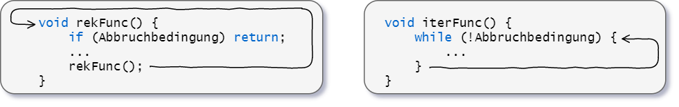

---
tags:
  - Algorithmus
aliases:
  - rekursiv
subject:
  - fsst
source:
  - Anton Hofmann
  - freecodecamp.org
created: 18th April 2022
---

# Rekursion

Die Anzahl mit der sich eine Funktion selbst aufruft nennt sich rekursive Tiefe.

| pros                                                                                            | cons                                               |
| ----------------------------------------------------------------------------------------------- | -------------------------------------------------- |
| Komplexe Aufgaben lassen sich elegant darstellen                                                | Langsam wegen CPU-Overhead                         |
| Reduziert den Gebrauch von [Schleifen](../Compiler/Schleifen.md) und Hilfsdatentypen                                        | Kann zu Out-of-Memory/[Stack](LIFO%20Stack.md) Overflow führen        | 
| Can Reduce [time complexity](O-Notation.md) easily with [Memoisation](Rekursion.md#Memoisation) | Can be unnecessarily complex if poorly constructed |
| Works really well with recursive structures (Trees, Graphs)                                     |                                                    |

**Iteration:** mehrmaliges/wiederholtes Ausführen einer Aktion.

## Prinzip

Eine rekursive Funktion returnt sich selbst als einen Funktionsaufruf  
Ein *Base-Case* (Stop kondition) wird daher benötigt


**Ohne Rekursion**

```
Pizzaessen():
vom Ersten bis zum letzten Stück:
	schneide ein Stück ab und esse ihn auf
ENDE
```

Iterationen werden in Programmiersprachen durch for, while, do-while o.ä. implementiert.

**Mit Rekursion:** mehrmalige Ausführung einer Aktion durch *Selbstaufrufen*.

```
Pizzaessen():
	wenn Teller leer: ENDE
	sonst:
		schneide ein Stück ab und esse ihn auf
		Pizzaessen()
```

Wir Menschen denken "eher Rekursiv", häufig lassen sich Probleme anschaulich rekursiv lösen. Eine Rekursion vereinfacht ein komplexes Problem mit jedem Schritt. Nachteil: in den meisten Fällen ist eine iterative Lösung effizienter. Eine rekursive Lösung benötigt durch die vielmalige Funktionsaufrufe mehr Speicher ([Stack](LIFO%20Stack.md)).

Grundsätzlich gilt:

- eine rekursive Lösung benötigt eine geeignete Abbruchbedingung
- jedes iterativ lösbare Problem lässt sich auch rekursiv lösen und umgekehrt (nicht immer trivial).
  



### Basic Attempt / Tought Process

> [!EXAMPLE] reverseString
>
> ```java
> public String reverseString(String input) {
> 	// What is the base case?
> 	if (input.equals("")) {
> 		return ""; 
> 	}
> 	// What is the smallest amount of work i can do in each iteration?
> 	return reverseString(input.substring(1)) + input.charAt(0);
> }
> ```


## Memoisation

To reduce [time complexity](O-Notation.md), it is recommended to save repeating patterns (in objects or structs).

> [!EXAMPLE] fibonacci  
> non-optimized function, without memoization:  
> [time complexity](O-Notation.md): $O(2^{n})$❌  
> [space complexity](O-Notation.md): $O(n)$ ✅
>
> ``` js
> const fib = (n) => {
> 	if(n <= 2) return 1;
> 	return fib(n - 1) + fib(n - 2);
> }
> ```
>
> optimized function, with memoization:  
> [time complexity](O-Notation.md): $O(n)$ ✅  
> [space complexity](O-Notation.md): $O(n)$ ✅
>
> ```js
> const fib = (n, memo = {}) => {
> 	if(n in memo) return memo[n];
> 	if (n <= 2) return 1;
> 	memo[n] = fib(n-1, memo) + fib(n-2, memo);
> 	return memo[n];
> }
> ```
>
> repeated patterns in the recursion tree are saved in the `memo` object.  
> 
>
> ``` js
> memo = {
> 	// memo contents
> 	1, // n=1 
> 	1, // n=2
> 	2, // n=3
> 	3, // n=4
> 	5, // n=5
> 	8, // n=6
> 	// ...
> }
> ```

> [!EXAMPLE] gridTraveler  
> Say that you are a traveler on a 2D grid. You begin in the top-left corner and your goal is to travel to the bottom-right corner. You may only move down or right.
> 
> In how many ways can you travel to the goal on a grid with dimensions $m\cdot n$
> 
> Write a function `gridTraveler(m, n)` that calculates this.

|**Example**|`gridTraveler(2,3)` $\rightarrow$ 3 |
|-|-|
| 1. right, right, down<br> 2. right, down, right <br> 3. down, right, right<br>|.svg) |

# Beispiele

- [Binary Search](Binary%20Search.md)
- [Ue_Rekursion](Uebung/Ue_Rekursion.md)

---

# Tags

<iframe width="560" height="315" src="https://www.youtube.com/embed/oBt53YbR9Kk" title="YouTube video player" frameborder="0" allow="accelerometer; autoplay; clipboard-write; encrypted-media; gyroscope; picture-in-picture" allowfullscreen></iframe>

<iframe width="560" height="315" src="https://www.youtube.com/embed/IJDJ0kBx2LM" title="YouTube video player" frameborder="0" allow="accelerometer; autoplay; clipboard-write; encrypted-media; gyroscope; picture-in-picture" allowfullscreen></iframe>

## [Tail-Call-Optimizations (TCO)](https://stackoverflow.com/questions/310974/what-is-tail-call-optimization).