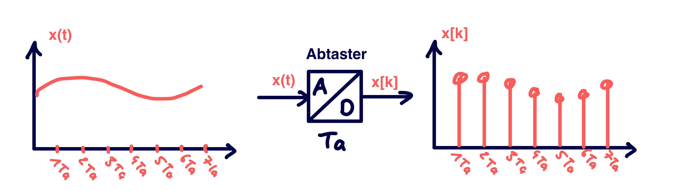
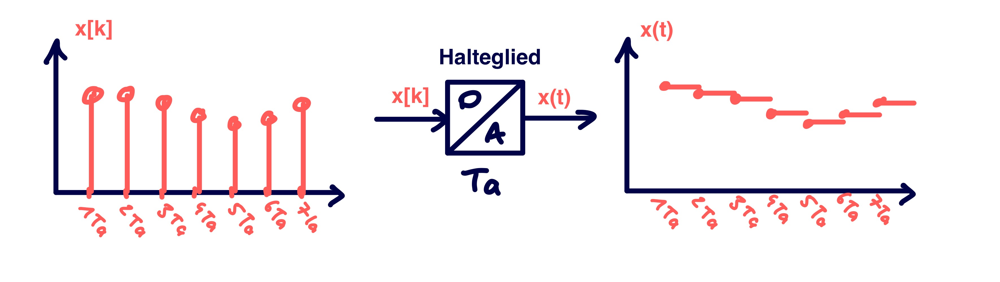

---
tags:
aliases:
  - Abtastsysteme
keywords:
subject:
  - VL
  - Signalverarbeitung
  - Regelungstechnik
semester: SS25
created: 19th March 2025
professor:
  - Markus Schöberl
  - Mario Huemer
release: false
title: Abtastung
---

# Abtastung

- [Duale Poissonsche Summenformel](Frequenzbereichsmethoden/Poissonsche%20Summenformel.md#Duale%20Poissonsche%20Summenformel)

---

## Abtaster

Ein idealer [A/D–Wandler](../Digital-Design/ADC.md) (Abtaster) erzeugt aus einem Zeitsignal eine Folge von Werten, die zu äquidistanten Zeitpunkten $kT_{a}, k \in \mathbb{Z}$ dem Zeitsignal entnommen werden. $T_{a}$ ist dabei die *Abtastperiode* oder *Abtastzeit*.

> [!def] **D)** Ideale Abtastung 
> 
> $$
> \mathbf{x}[k] := \mathbf{x}(kT_{s})
> $$

Ist eine Zeitkontinuierliches System gegeben, muss zuerst die [Fundamentallösung](../Mathematik/Analysis/Differentialgleichungen/Fundamentalmatrix.md) ermittelt werden, damit $kT_{s}$ in die Lösung eingesetzt werden kann.

## Halteglied

Ein idealer [D/A–Wandler](../Digital-Design/DAC.md) (Halteglied) erzeugt aus einer Zahlenfolge eine Treppenfunktion.

> [!def] **D)** 
> 
> $$
> y(t) = u_{k}, \quad \text{für}\quad kT_{a} \leq t< (k+1)T_{a}
> $$

## Abtastsystem

Zusammenhang der Eigenwerte: Sind $s_{i}$ die Eigenwerte des kontinuierlichen System und die $z_{i}$ die Eigenwerte des zugehörigen Abgtastsystem mit der Abtastzeit $T_{a}$, gilt der zusammenhang

$$ z_{i} = e^{ s_{i} T_{a} } $$

### Abtastung nicht linearer Systeme

### Abtastung LTI-Systeme

## Matlab

Abtasten in Matlab:

- discrete to continuous: `d2c`
- continuous to discrete: `c2d`

Dient zum hin und her wechseln zwischen $G(s) \leftrightarrow G(z)$

## Methoden zum Abtasten

> [!info] [ADC](../Digital-Design/ADC.md)
> 
> - [Sukzessive Approximation](../Digital-Design/SAR-ADC.md)
> - [Sigma-Delta](../Digital-Design/Sigma-Delta-ADC.md)

---

# Referenzen

- [q-Transformation](Frequenzbereichsmethoden/q-Transformation.md)